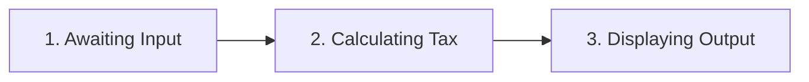
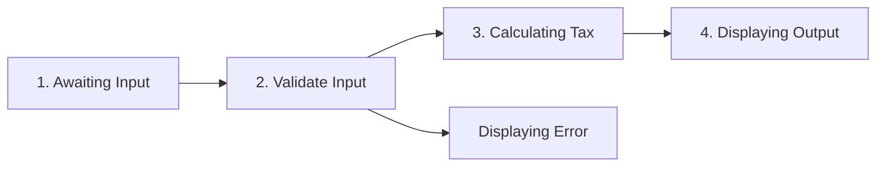

# CompTIA Security+ Exam (SY0-501): Threats, Attacks, and Vulnerabilities

- Up to 90 minutes
- Up to 90 questions

Domains:

- Threats, Attacks, and Vulnerabilities (21%)
- Technologies and tools (22%)
- Architecture and design (15%)
- Identity and access management (16%)
- Risk management (14%)
- Cryptography and PKI (12%)

Formats:

- multiple choice questions
- performance-based questions

Grading Scale:

To pass the exam: at least 750 on a scale ranging from 100 to 900

Study Resources:

[1] [Get Certified Get Ahead](https://blogs.getcertifiedgetahead.com/)

[2] [CertMike](https://www.certmike.com/)


Objectives:

- Analyze IoC and determine the type of malware used; understand the propagation method and payloads used by various types of malicious code.
- Compare and contrast different types of attacks; understand the flavors of spam and phishing attacks; understanding of network attacks, wireless and cryptographic attacks
- Explain threat actors and attributes.
- Explain the proper use of penetration testing, including active and passive reconnaissance, pivoting, and escalation of privilege; understand the differences between black, white, and gray box testing.
- Use appropriate tools and techniques for vulnerability scanning, including identifying vulnerabilities, nothing the lack of security controls, and identifying common misconfigurations.
- Explain the impact associated with different types of vulnerabilities (e.g. race conditions, end of vendor support, input and error handling, memory issues, zero day attacks)


## 1. Malware

### 1.1 Comparing viruses, worms and Trojans (Propagation)

Two components of malware

- Propagation mechanism: The way that a malware object spreads
- Payload: The malicious action that the malware performs

**Any** malware object can carry **any** payload.

#### Viruses: Spread by human action

The best way to defend against viruses is user education

#### Worms: Spread by themselves

- Requires vulnerable systems to spread

The best way to defend against worms is keeping systems updated with the most recent operating system and application patches

Examples:

- The RTM Worm: first major worm outbreak, in 1988
- Stuxnet: infiltrated Iranian nuclear facility, in 2010

#### Trojan Horses

- Disguise themselves as beneficial programs

- Act as advertised when they are run
- Deliver their malicious payload behind the scenes

Application control provides a good defense limiting the software that may run on the systems to titles and versions specifically approved by administrators.

#### Remote Access Trojans (RAT)

- Provides backdoors to hacked systems

#### Propagation Mechanisms

- Viruses: spread through human action
- Worms: spread by themselves
- Trojan horses: pose as beneficial software

#### ! EXAM TIPS

Know the differences between viruses, worms and Trojan horses


### 1.2 Comparing adware, spyware and ransomware (Payload)

#### Adware: Displays advertisements

Mechanisms

- Changing the default search engine
- Displaying pop-up advertisements
- Replacing legitimate ads with other ads

#### Spyware: Gathers information

Techniques

- Logging keystrokes
- Monitoring web browsing
- Searching hard drives and cloud storage

#### Ransomware: Bocks access to your files 

Example:

CryptoLocker: arrives via email attachment, encrypts local files using strong RSA, in 2014

#### Preventing Malware

- Anti-malware software
- Security patches
- User education

#### Payloads

- Adware: Display advertisements
- Spyware: Gathers information
- Ransomware: Blocks access to your files 


### 1.3 Understanding backdoors and logic bombs

(Viruses), worms, Trojans, adware, spyware, and ransomware have one thing in common: they are independent programs written by malware developers to deliver malicious payload

However, instead of being an independent programs, they are pieces of code inserted into other applications with malicious intent

#### Backdoors: Provide workaround access

- Hardcoded accounts
- Default passwords
- Unknown access channels

#### Logic Bombs: Deliver a triggered payload

Logic Bomb Conditions:

- Date/time reached
- File contents
- API call results

#### Malicious Code

- Backdoors: Provide unregulated access
- Logic Bombs: Deliver a triggered payload

In addition to the standard anti-malware controls, you should

- routinely change default passwords
- disable unused accounts
- monitor security bulletins for news of logic bombs and backdoors


### 1.4 Advanced Malware

The Root Account: A special superuser account that provides unrestricted access to system resources.

#### Rootkits

- Originally were designed for privilege escalation
- Now used to describe software techniques designed to hide other software on a system

**Rootkit Payloads**

- Backdoors
- Botnet agents
- Adware/Spyware
- Antitheft mechanisms for copyrighted content (not always malicious in design)

**User Mode vs. Kernel Model **


User mode rootkits

- Run with normal user privileges
- Are easy to write and difficult to detect

Kernel model rootkits

- Run with system privileges
- Are difficult to write and easy to detect

#### Polymorphic Viruses: Change to avoid detection

Signature Detections: Identifying viruses by detecting known code patterns from a database.

##### **Polymorphic Virus Techniques**

- Changing their own code to avoid signature detection
- Using encryption with a different key on each infected system

#### Armored Viruses: Prevent reverse engineering

Armored Viruses Techniques

- Writing the virus in obfuscated assembly language
- Blocking the use of system debuggers
- Preventing the use of sandboxing

#### Payloads

- Rootkits: Escalate user privileges (now used to hide)
- Polymorphism: Changes code to avoid detection
- Armored Viruses: Prevent reverse engineering


### 1.5 Botnet: Network of infected machines

- Malware Target: Added to botnet once infected
- Botnet: Network of infected machines

#### How are botnet used?

- Renting out computing power
- Delivering spam
- Engaging DDoS attacks
- Mining Bitcoin
- Waging brute force attacks

#### **Botnet Command and Control**

- Command and control networks relay orders
- Communication must be indirect and redundant
  - Internet Relay Chat (IRC)
  - Twitter
  - Peer-to-peer within the botnet

#### Botnets

1. Infect systems
2. Convert to bots
3. Infect others
4. Check in 
5. Get instructions
6. Deliver payload


### 1.6 Advanced persistent threats

- Zero Days and the Advanced Persistent Threat (APT)

- Undiscovered security vulnerabilities lurk in existing code

#### Ethical Disclosure

1. Notify the vendor of the vulnerability
2. Provide the vendor a reasonable amount of time to create a patch
3. Disclose the vulnerability publicly

#### What if a vulnerability is kept secret?

This type of vulnerability is known as Zero-Day Vulnerability. 

- Zero-day vulnerability: A vulnerability in a product that has been discovered by at least one researcher but has not yet been patched by the vendor
- Window of Vulnerability: The time between the discovery of a zero-day vulnerability and the release of a security patch

**Exploiting zero days is difficult.** However, there's a type of attacker that is known to use this type of attack.

#### Advanced Persistent Threats (APTs)

- Are well-funded and highly skilled
- Are typically government sponsored
- Have access to zero days and other sophisticated weapons
- Work methodically to  gain access to a target

#### Defending Against APTs is Difficult

- Build a strong security foundation
- Implement strong encryption
- User rigorous monitoring


### Chapter Quiz

1. Cryptolocker is an example of what type of malicious software?

   A. Trojan horse

   B. ransomware

   C. adware

   D. spyware

2. What type of malware delivers its payload only after certain conditions are met, such as specific date and time occurring?

   A. worm

   B. Trojan horse

   C. ransomware

   D. logic bomb

3. What technique does some malware use to modify itself each time it infects a new system to avoid signature detection systems?

   A. bipartite

   B. armored

   C. multipartite

   D. polymorphism

4. Which of the following is a common command-and-control mechanism for botnets?]

   A. HTTP

   B. FTP

   C. IRC

   D. SMTP


Answers:

1. ransomware
2. logic bomb
3. polymorphism
4.  IRC


## 2 Understanding Attackers

### 2.1 Cybersecurity adversaries

#### Differentiating Attackers

- Internal vs. external attackers
- Level of sophistication
- Access to resources
- Motivation
- Intent

**Script kiddies** are unskilled attackers who simply reuse hacking tools developed by others.

**Hacktivists** seek to use hacking tools to advance political and social agendas.

**Organized crime** seeks to use hacking tools, such as ransomware, for financial gain.

**Competitors** may use hacking tools and techniques for corporate espionage purposes.

**Nation-states** sponsor highly sophisticated advanced persistent threat (APT) groups. 


### 2.2 Preventing insider threats

#### Insider Attackers Are Commonplace

- 51% of organizations experiencing a security breach experienced an insider attack
- 72% of insider attacks are handled internally
- 67% of insider breaches are more costly than external attacks

#### Privilege Escalation Attacks

In many cases, inside attacks occur at the hands of the most trusted users, such as system administrators and executives. But not all attacks use these privileged accounts. **Privilege escalation attacks** can take a normal user's credentials and transform them into powerful  super user accounts. Before you think that normal users don't have the technical skills required to conduct a privilege escalation attack, remember they may have skills that you don't know about. And even if they don't have those skills, your receptionist might be married to an information security expert

#### Most Insider Attackers...

The people who conduct insider attacks often share some common characteristics

**Had personal predispositions**

- Mental illness
- Series of rule violations

**Were disgruntled due to unmet expectations**

- Low salary
- Passed over for promotion

**Were triggered by stressful events**

- Performance evaluation
- Divorcer/death in family

**Showed technical precursors**

- Downloading hacker tools

- Inappropriate Internet use

**Used access methods unknown to management**

- 59% former employees
- 75% create alternative access paths (cuz they might typically disabled when they're terminated)

##### HR Practices Control Insider Threats

- Perform background checks to uncover past legal issues
- Give users only the permissions that they need
- Require multiple users to carry our sensitive operations
- Implement mandatory vacations for critical staff

##### Behavioral Indicators from the FBI

- Tacking work materials home
- Interest in issues outside responsibilities
- Unexplained duplication of materials
- Strange network access pattern
- Using personal hardware/software
- Working odd hours
- Unexplained foreign contacts/trips
- Unexplained affluence


### 2.3 Threat intelligence

#### Threat Intelligent

The set of activities that an organization undertake to educate itself about changes in cybersecurity threat landscape, and adapt security controls based upon that information

#### Open-Source Intelligence

- Uses public information
- Security websites
- News media
- Social media
- Government-sponsored security analysis centers
- Security researchers

#### Email Address Harvesting

- Searches for valid address
- Sends out spearing phishing attacks

#### **Many security companies offer commercial threat intelligence solutions. **


### Chapter Quiz

1. Which one of the following controls is not particularly effective against the insider threat?

   A. firewalls

   B. background checks

   C. least privilege

   D. separation of duties


Answers:

1. firewalls


## 3 Understanding Attack Types

### 3.1 Denial of service attacks


- Makes a resource unavailable for legitimate use
- Sends a huge number of requests to a server
- Is difficult to distinguish from legitimate requests

#### Limitations of a DoS Attack

- Requires a massive amount of bandwidth
- Is easy to block based on IP addresses

That's where DDoS come into play

#### Distributed Denial of Service

A denial of service attack that leverages a botnet to overwhelm a target

**Ping Command** 


#### Smurf Attack


The smurf attack is also an example of a special type of DDoS attack known as Amplified DDoS Attack.

#### Amplified DDoS Attack


In a basic DDoS attack, bandwidth is a limiting factor. In an amplification attack, the attacker carefully chooses requests that have very large responses. The attackers can then send very small requests over his/her network connection that generate very large replies over the third party's network connection. Variations on the smurf attack send carefully crafted requests that have very large responses

**Amplification Factor** is the degree to which the attack increases in size:

$$\frac{Reply}{Request}=Amplification$$

$$\frac{512bytes}{64bytes}=8*Amplification$$


DDoS attacks are a serious threat to system administrators as they can quickly overwhelm a network with illegitimate traffic. Defending against them requires that security professionals understand them well and implement blocking technology on the network that identifies and weeds out suspected attack traffic before it reaches servers. This is often done with cooperation of ISP and third party DDoS protection services.


### 3.2 Eavesdropping attacks

#### Rely on a compromised communications path

- Network device tapping
- DNS poisoning
- ARP poisoning

Since simple eavesdropping is easily defeated by encryption, attackers can use the **Man in the Middle Attack** to step up the game a bit.

#### Man in the Middle Attack (MITM)

Instead of establishing communications with a legitimate server, the user then connects directly to the attacker. The attacker, in turn, connects to the legitimate server. The user authenticates to the fake server set up by the attacker, and the attacker acts as a relay, the man in the middle, and can view all of the communications that take place between the client and the server. 

The attacker receives the requests from the user, passes them onto the server, and receives the real responses, reads them, and then replays them to the original user, who has no idea that there is a man in the middle intercepting those communications.

**Man-in-the-browser attack exploit flaws in browsers and browser plugins**

If attackers have the ability to capture network traffic, they can also conduct a **Replay Attack**.

#### Replay Attack

It uses previously captured data, such as an encrypted authentication token, to create a separate connection to the server that is authenticated, but does not involve the real end user. If the attacker can resend the authentication sequence without the remote system noticing that it's being replayed, the attacker can then use those credentials for his or her own purposes.

**Replay Attack Limitations**

- The attacker can't see the encoded credentials

#### Preventing Eavesdropping Attacks

- Include a unique characteristic
  - Token
  - Timestamp
- Prevent reuse of captured credentials


Once an attacker gains access to the network underlying a connection, it becomes very difficult to protect those communications. Encryption, secure network configuration, and strong authentication mechanisms are all good ways to protect your applications and users from falling victim to eavesdropping attacks.


### 3.3 Network attacks

#### **Packets**

- Are the basic unit of network communications
- Contain a data payload to be sent
- Contain a header with additional information

Packet Header Flag:


A typical packet has only 1 or 2 flags set to a value of 1.

#### Christmas Tree Packet

All of the flags are set to one. It's said to be lit up like a Christmas tree.


- Some systems can't handle all the flags being set
- Responses can be used to identify the operating system


**Domain Name Service (DNS)** A service that translates common domain names into IP addresses for the purpose of network routing.

**Hierarchical DNS Lookups**


#### DNS Poisoning

Disrupt the normal operation of DNS by providing false results. The attacker inserts incorrect DNS records at any point along that hierarchy, and can then redirect the traffic to attacker's system. The attacker's system contains a web server built closely resemble the system that the unsuspecting victim expects to visit. When the victim logs on to the attacker's fake system, the attacker captures log on information.

In a well done DNS poisoning attack, the attacker passes the credentials through to the real system, and then captures all traffic between the client and server, preventing the victim from noticing the attack. That's a MITM attack


**Address Resolution Protocol (ARP)** A protocol that translates logical (IP) addresses into the hardware (MAC) addresses on local area of networks.

#### ARP Poisoning

Much like DNS poisoning, ARP poisoning is a spoofing technique that provides false information in response to ARP requests. Unlike DNS poisoning, ARP poisoning only works on a local network. 

Normally, any system on the network sends all traffic bound for outside the network to a gateway system. When ARP spoofing occurs successfully, the victim system believes that another system is the gateway, and sends traffic to it. That system actually belongs to a malicious user engaging in a MITM attack.


#### Typosquatting (URL Hijacking)

An attack that consists of registering domain names similar to official sites, hoping that users will make a typo and visit their site.

Example:

2012 Election Typosquatting

- Missing periods: ww<font color=red>wb</font>arackobama.com
- Missing letters: www.bar<font color=red>ak</font>obama.com
- Mistyped letters: www.barackoba<font color=red>n</font>a.com
- Added letters: www.bar<font color=red>r</font>ackobama.com
- Reversed letters: www.baracko<font color=red>ab</font>ma.com

**Domain hijacking attacks steal a domain registration or alter DNS records**

They may do this by contacting the domain registrar, and attempting to illegitimately transfer actual ownership of the domain to themselves, or they conduct a DNS attack that changes the legitimate site's DNS records.

#### Network Attacks

- **Christmas Tree Attack** Use packet flags to exploit a system
- **DNS/ARP Poisoning** Redirects or intercepts traffic
- **Typosquatting** Exploits typos to get web traffic


### 3.4 Network address spoofing

Network addresses are easily altered by anyone with administrative access to a system, so they should not be relied upon for authentication purposes. Attackers can modify both the IP address and the MAC address of a system

#### MAC Spoofing Attack

- Alters hardware addresses

**Anyone with administrative access to a system can change its MAC address.**

```bash
$sudo ifconfig en0
en0: flags=8863<UP,BROADCAST,SMART,RUNNING,SIMPLEX,MULTICAST> mtu 1500
		ether 20:c9:d0:44:ba:6f
		...
		
$sudo ifconfig en0 ether 00:00:aa:55:66
$sudo ifconfig en0
en0: flags=8863<UP,BROADCAST,SMART,RUNNING,SIMPLEX,MULTICAST> mtu 1500
		ether 00:00:aa:55:66
		...
```

#### IP Spoofing Attack

- Alters IP addresses

However, IP Spoofing Attack are often more difficult to use in reality, because it's difficult to reconfigure the network to receive return traffic at a spoofed IP address. For this reason, spoofed IP addresses are often used in DoS attacks where that return information isn't necessary, but they can't commonly be used in attacks that require two-way communication.


### 3.5 Password attacks

Password secure access to the vast majority of systems today. This time test approach does provides adequate security for many purposes, but also has potential drawbacks. Attackers can wage attacks designed to crack passwords stored in system files. Many recent attack used this approach to steal massive numbers of user accounts.

#### /etc/passwd: Password File

On Linux systems, password files contain user credentials. When a user attempts to login to a system, the login process checks the password file to determine whether the password is valid. Of course, the file doesn't simply contain a copy of the password, which would be an easy target for attackers and would also allow system admins to know all of the user password on a system. Instead, the password file contains a password hash computed using a one way hash function. When the user logs in, the login process takes the password, computes a hash, and then compares that hash with the one stored in the file. If they match, the user is logged in. This approach is still vulnerable to password cracking attempts, because a user who obtains a copy of the password file, which must be publicly accessible on the system for a number of technical reasons, can simply start guessing passwords and comparing the hashes offline in a brute force attack.

#### /etc/passwd: Removed Passwords

The first step in securing this approach is to remove password hashes from the publicly accessible `/etc/passwd` file. But, in this approach,  how does the system log users in?

#### /etc/shadow: Shadow File

The hashes still exist, but they are stored in a separate file, known as the shadow password file. Unlike the password file, the shadow file can be locked down and highly restricted, so only the super user root may access it.

**Hash Function** A mathematical function that converts a variable length input into a fixed-length input.

#### Hash Function Criteria

- It must produce a completely different output for each input
- It must be computationally difficult to retrieve the input from the output (irreversible)
- It must be computationally difficult to find two different inputs that generate the same output (collision)

Collision is because of a mathematical phenomenon known as the birthday problem.

#### The Birthday Problem

Collisions become common with large samples.

What are the odds two people in a room will share a birthday?

- 100% with 367 people
- 50% with only 23 people
- 99.9% with 70 people

Hashing algorithms must be carefully designed to avoid the birthday problem.

#### Cracking Passwords

Passwords are hashed, so if someone gets the file, they can't just read the passwords. If the hash function is well designed, they can't reverse the hash either. Instead, they need to guess the password, run that guess through the hash algorithm and then compare the results. There are 4 common types of password attacks. 

**Brute Force Attacks** Try all possibilities (only against short, non-complex passwords)

**Dictionary Attacks** Try English words first

**Hybrid Attacks** Add variation to tries (e.g. add a year to the end of a word, or replace o with 0)

**Rainbow Table Attacks** Precomputes hashes

Hackers often post cracked password files on public websites, just to make a public display of security vulnerabilities. Password are a common authentication mechanism, but they have serious security flaws, if they're not implemented properly. Security professionals must take care to ensure that password algorithms use strong hashing and that the files are safeguarded. When security is paramount, password should be only one component of a multi-factor authentication system.


### 3.6 Brute force cryptographic attacks

#### Brute-Force Attacks

- Repeatedly guess keys
- also called known ciphertext attacks

**Keyspace** The set of all possible encryption keys usable with an algorithm

**Modern algorithms aren't susceptible to brute-force attacks.**

#### Size of Keyspaces

- 56-bit DES: $2^{56}=7.2057594*10^{16}$ keys
- 128-bit AES: $2^{128}=3.4028237e*10^{38}$ keys
- 256-bit AEC: $2^{256}=3.4028237*10^{38}$ keys

**Flawed algorithms may be vulnerable to brute-force attacks.**

Brute-force attacks simply aren't possible against modern encryption algorithms, with one exception. If there's a flaw in the way that the encryption algorithm works that limits the size of the key space, brute-force attacks may be possible against that weak implementation of the cryptographic system.


### 3.7 Knowledge-based cryptographic attacks

Knowledge-based attacks go beyond the simplicity of brute-force attacks. And combine other information available to the attacker, with cryptanalytic techniques, to break the security of encrypted data. 

#### Frequency Analysis

- Detects patterns in ciphertext
  - The most common letters in English text are E, T, O, A, I, and N
  - The most common digraphs in English text are TH, HE, IN, and ER

#### Exam Tips

- You won't need to perform cryptanalysis on the exam - just know the different techniques

#### Known-Plaintext Attack

- Attacker has access to an unencrypted message

#### Chosen-Plaintext Attack

- Attacker can create an encrypted message of his or her choice

In this type of attack, the attacker can study the algorithm's workings in greater detail and attempt to learn the key being used. 

#### Downgrade Attack

Downgrade Attacks are possible when a system supports many different types of encryption, some of which are insecure. 

- Attacker forces two systems to use weak cryptographic implementations

In a downgrade attack, the attacker uses a man in the middle exploit, to force two other systems that attempting to communicate, to switch to a weak implementation of a cryptographic algorithm, that the attacker can eavesdrop on, and then crack. 

Example

POODLE Attack (Padding Oracle On Downgraded Legacy Encryption), in 2014. Attackers discovered that they could exploit a flaw in a software library used for encryption by many browsers, and other applications. And then force the communicating systems to switch, from the secure TLS protocol, to the insecure SSL protocol.


### 3.8 Watering hole attacks

In nature, a watering hole is a place that animals gather, particularly in dry climates. It's important that animals visit the watering hole, because the water there is essential to their survival. But, there are also significant risks involved. First, diseases can spread easily at watering holes, because all of the animals drink from a common source. Second, predators can lay and wait at the watering hole, waiting for prey to show up in need of a drink and then attack. 

#### Websites Spread Malware Effectively

- Users trust the websites they visit, to some extent
- Browsers and add-ons often have vulnerabilities
- Users are conditioned to click "OK" on security warnings

In the electronic world, websites are a great way to spread malware. Watering hole attacks are an example of a type of attack known as client-side attacks. These attacks don't necessarily exploit security issues on the server. Rather, they use malicious code and other attacks that exploit vulnerabilities in the client accessing the server. Watering hole attacks often cause popup warnings, but users are conditioned to click "OK" to security warnings to get them out of the way and move on to the content they requested. Attackers can take advantage of this by installing malware on a website and letting users come to them. 

#### Limitations

- Attackers can't just build their own sites
- Why would users visit the website
- Content filtering can block known malware sites

#### How a Watering Hole Technique Works

1. Identify and compromise a highly targeted website
2. Choose a client exploit and bundle in a botnet
3. Place the malware on the compromised website
4. Sit back and wait for infected system to phone home

Watering hole attacks are especially dangerous, because they often come from otherwise trusted websites. Attackers using this technique, making an access to highly targeted systems, and find the proverbial needle in a haystack, because the victim comes to them. Website owners and web users alike must remain current on security patches to prevent falling victim to watering hole attacks.


#### Chapter Quiz

1. What type of packet do participating systems send during a Smurf attack?

   A. ICMP information reply

   B. ICMP status check

   C. ICMP timestamp

   D. ICMP echo request

2. Which one of the following techniques is useful in preventing replay attacks?

   A. mobile device management

   B. session tokens

   C. man-in-the-middle

   D. full disk encryption

3. What attack uses carefully crafted packets that have all available option flags set to 1?

   A. DNS poisoning

   B. URL hijacking

   C. ARP poisoning

   D. Christmas tree

4. Dan is engaging in a password cracking attack where he uses precomputed hash values.  What type of attack is Dan waging?

   A. rainbow table

   B. hybrid

   C. brute force

   D. dictionary

5. What type of attack is possible when the attacker has access to both an encrypted and unencrypted version of a single message?

   A. known ciphertext

   B. chosen ciphertext

   C. known plaintext

   D. chosen plaintext

6. What type of website does the attacker use when waging a watering hole attack?

   A. site trusted by the end user

   B. software distribution site

   C. known malicious site

   D. hacker forum


Answers:

1. ICMP echo request
2. session tokens
3. Christmas tree
4. rainbow table
5. known plaintext
6. site trusted by the end user


## 4. Wireless Attacks

### 4.1 Wireless eavesdropping

Wireless networks are insecure by default until administrators add security controls. This is due to the very nature of wireless networks. They use radio transmissions that may be intercepted by anyone with an antenna. Security professionals use encryption to protect the confidentiality of information sent over wireless networks.

### Wireless Networking

- Governed by the IEEE 802.1.1 standard
- Uses plaintext Service Set Identifiers (SSIDs)
- Uses "beaconing" to advertise to other devices

### Security Concerns

Wifi introduces security concerns that didn't exist on wired networks. When I'm plugged into a network jack on the wall, eavesdropping on that connection requires either physically tapping the cable, or compromising a network device. Wifi, on the other hand, uses radio signals that anyone can pluck out of the air with some very basic equipment and an antenna. This makes encryption critical for protecting the security of wireless networks. 

### Wireless Encryption

- Protects confidentiality of communication
- Prevents eavesdropping
- Allows use of insecure transmission methods

##### Wi-Fi Encryption Options

1. You can opt to use no encryption whatsoever
2. Wired Equivalent Privacy (WEP) uses a static key (easy to hack)
3. Wi-Fi Protected Access (WPA) uses the Temporal Key Integrity Protocol (TKIP)
   - TKIP changes encryption key for each packet preventing an attacker from discovering the key after monitoring the network for a long period of time
   - Security researchers have demonstrated some theoretical attacks against WPA, but it's still widely used and considered safe
4. Wi-Fi Protected Access v2 (WPA2) uses Advanced Encryption Standard (AES) via CCMP (Counter Mode Cipher Block Chaining Message Authentication Code Protocol)

#### Hacking WEP

When you set up a new WEP connection, the computer and access point exchange an Initialization Vector, or IV, that helps get the connection established. **This IV is sent without encryption, because it is used to create the encrypted channel**. If an attacker captures enough different Initialization Vectors, he or she can reconstruct the encryption key. 

### ! EXAM TIPS

Know that WEP attacks depend upon capture initialization vectors (IVs)

Use WPA2


### 4.2 WPA and WPS attacks

#### Wi-Fi Protected Access (WPA)

- Fixes the problems inherent in WEP
- Uses RC4 with 128-bit key, but adds Temporal Key Integrity Protocol (TKIP)
- Changes its key constantly, with a new key for each packet

#### Is WPA Secure?

- Known attacks allow injection of packets and some limited decryption
- These attacks work against the principles of TKIP
- If you want to play it safe, use WPA2
- WPA2 throws out all vestiges of WEP

#### Wi-Fi Protected Setup (WPS)

- WPS allows quick setup of devices
- There're 2 methods for establishing connection:
  - Pressing buttons on devices
  - Using 8-digit WPS PIN

#### WPS Attacks

- Flaws in WPS make it trivial to guess the WPS PIN
- Though there're 10,000,000 possibilities, a flaw requires only 11,000 guesses
- Got the PIN? You get the WEP/WPA.WPA2 key
- PIN can't be changed


### 4.3 Propagation attacks

The open nature of wireless networks makes them perfect targets for attacks that prey upon radio wave propagation. Attackers can simply use strong antennas and pull signals out of the air for analysis.

#### Jamming and Interference

- DoS attacks are easy on wireless network
- The radio spectrum is open, but in a limited access
- The loudest signal always wins, so it doesn't have to interfere with another signal

#### War Driving

Attackers will cruise neighborhoods and commercial areas, using tools that capture information about Wi-Fi networks. 

They might notice open wireless networks, or those using weak WEP encryption. War drivers use special software that automatically captures this information, and even correlates it with GPS data to plot it on a map. After driving around gathering information, attackers can return to areas where they want to exploit vulnerable networks.

War driving tools:

- iStumbler: mac tool that shows very detailed info about nearby wireless networks
- wigle.net: shows all of the wireless networks that others discovered in the area


### 4.4 Preventing rogues and evil twins

Attackers sometimes use fake wireless access points that pose as legitimate network connections in order to gain sensitive information or network access. 

#### Rogue Access Points

Rogue access points occur when someone connects an unauthorized wireless access point to an enterprise network. The huge risk with rogue access points is that they can bypass other wireless authentication mechanisms. If you spend hours configuring your systems to use WPA2 security, a rogue access point configured to avoid encryption can quickly bypass all of that. Anyone connecting to the rogue AP can then gain unrestricted access to your network. 

A second risk posed by rogue access points is interference. There are a limited number of wifi channels available and rogue APs can quickly interfere with legitimate wireless use. 


#### Rogue AP Detection

- Enterprise-grade wireless has built-in intrusion detection capabilities
- Unknown radios on the network can be identified (e.g. triangulation by readings of signal strength and direction from 3 or more legitimate access points)
- Handheld tools can also help pinpoint them

IT staff should monitor their buildings and networks for the presence of rogue access points and shut them down quickly when they are detected. There are several technologies available to help with this. 

#### Evil Twins

Evil twin attacks are cousins of phishing and pharming attacks. A hacker sets up a fake access point with the SSID of a legitimate network. They then lure unsuspecting users who will automatically connect to that network when in the vicinity. 

Since the hacker controls the network he or she can then use DNS poisoning and similar tactics to redirect users to phishing websites. 

Conducting an evil twin attack is easy if attackers use very common SSIDs that millions of computers are configured to automatically connect to:

- linksys
- netgear
- xfinitywifi
- dlink
- freewifi
- optimumwifi
- cablewifi
- home
- attwifi

Attackers can automate the evil twin attack using software known as the karma toolkit. 

##### Karma Tookit

- Automates the evil twin process
- Searches for adjacent networks
- Creates a matching fake network
- Redirects traffic to phony sites and capture credentials


### 4.5 Disassociation attacks

Many attacks against wireless encryption require that the attacker collect a large number of authentication attempts from wireless clients. Disassociation attacks speed up this time-consuming process. They may also be used in denial of service attacks against wireless network. 

**Normally, clients stay connected to wireless networks for extended periods of time**

For example, a client might re-authenticate only once or twice every hour. On a low-traffic network, this means that it can take quite a bit of time before an attacker is able to gather enough information to conduct an attack.

#### Deauthentication Frame

- Immediately disconnects clients


This deauthentication frame is sent by the access point to the client. Therefore, it bears the source MAC address of the access point and the destination Mac address of the client. 


Attackers can use this disassociation capability to force a network client to re-authenticate. They do this by simply sending a spoofed data frame that uses the MAC address of the access point as the source address and the MAC address of the client as the destination address. When the client receives this spoofed frame, it believes that it came from the access point and then disconnects from the WiFi network. The client may then try to reestablish the connection by re-authenticating to the network. 

#### Disassociation Attack Goals

- Gather authentication information for cryptographic attacks
- Conduct DoS attacks on wireless networks


### 4.6 Understanding Bluetooth and NFC attacks

#### Near Field Communication

- I used for very short range links between devices (30-50 feet)
- Is most commonly seen in Bluetooth
- Is commonly used for speakers, headsets, keyboards, and similar devices

#### Bluejacking

- An attacker sends Bluetooth spam to a user's device
- The attacker tries to entice user to take some action
- This is essentially Bluetooth spam/phishing

The reality is that Bluejacking attacks are mostly a dated concept and they're rarely seen today. 

#### Bluesnarfing

- An attackers exploits firmware flaw in older Bluetooth devices
- The attacker forces pairing between devices
- The connection grants access to the device

You see the forced pairing attacks of Bluesnarfing a lot on television but it doesn't really happen anymore in practice. 

#### NFC Security

- Turn off discoverable mode when not in use
- Apply firmware updates
- Watch for suspicious activity

Fortunately, Near Field Communication technologies such as Bluetooth are well-designed and allow for secure use. Organizations should ensure that they follow basic security principles to provide a secure NFC experience for users.


### 4.7 RFID security

Radio Frequency Identification, or RFID chips, allow organizations to achieve a wide variety of business benefits. 

- RFID chips are embedded in many items and may be read by RFID scanners.
- Passports bearing the international standard electronic passport symbol contain RFID chips
- Transit cards and credit cards often contain RFID chips to allow contactless reading
- Electronic toll systems use RFID
- Warehouses track inventory with RFID

#### RFID Security Concerns

- Business want strong authentication and encryption to protect the integrity of RFID systems
- Consumers want privacy safeguards to protect their personal information

RFID is still an emerging area of concern and security professionals should ensure that they address security and privacy issues and remain abreast of new technical and regulatory developments in this field.


### Chapter Quiz

1. Beth is creating a new wireless network for her organization and wants to protect against eavesdropping attacks.  What encryption technology should she use to protect the network?

   A. WPA2

   B. WPA

   C. WEP2

   D. WEP

   How many digits are allowed in a Wi-Fi Protected Setup (WPS) PIN?

   A. 11

   B. 8

   C. 6

   D. 4

2. Renee notices a suspicious individual moving around the vicinity of her company's buildings with a large antenna mounted in his car.  Users are not reporting any problems with the network. What type of attack is likely taking place?

   A. war chalking

   B. jamming

   C. war driving

   D. WPS cracking

3. What toolkit enables attackers to easily automate evil twin attacks?

   A. NIDS

   B. KARMA

   C. HIPS

   D. iStumbler

4. Chris is attending a hacker convention and overhears someone talking about "force pairing" a mobile device.  What type of attack is the individual discussing?

   A. bluesnarfing

   B. bluedriving

   C. bluechalking

   D. bluejacking


Answers:

1. WPA2
2. 8
3. war driving
4. KARMA
5. bluesnarfing


## 5. Application Attacks

### 5.1 Application security

- We're dependent on secure, reliable software

The details of software security vary quite a bit depending upon how organizations acquire their software:

- **Purchased Software** Acquired from software vendors for use in many different organizations
- **Developed Software** Custom-written to meet the specialized needs of a single organization

We have security responsibilities in either case. Application hardening is one of the core principles of software security.

#### Application Harding

- Use proper authentication
- Encrypt sensitive data
- Validate user input
- Avoid and remediate known exploits

**Prompt Patching Is Critical!** Attackers quickly exploit new vulnerabilities.

#### Application Configuration

- Type of scope of encryption
- Users with access to the application
- Access granted to authorized users
- Security of underlying infrastructure

**Configuration baselines allow quick identification and remediation of security gaps.**


### 5.2 Preventing SQL injection

SQL injection attacks use web applications as a mechanism to illegitimately access database servers that support web applications and retrieve sensitive information or make unauthorized modifications to the database.

#### Database-Driven Web Applications

For example, an online shopping website that has millions of items in its catalog. Users can visit the site and search for just about anything using any combination of key words. Obviously, the site developers can't imagine every possible search term and create pages in advance. That's where databases come into play. Instead of creating those pages in advance, developers write dynamic web applications. These web applications reach out to databases to obtain content as they build pages that respond to user requests. 

##### Example SQL Query

```sql
SELECT username, password
FROM user_account
WHERE username='mchapple'
```

Returns:

| Username | Password |
| -------- | -------- |
| mcapple  | apple    |

The `Select` statement specifies the information that we want to retrieve from the database. In this case, that's the username and password. The `From` clause tells the database what table contains the information. In this case, that's the user_accounts table. Finally, the `Where` clause limits the results to those matching a certain query. In this case, those for the user mchapple. 

A dynamic web application might plug in information to the `Where` clause from a variable. SQL injection attacks take advantage of this to give the database unexpected instructions. 

```sql
SELECT username, password
FROM user_account
WHERE username='mchapple' OR 1=1
```

One equals one is just a mathematical statement that's always true. So the `Where` clause now essentially reads "Where username equals mchapple or true." So it's always true. And you see the results that come back from the web application include all of the usernames and passwords from the database. 

| Username | Password   |
| -------- | ---------- |
| mcapple  | apple      |
| john     | mypassword |
| dennis   | e8amq0ska  |
| todd     | uoOm99ab!  |

**Example of WebGoat**

Input `Smith' OR 1=1;--`

The purpose of some of the extra characters here is just to make the SQL query work. The rest of this just comments out the single quote that's left over from the query template. The interesting thing here, now, is instead of just seeing the results for the user John Smith, we see all of the users contained within that database and their credit card numbers. We can even get a little more sinister than this. 

Input `Smith'; DELETE FROM user_data;-- `

Remove all of the information from that table in the database

#### Validate all user input

You have to check user input to make sure that it matches the expected format. If you're expecting a last name, you should have letters only. No apostrophes or equals signs in there. 

#### Other Injection Attacks

- LDAP injection
- XML injection
- Command injection (arbitrary code execution)


SQL injection attacks allow dangerous direct interaction between attackers and your databases. Input validation is essential to preventing SQL injection attacks.


### 5.3 Understanding cross-site scripting

Cross-site scripting attacks are one of the most dangerous web-based attacks on the internet today. They're easily executed by attackers and can take place without the knowledge of the victim. 

#### Cross-Site Scripting (XSS)

Cross-site scripting attacks occur when an attacker embeds malicious scripts in a third-party website that are later run by innocent visitors to that site.

**HTML Enhances Websites with Formatting and Images**

HTML is a markup language that allows web pages to have all sorts of advanced functionality, other than just displaying plain text. HTML authors can add different fonts, include images, link to other sites and even include small programs called scripts that run in the browsers of visitors to the site. HTML uses the concept of tags to perform all of these actions. 

##### HTML Tags

- Mark up text with formatting instructions
  - \<b>  for bold text
  -  \<i> for italics
  - \<a> for links
- This is \<b>bold text\</b> displays as 
  - This is <b>bold text</b>
- This is \<i>italicized text\</i> displays as
  - This is <i>italicized text</i>
- \<a href="www.cnn.com">This is a link to CNN\</a>
  - <a href="www.cnn.com">This is a link to CNN</a>

**The \<Script\> Tag Allows Web Developers to Embed Code in a Page** 

##### Sample Script

```html
<SCRIPT>
alert("This site is under construction");
</SCRIPT>
```

You might include this code in a webpage that pops up a window in the readers browser saying that the site is under construction. 

**XSS Attackers Embed Scripts in Sites without Permission**

The attacker manages to trick a legitimate website into sending its users copies of a malicious script. This often happens when the site allows users to enter input that is then displayed to other users. 

##### Auction Listing

For example, an online auction site might accept postings from anyone in the world. Users posting to the site may wish to dress up their auction listings with bold characters, images and other enhancements, so the auction site owners allow them to write HTML code in their listings. Maybe someone selling a boat might want to make their boring listing look a little more interesting by including HTML code in their input and then getting a catchier looking description that includes a picture. 

```html
I am selling my 20-foot pontoon boast.
It is in <b>excellent condition</b>/
Priced to sell!

```

But what happens if the user includes unexpected HTML in their post? Like a script that takes some malicious action on the viewers computer? If the website simply takes this input and passes it along to other users, the users will see the same auction

```html
I am selling my 20-foot pontoon boast.
It is in <b>excellent condition</b>/
Priced to sell!

<script>
INSERT EVIL CODE HERE
</script>
```

If the website simply takes this input and passes it along to other users, the users will see the same auction listing but the malicious script runs in the background without their knowledge. 

#### Use Input Validation!

- Don't allow \<script\> tags in user-supplied input

**Example: OWASP-WebGoat**

Change the Street information from "2211 Hyper Thread Rd." to "2211 Hyper Thread Rd.\<SCRIPT>confirm('You have been attacked');\<SCRIPT\>"


XSS attack demonstrates a more serious vulnerability. We can execute our own scripts on a victim's machine. What if, instead of the pop-up window we instructed Jerry's browser to visit a bank's website and transfer cash to Tom. If Jerry wasn't a customer of that bank or wasn't logged into that site, the attack would fail. But if he was logged into the bank's website in another tab, it might succeed. Cross-site scripting attackers try this thousands of times, waiting until they hit the jackpot once. They don't care if they have 999 failures before a single success. As with many types of attack, the attacker is playing a numbers game waiting for that one victim.


### 5.4 Understanding cross-site request forgery

Another danger of facing web applications is the threat of cross-site request forgery. These attacks are similar to cross-site scripting attacks, but even more nefarious. 

#### !EXAM TIPS

**Cross-site request forgery, CSRF, XSRF, and "sea surf" all refer to the same attack!**

#### Cross-Site Request Forgery

Cross-site request forgery (CSRF or XSRF) attacks leverage the fact that users are often logged in to multiple sites at the same time and use one site to trick the browser into sending malicious requests to another site without the user's knowledge.

(Cross-site request forgery attacks prey upon these persistent authentication sessions in a manner similar to a cross-site scripting attack.)

##### Sample Funds Transfer

```
http://www.paybuddy.com/transfer_funds.php?amount-500&source=acct1230122&target=acct915284
```

**XSRF Secretly Sends Request**

Now an attacker that knows this can try to exploit it using a cross-site request forgery attack, by attempting to trick users into sending this command without their knowledge. One of the easiest ways to do this is to include a fake image tag in a webpage that actually executes the desired command. 

##### XSS Auction Listing

```html
I am selling my 20-foot pontoon boast.
It is in <b>excellent condition</b>/
Priced to sell!

<script>
INSERT EVIL CODE HERE
</script>
```

This image tag attempts to transfer funds from the user's checking account to the attacker's checking account. When the user loads the page, the boat sales listing looks completely normal, but the invisible image added to the page actually executes the unauthorized bank transfer. 

#### Defending Against CSRF

- Rearchitect web applications
- Prevent the use of HTTP GET requests
- Advise users to log out of sites
- Automatically log out users after an idle period

Defending against cross-site request forgery is very difficult, and often requires rearchitecting web applications to use cryptographically strong tokens in each exchange between authenticated users and a website. Other measures include preventing the use of HTTP get requests to make cross-site request forgery attacks more difficult, advising users to log out when they are finished using a site, and because they probably won't follow that advise, automatically logging users out after a short idle period. This is an end convenience to end users, but it reduces the likely-hood that those users will fall victim to a cross-site request forgery attack.


### 5.5 Clickjacking

Clickjacking attacks are a form of cross-site request forgery. 

#### Clickjacking Attack

An attack where the attacker hides elements of a webpage behind other elements so that a user cannot see what he or she is actually clicking.


For example, an attacker might create a simple webpage like this, that shows a user some interesting content, and invites them to join a free mailing list. To join the list, they simply enter their email address and click the subscribe button. Unbeknownst to the user, there's another invisible link lurking behind the subscribe button. That link might go directly to the follow link for a business's Twitter account. If the user happens to be already logged in to Twitter, the clickjacking effort results in a successful cross-site request forgery attack. And the user follows the business on Twitter, building that company's Twitter following. 

##### Cursorjacking 

- A specialized form of clickjacking that tricks the user about the cursor's location on the screen

It can be difficult to detect clickjacking attacks, but there are some security tools that make it easier. The **Noscript** extension for Firefox includes a technology called Clear Click that analyzes webpages before a user clicks on them, and makes sure that the page displayed to the user doesn't contain any visually hidden elements. 

Clickjacking attacks are a dangerous form of cross-site request forgery that may be used for building social media followings, stealing money, and obtaining sensitive personal information.


### 5.6 Defending against directory traversal

Another common web application security flaw is the directory traversal attack. This attack allows an attacker to manipulate the file system structure on a web server.

**Quick Facts about Unix Filesystems**

- `.` references the current directory
- `..` references the directory one level higher in the hierarchy

#### Directory Traversal Attacks

When an attacker uses directory navigation references to search for unsecured files on a server

Example of a file system:


- ThreadSafetyProblem: file we're supposed to get
- tomcat-users.xml: target

 with the web application. 

```bash
../../../../conf/tomcat-users.xml
```

We could use ZAP, a web proxy that intercepts web requests and lets us modify them, and WEBGOAT to practice Directory Traversal Attacks

Directory traversal attacks are dangerous, because they allow attackers to bypass normal access controls and view sensitive files stored on a web server. 

There are two ways you can defend your applications against directory traversal attacks. 

- Input validation to prevent the inclusion of periods in user requests
- Set strict file system access controls to limit the web server users ability to read sensitive files


### 5.7 Overflow attacks

Buffer overflow attacks also pose a danger to the security of web applications. When software engineers develop applications, they often set aside specific portions of memory to contain variable content. Users often provide answers to questions that are critical to the application's functioning and fill those memory buffers. If the developer fails to check that the input provided by the user is short enough to fit in the buffer, a buffer overflow occurs. The user content may overflow from the area reserved for input into an area used for other purposes and unexpected results may occur.

Example

Valid input


4096 bit room number


The web application has placed in here the names and room numbers of every other guest of the hotel. 

In this example, we saw how a buffer overflow can result in unexpected behavior. More specifically, we exploited a type of buffer overflow known as an integer overflow. The simple use of input validation limiting room numbers to three or four digits would have prevented this problem.


### 5.8 Explaining cookies and attachments

Cookies small pieces of content that can track users between website visits and across different websites. Understanding the uses of cookies and how to remove them from a system is a critical task for privacy minded security administrators.

#### What are cookies?

- Cookies are data stored by websites in user browsers
- They are particularly useful to recognize users
- They are used to remember information

#### Privacy Risks

- Cookies can be used across different websites
- Cookies can tracker user activity
- If you log into one site, everything is de-anonymized

Fortunately, the user has a high degree of control over the use of cookies. 

#### Cookies are used in apps, too

While web browsers are the most common place to find cookies, they're not the only cookies in use. Some application platforms use cookies as well. For example, many people are surprised to learn that Adobe Flash has its own cookie system. These Flash cookies are also known as locally shared objects, or LSOs. 


Cookies track user activity across the web. As a Security Plus certified professional, you should be able to explain these risks to end users, and be knowledgeable about the privacy settings available for cookie management.


### 5.9 Session hijacking

Cookies are often used for web application authentication. After a user logs into a system, the web server provides a cookie, so that the user doesn't need to continuously log into the system every time he or she requests a new webpage. Presenting the cookie with each request causes the web server to reference the earlier successful login. One major flaw with some web applications is that they don't use random cookies. Instead, they use a guessable value. 

#### Cookie values weak if guessable


1. Alice's cookie also begins with 65432
2. They end with a text value
3. Each of these text values is the same length as the username
4. The text value at the end of the cookie is actually figured out by taking the username, reversing the letters, and then adding one value to each letter. 
5. 65432fdjmb

Tamper with the request using a technique known as header manipulation. 

In this example, we analyze the login cookie and guess the correct value because it wasn't very carefully constructed. This is a somewhat sophisticated session hijacking attack. A simpler variation of this attack involves eavesdropping on a user's unencrypted connection. If you can simply view the cookie, you don't need to go through all these hoops to figure out the value yourself.


### 5.10 Malicious add-ons

Browser add-ons are a valuable way to add functionality for web users, but they can also become malicious. Let's take a look at how add-ons and extensions work and what security risks they pose. 

#### What are Add-ons?

- Are also known as extensions
- Add new functionality to browsers and other software
- Are written by third-party developers

#### Security Risks

- You might not know who wrote the code
- Trojans may perform malicious actions
- Permission may be overly broad
- Legitimate browser extensions purchased by malicious individuals, then used for other purposes

Whether attackers write their own malicious add-ons, or purchase and repurpose a popular existing add-on, the extra code inherent in browser add-ons and extensions jeopardizes computer security. Security administrators must be careful to understand, what extensions are running on browsers in their environments, and limit use to trusted add-ons with limited permission to access data.


### 5.11 Code execution attacks

**Code Execution Attacks** Occur when an attacker exploits a vulnerability in a system that allows the attacker to run commands on that system

#### Key Terms

##### Arbitrary code execution

- Code execution attacks where the attacker runs commands of his or her choice

##### Remote code execution

- Code execution attacks that take place over a network connection

Attackers using code execution vulnerabilities may perform any action they desire on the targeted system. If the process they trick into executing their code is running with administrative privileges, they will gain full access to the system. 

#### Code Execution Objectives

- Install malicious code
- Join a system to a botnet
- Steal sensitive information
- Create accounts for later access

#### Protect Against Code Execution Attacks

##### 1. Limit administrative access

When code execution attacks take place within an application running on a server, the code executes with the permissions of that application process. You should limit that access as much as possible, running application services with restricted accounts that follow the principle of least privilege. This will limit the damage caused by a successful code execution attack. 

##### 2. Patch systems and applications

Code execution attacks almost always exploit vulnerabilities in applications or operating systems. Many of these vulnerabilities are known and have existing patches. Keeping your operating systems and applications patched is an incredibly important and effective security control.


### 5.12 Driver manipulation

Sophisticated attackers may reach down into device drivers and manipulate them in ways that undermine security. 

**Device Driver** Serves as the software interfaces between hardware devices and the operating system

**Device drivers require low level access to the operating system and therefore run with administrative privileges.** If an attacker can convince a user to install a malicious driver on their computer, that malware can gain complete control of the system. 

#### Refactoring

- Modifying a driver to carry out malicious activities
- Requires access to the driver source code

#### Shimming

- Wraps a legitimate driver with a malicious shim
- Does not require access to the legitimate driver's source code

#### Code signing protects against malicious drivers

However, the driver can also carry out its malware payload in the background. Fortunately, modern operating systems all contain protections against malicious drivers. The most important of these protections is code signing. Device manufacturers write drivers and then apply digital signatures to them so that the operating system can verify the driver's authenticity. If the driver is not digitally signed, or the digital signature is incorrect, the operating system may warn the user of the suspicious driver or prevent the driver's installation all together. 


The privileged nature of drivers gives them deep access to the operating system. Security professionals must ensure that the drivers used in their organization are legitimate and were not modified to carry out malicious activities.


### 5.13 Error and exception handling

Many security issues occur when software acts in an unexpected manner in response to invalid user input or another error situation. For this reason, appropriately handling errors is a critical component of software security.

Example of a Tax Calculator

State Diagram:



What happens if an error occurs? For example, what if the user types "apple" into the transaction amount field instead of a dollar amount? 

**Unpredictable States Jeopardize Application Security**

#### Error Handling

- Avoids unpredictable states

New State Diagram



**Java's Try..Catch Model**

```java
int numerator = 10;
int denominator = 0;

try
{
    int quotient = numerator / denominator;
}

catch (ArithmeticException err)
{
    System.out.println("Division By Zero!");
}
```


If you think through the different errors that could result from your code, and provide explicit instructions for handling those errors, your code will be much more secure.


### Chapter Quiz

1. Which one of the following is not a standard application hardening technique?

   A. encrypt sensitive information

   B. conduct cross-site scripting

   C. validate user input

   D. apply security patches properly

2. What character is essential in input for a SQL injection attack?

   A. '

   B. "

   C. *

   D. !

3. What is the most effective defense against cross-site scripting attacks?

   A. query parameterization

   B. antivirus software

   C. input validation

   D. vulnerability scanning

4. Which one of the following is not an effective defense against XSRF attacks?

   A. user education

   B. automatic logouts

   C. preventing the use of HTTP GET requests

   D. network segmentation

5. Alan is analyzing his web server logs and sees several strange entries that contain strings similar to "../../" in URL requests.  What type of attack was attempted against his server?

   A. cross-site scripting

   B. SQL injection

   C. directory traversal

   D. buffer overflow

6. What type of attack seeks to write data to areas of memory reserved for other purposes?

   A. SQL injection

   B. buffer overflow

   C. XSS

   D. XSRF

7. What type of object must a hacker typically access in order to engage in a session hijacking attack?

   A. hard disk

   B. one-time password generator

   C. network cable

   D. cookie

8. Which one of the following is not a significant risk associated with browser add-ons and extensions?

   A. overly board permissions

   B. sandbox execution

   C. malicious author

   D. resale of legitimate extensions

9. What Java clause is critical for error handling?

   A. try...catch

   B. if...then

   C. while...until

   D. for...next


Answers:

1. conduct cross-site scripting
2. '
3. input validation
4. network segmentation
5. directory traversal
6. buffer overflow
7. cookie
8. sandbox execution
9. try...catch


## Reference

[1] https://www.linkedin.com/learning/comptia-security-plus-sy0-501-cert-prep-1-threats-attacks-and-vulnerabilities/
