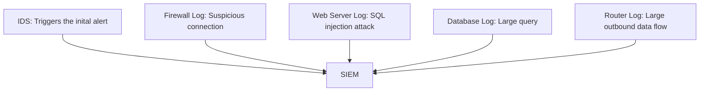
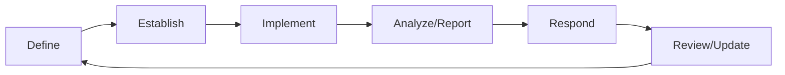

# CompTIA Security+ Exam (SY0-501): Technologies and Tools

- This domain accounts for 22% of the questions on the real exam

We'll be focusing on 

- installing and configuring network components to support enterprise security
- using tools to assess the security posture of an organization
- trouble shooting common security issues
- analyzing and interpreting output from security technologies
- deploying mobile devices securely
- and implementing secure protocols. 


## 1. TCP/IP Suite

### 1.1 Introducing TCP/IP

Transmission Control Protocol/Internet Protocol

TCP and IP are two of the main protocols that make up all modern networks. 

#### Internet Protocol

- Routes information across networks
- Provides an addressing scheme
- Delivers packets from source to destination
- Serves as a network layer protocol

It supports other transport layer protocols that have higher-level responsibilities. The two main transport layer protocols are **Transmission Control Protocol (TCP)** and **User Datagram Protocol (UDP)**

#### TCP

- Is a connection-oriented protocol
- Guarantees delivery through acknowledgement
- Is widely used for critical applications

TCP is responsible for the majority of Internet traffic. It is a connection-oriented protocol, meaning that it establishes connections between two systems before transferring data. TCP is also a reliable protocol that guarantees delivery by having the destination system acknowledge receipt of every packet. TCP's reliability makes it widely used for applications that require this guaranteed delivery, such as email and websites. 

##### TCP Flags

- SYN: opens a connection
- FIN: closes a connection
- ACK: acknowledges a SYN or FIN

##### TCP Handshake


In the first step, the system originating the connection sends a packet with a SYN flag set. This indicates that it would like to open a connection to the destination system. The destination system receives this packet and replies with another packet that does two things: It acknowledges the original connection request and then asks to open a reciprocal connection in the other direction. This packet has both the SYN and ACK flags set, and is known as the SYN/ACK packet. Finally, the original system receives the SYN/ACK packet, and sends a final ACK to the destination system, completing the reciprocal connection. Once the three-packet sequence completes, the connection is open and the systems may begin exchanging data. 

#### UDP

- Is a lightweight, connectionless protocol
- Doesn't send acknowledgements or guarantee delivery
- Is used for voice and video applications

#### OSI Model


1st layer: sends bits over the network using wires, radio waves, fiber optics, and other means

2nd layer: transfers data between two nodes connected to the same physical network

3rd layer: expands networks to many different nodes. The Internet Protocol works at this layer. 

4th layer: creates connections between systems and transfers data in a reliable manner. TCP and UDP are examples of transport layer protocols. 

5th layer: manages the exchange of communications between systems. 

6th layer: translates data so that it may be transmitted on a network. This layer describes how to represent a character in terms of bits, and performs both encryption and decryption. 

7th layer: determines how users interact with data using web browsers and other client applications. 

#### !EXAM TIPS

- Know the 7 layers of the OSI model


### 1.2 IP addresses

**IP Addresses** Uniquely identify systems

#### Dotted Quad Notation

192.168.1.100

#### Why the Range 0-255?

- 8-bit binary numbers
- $2^8=256$ possible values
- Start counting at 0
- Range: 0-255 (256 values)

#### IP addresses

- Uniquely identify systems on a network
- Must not be reused on Internet-connected systems
- May be reused if on private networks

#### Subnets

- Network address
- Host address

IP addresses are divided in two parts. The network portion of the address identifies the network a system is connected to. Your company for example, may have its own network address. The second portion of the address, the host address, uniquely identifies a system on that network. 

In this example, the network address is 192.168 and the host address is 1.100. The dividing line is right in the middle of the address, but it doesn't have to be. 

#### Source and Destination


The source address indicates the system's sending information, and the destination address indicates the system's receiving information. As two systems communicate back and forth, the source and destination addresses will swap places, depending upon who sends each packet. 

#### IPv6

- Replaces Ipv4 due to address exhaustion
- Uses 128 bits (compared to 32 for IPv4)
- Consists of 8 groups of 4 hexadecimal numbers
- Example: fd02:24c1:b942:01f3:ead2:123a:c3d2:cf2f


### 1.3 Domain and name service

#### DNS Servers

- Translate domain names into IP addresses
- www.lynda.com -> 192.229.162.23
- DNS functions over UDP port 53

Every time you connect to a network that network provides your computer with the IP address of a local DNS server that it can use to look up IP addresses. 

#### DNS Functioning

1. User types domain name into browser
2. Computer sends a DNS query to the local DNS server
3. DNS server responds with an IP address
4. Computer contacts the server at that IP address

If the local DNS server doesn't know the answer to your question, it contacts other DNS servers to determine the correct answer, and then responds to you. 

#### A Hierarchical System

- Organizations designate servers that are authoritative for their domains

When a local DNS server needs to perform a DNS lookup, it asks a series of questions that eventually lead it to the definitive answer from the DNS server that is authoritative for a domain. 

#### Dig

Most of the time, DNS queries happen behind the scenes and computer users never see them. However, we can use a tool called Dig to perform DNS lookups manually. 

```bash
dig www.lynda.com

; <<>> DiG 9.11.3-1ubuntu1.7-Ubuntu <<>> www.lynda.com
;; global options: +cmd
;; Got answer:
;; ->>HEADER<<- opcode: QUERY, status: NOERROR, id: 59389
;; flags: qr rd ra; QUERY: 1, ANSWER: 3, AUTHORITY: 0, ADDITIONAL: 1

;; OPT PSEUDOSECTION:
; EDNS: version: 0, flags:; udp: 4096
;; QUESTION SECTION:
;www.lynda.com.                 IN      A

;; ANSWER SECTION:
www.lynda.com.          263     IN      CNAME   www.lynda.com.cdn.cloudflare.net.
www.lynda.com.cdn.cloudflare.net. 263 IN A      104.18.1.28
www.lynda.com.cdn.cloudflare.net. 263 IN A      104.18.0.28

;; Query time: 11 msec
;; SERVER: 192.168.1.254#53(192.168.1.254)
;; WHEN: Tue Mar 23 03:16:26 PDT 2021
;; MSG SIZE  rcvd: 120
```

8.8.8.8 is actually a web server belonging to the Google public DNS service and anybody can use this server to perform DNS lookups. 


**Some content filters alter DNS query results** to prevent users from accessing undesirable websites. 

Those filters work by simply providing incorrect answers to DNS queries for those undesirable sites. If your organization uses this content filtering approach, you also need to make sure that you block outbound DNS requests sent to other organization's DNS servers. 


### 1.4 Network port

**Network ports, like apartment numbers, guide traffic to the correct final destination.**

#### Network Port Numbers

- 16-bit binary numbers
- $2^{16}$, or 65,536 possible values
- Start counting at 0
- Allowable range of 0-65,535

#### Port Ranges

- 0-1,023: well known ports
- 1,024-49,151: registered ports
- 49,152-65,535: dynamic ports

#### !EXAM TIPS

Memorize the list of common ports before taking the Security+ exam.

#### Administrative Services

- Port 21: File Transfer Protocol (FTP)
- Port 22: Secure Shell (SSH)
- Port 3389: Remote Desktop Protocol (RDP)
- Ports 137, 138, and 139: NetBIOS (Windows for network communications)
- Port 53: Domain Name System (DNS)

#### Mail Services

- Port 25: Simple Mail Transfer Protocol (SMTP): exchanges emails between servers
- Port 110: Post Office Protocol (POP): allow clients to retrieve mail
- Port 143: Internet Message Access Protocol (IMAP)

#### Web Services

- Port 50: Hypertext Transfer Protocol (HTTP)
- Port 443: Secure HTTP (HTTPS)

#### Memorize These Ports!

| Service | Port(s) | Service | Port(s) | Service | Port(s) |
| ------- | ------- | ------- | ------- | ------- | ------- |
| FTP     | 21      | SMTP    | 25      | HTTP    | 80      |
| SSH     | 22      | POP     | 101     | HTTPS   | 443     |
| RDP     | 3389    | IMAP    | 143     |         |         |
| NetBIOS | 137-139 |         |         |         |         |
| DNS     | 53      |         |         |         |         |


### 1.5 ICMP

The Internet Control Message Protocol, ICMP, is the housekeeping protocol of the internet. It performs a variety of important administrative functions. 

#### Ping Command


#### Traceroute

- Identifies network paths

Traceroute performs more detailed troubleshooting by not only showing you whether a system is alive on the network, but also showing the path over the network between two systems. 

#### Other ICMP Functions

- Destination unreachable
- Redirects
- Time exceeded
- Addresses mask requests and replies

The Internet Control Message Protocol plays an important role in maintaining a robust, healthy network and troubleshooting network connectivity issues.


### Chapter Quiz

1. What TCP flag indicates that a packet is requesting a new connection?

   A. RST

   B. PSH

   C. URG

   D. SYN

2. What technology provides the translation that assigns public IP addresses to privately addressed systems that wish to communicate on the Internet?

   A. TLS

   B. SSL

   C. HTTP

   D. NAT

3. Which one of the following ports is not normally used by email systems?

   A. 25

   B. 110

   C. 139

   D. 143

4. What command sends ICMP Echo Request packets?

   A. ssh

   B. ftp

   C. telnet

   D. ping


Answers:

1. SYN
2. NAT
3. 139
4. ping


## 2. Network Security Devices

### 2.1 Routers, switches, and bridges

#### Switches

- Switches reside in wiring closets and connect the computers in a building together.

- Ethernet jacks are at the other end of network cables connected to switches.
- Wireless access points (WAPs) connect to switches and create Wi-Fi networks.
- Switches generally work at Layer 2.
- Some switches do have Layer 3 capabilities

Switches do create networks, but they're limited to creating local networks. Switches generally operate at Layer 2 of the OSI model, the Data Link layer, where they work with Mac addresses only. Some switches have the capability to perform limited functions at Layer 3 of the OSI model, the Network layer, where they can interpret IP addresses. In those cases, switches are beginning to take on the functions of routers.

#### Routers

- connect networks together
- Router access control lists (ACLs) generally perform stateless inspections

Routers play a higher-level role, connecting networks together by serving as a central aggregation point for network traffic heading to or from a large network. The router serves as the air traffic controller of the network, making decisions about the best paths for traffic to follow as it travels to its final destination. Routers also perform some security functions using access control lists to limit the traffic that may enter or leave a network based upon the organization's security policies. This type of filtering using access control lists does not pay attention to connection state, and is known as stateless inspection.

#### Bridges

- Connect two networks together at Layer 2 using MAC addresses

Bridges, like switches, are Layer 2 devices, but they perform a very limited function. Bridges connect two networks together. They learn the MAC addresses present on each network, and then forward traffic between the networks as appropriate. 

#### Media Gateways

- Connect different telecommunications networks together

Media gateways perform a similar function, interconnecting networks that use different standards. You'll most often hear the term media gateway in connection with telecommunications networks such as 3G, 4G, LTE, PBX, and Voice over IP communication systems. Together, routers, switches, bridges, and media gateways make possible the interconnected nature of modern networking.

https://afteracademy.com/blog/what-are-routers-hubs-switches-bridges


### 2.2 Firewalls

If routers and switches are the connectivity building blocks of a network, firewalls are the security workhorses. 

**Firewalls act as security guards, blocking unwanted network traffic.**

#### Firewalls on the Network

Firewalls often sit at the network perimeter in between an organization's routers and the internet. From this network location, they can easily see all inbound and outbound connections. Traffic on the internal network may flow between trusted systems unimpeded but anything crossing the perimeter to or from the internet, must be evaluated by the firewall. 


#### Firewalls Connect Three Networks

Firewalls often connect three networks together: the internet, an internal network, and a special purpose network known as the demilitarized zone or DMZ. 


#### Demilitarized Zone (DMZ)

- Contains systems that must accept direct external connections
- Isolates those systems due to risk of compromise
- Protects internal network from compromised DMS systems

#### Stateful Inspection

- Tracks open connections

For example, when a user on the internal network requests a webpage from a server, the firewall notes that request and then allows the web server to respond and the two systems to communicate back and forth for the duration of the connection without reevaluating the request each time a new packet appears at the firewall. When the firewall encounters a new connection request it evaluates it against a set of rules created by system administrators. 

#### Firewall Rule Contents

- Source system addresses
- Destination system addresses
- Destination port and protocol
- Action (allow or deny)


| Attributes  | Values      |
| ----------- | ----------- |
| Action      | Allow       |
| Source      | Any         |
| Destination | 10.15.100.1 |
| Port        | 80          |
| Protocol    | TCP         |

For example, imagine that we have a web server located in our DMZ with the IP address 10.15.100.1. If we want users on the internet to access that system we must write a firewall rule that permits access from the internet into the DMZ. This is a rule that permits access so we set the action to allow. In this case the connection request would be coming from an unknown internet system to the web server. Since we do want anyone to have access to the website we set the source address on this rule to any. We do want to limit this access to the web server only so we set the destination IP address to 10.15.100.1. The IP address of our web server. We also want to limit access to resources on that system to the HTTP protocol which uses port 80, so we set the destination port as 80 and protocol as TCP. 

#### !EXAM TIPS

#### Implicit Deny Principle

If the firewall receives traffic not explicitly allowed by a firewall rule, then that traffic must be blocked. (This is a very important concept that is often tested on the security plus exam.)

#### Web Application Firewalls

Specifically protect web applications by using applications awareness to peer deep into the application layer and block web attacks. (They understand how the HTTP protocol works and peer deep into those application connections looking for signs of SQL injections, cross site scripting and other web application attacks.)


### 2.3 Proxies

#### Proxy Server


Proxy servers are specialized servers that browse websites on behalf of end users. They serve as proxies, or intermediaries, that prevent users from directly connecting to websites. Normally, when a user connects to a website, the user system is in direct contact with the server, sending information back and forth. In a proxy situation, the proxy server sits in the middle of the connection. The user connects to the proxy server and the proxy server connects to the web server. All traffic then passes through the proxy server. 

#### Proxy Server Benefits

- Anonymization
- Performance Boasting
- Content Filtering

First, proxying provides anonymity. The web server never learns the network address of the actual user. Its logs only contain the address of the proxy server. Second, proxying provides performance benefits by caching. The proxy server can store copies of frequently requested pages and answer some user requests with those stored or cached copies, reducing the demand for network bandwidth. Finally, proxy servers can perform security tests, checking, for example, that users are not visiting websites containing malicious software. 

**Forward Proxies** work on behalf of clients.

**Reverse proxies** work on behalf of servers.

**Transparent proxies** work without the client or server's knowledge

Also known as in-line proxies, or forced proxies, these transparent proxy servers sit on the client's network, physically in between the client and the Internet. They intercept requests for web services and proxy them on behalf of the client. Now, this approach can cause numerous issues on the network, and doesn't work well with SSL or TLS encrypted communications. I

**Proxies can handle many applications, not just web traffic.**

It is possible to proxy any application, and proxy servers may be set up as multi-purpose proxies that handle a wide variety of different network applications. Proxy servers play a valuable role in securing network communications.


### 2.4 Load balancers

Load balancers help web servers scale by distributing the workload among multiple servers.

#### Web Server


Basic web server configurations look something like this. Assigning an IP address to a web server located on a DMZ network. Network administrators then create a DNS entry that ties registered domain name for the server let's say www.myserver.com to the IP address of that server. Then when users type myserver.com into their web browser they connect to that web server located in the DMZ. This works well as long as the web server can keep up with those requests from users. Eventually, if the website grows the demand for the content will exceed the capacity of the server. Administrators might respond by making the server bigger but eventually the demand may grow again requiring a bigger and bigger server. This approach is not scalable because eventually administrators won't be able to purchase a bigger server and it'll also be left with a big pile of unused smaller servers gathering dust. 

#### Load Balancing


The more efficient way to grow server capacity is to use a technique known as load balancing where several servers share the load. They all sit behind a device known as the load balancer that determines which server will answer each user request. The DNS entry for the web domain doesn't point directly to a web server but instead points to the load balancer. This address is known as a virtual IP address and is published to the world as the IP address corresponding to the website but it is actually answered by the load balancer. As demand increases, administrators can simply add more servers sometimes automatically using a technique called auto scaling. 

#### Load Balancer Security Functions

- SSL certificate management
- URL filtering
- Other web application security tasks

#### Scheduling Algorithms

**Round-robin scheduling** Each server gets an equal number of requests.

While this approach is simple and may seem fair, it's not always efficient. If one server is more powerful than the others it can handle a greater load. Also, if a server gets a particularly intense request that requires more CPU time, it may not be able to handle as many other requests at the same time. 

**Advanced scheduling algorithms choose servers based upon performance and available capacity.**

#### Session persistence

- Routes an individual user's requests to the same server

Some applications require that users return to the same server for future requests to maintain information about session state.

#### 2 Modes

Load balancers play an important role on networks but they also serve as a single point of failure. Therefore organizations that adopt load balancers should maintain them in a high availability mode. This involves having two or more load balancers set up in one of two topologies. 

- Active-Active: two or more load balancers actively handle network traffic and continue to function with diminished capacity if one device fails
- Active-Passive: One load balancer handles all traffic while a second monitors activity and assumes responsibility if the primary load balancer fails

In the 2nd approach you have no loss of capacity during a failure or event, but most of the time the passive load balancer sits unused. 

Load balancing is an important way to scale applications by distributing the load among multiple servers.


### 2.5 VPNs and VPN concentrators

- Site-to-Site VPNs: Connect remote offices to each other and headquarters
- Remote Access VPNs: provide remote access to corporate networks for mobile users

#### Virtual Private Networks


VPNs work by using encryption to create a virtual tunnel between two systems over the internet. Everything that enters one end of the tunnel is encrypted and then it is decrypted when it exits the other end of the tunnel. From the user's perspective, the network appears to function normally. But if an attacker gains access to traffic between the two secure end points, all they see is encrypted information that they can't read.

#### VPN Endpoints

- Firewalls
- Routers
- Servers
- VPN concentrators

All of these approaches provide secure VPN connections but organizations that have high volumes of VPN use often choose to use a dedicated VPN concentrator because these devices are very efficient at VPN connections and can manage high bandwidth traffic with ease. 

If you don't have a high volume of VPN traffic, you might choose to use the firewall, router or server approach. If you do go that way, be warned that VPN traffic requires resource intensive encryption and unlike VPN concentrators, firewalls, routers and servers usually don't contain specialized hardware that accelerates encryption. Using these devices as VPN endpoints can cause performance issues. 

#### Two VPN Protocols

##### IPSec

- Network layer VPN protocol commonly used for site-to-site VPNs but difficult to configure

For many years most VPN use a protocol called IPSec, short for Internet Protocol Security to create these encrypted tunnels. IPSEC works at the network layer of the OSI model and provides robust, secure transport, but it is often difficult to configure and maybe blocked by firewalls. For that reason IPSec is often used for static, site to site VPN tunnels, but it is becoming less common for remote user VPNs. 

##### SSL/TLS

- Application layer VPN protocol commonly used for remote access VPNS and easier to configure

Remote user VPNs now often rely upon SSL or TLS VPNs that work at the application layer. These VPNs work on any system with a web browser and use port 443 for communications. A network that is typically allowed through almost every firewall. 

#### Two Tunnels

##### Full-Tunnel VPN

- All network traffic leaving the connected device is routed through the VPN tunnel, regardless of its final destination

##### Split-Tunnel VPN

- Only traffic destined for the corporate network is sent through the VPN tunnel. Other traffic is routed directly over the network

In most cases, administrators configure the split tunnel to send traffic headed for corporate systems through the VPN, while allowing regular internet traffic to go directly to the destination over the local network. This approach is often set up to reduce the burden on VPNs and conserve bandwidth. 

**Split-tunnel VPNS provide users with a false sense of security.**

Today most security experts recommend against the use of split-tunnel VPNs. End users generally don't understand the difference between split-tunneling and full-tunneling and they assume, incorrectly, that if they connect to a VPN, all of their network traffic is secure. 

#### Always-on VPN

- Connects automatically

In this strategy, all corporate mobile devices are configured to automatically connect to the VPN whenever they are powered on. This takes control away from the end user and ensures that traffic leaving the device is always protected by strong encryption. 

Virtual Private Networks provide administrators with the ability to secure an otherwise insecure communications mechanism and create private networks using inexpensive internet connections.


### 2.6 IPsec

When the developers of network technology created the TCP/IP protocol suite, they honestly didn't pay too much attention to security. This has created a dilemma for cyber security professionals ever since. We have a set of protocols that we rely upon every day that were designed without security in mind, and we now need to retrofit them to add on security capabilities. 

#### Internet Protocol Security

- Adds security to TCP/IP
- IPSec secures the entire packet payload

IPSec framework, is a set of protocols designed to add security capabilities to TCP/IP networking. Unlike TLS, IPSec reaches deep into the protocol stack and provides security for the entire payload of encrypted communications. 

#### Two Protocols

##### Encapsulating Security Payload (ESP)

- Provides confidentiality and integrity protection for packet payloads

##### Authentication Headers (AH)

- Provides integrity protection for packet headers and payloads

**You can combine ESP and AH.**

A single communication may combine both ESP and AH to achieve confidentiality for packet payloads in conjunction with integrity verification for the entire packet, including the header.

#### Security Associations (SAs)

- Identify cryptographic algorithms

Each system participating in IPSec makes available a list of cryptographic protocols and hash functions that it is configured to support. Each pair of cryptographic protocol and hash function is known as a security association. Systems that wish to communicate with each other compare their lists of security associations to find the strongest security association that they have in common, and then they communicate using those algorithms. 

#### Support VPN

IPSec may be used to support virtual private network, or VPN connections of two different types. 

##### Site-to-Site VPNs

- Encrypted tunnels connecting two networks together in a manner that is transparent to users

First, administrators may create IPSec tunnels to connect two different sites together. In this approach, the connection is transparent to end users. From the user's perspective, the two sites are simply connected to each other and may be contacted directly over the network. However, when traffic moves between the two sites, is travels through the encrypted IPSec tunnel, which protects the traffic so that it may safely travel over a public network without worrying about confidentiality. This is known as **tunnel mode**. 

##### End-User VPNs

- Provides encrypted remote network access for individual systems

The second option is that end users may use IPSec VPN clients to connect individual computers to a remote network. This is known as **transport mode**. 

IPSec based VPNs were once quite common, but are now falling out of use in favor of easier to use TLS spaced VPNs.


### 2.7 Network intrusion detection and prevention

#### Intrusion Detection Systems

- Monitor network traffic
- Alert administrators to suspicious activity, such as 
  - SQL injection (request for a web server)
  - Malformed Packets (attempting to create a DoS)
  - Unusual Logins
  - Botnet Traffic
- Require someone to monitor and take appropriate action

#### Intrusion Prevention Systems

- Block suspicious activity automatically

#### Two Types of Mistakes

##### False Positive Error

- IDS/PIS triggers an alert when an attack did not take place.

##### False Negative Error

- IDS/IPS fails to trigger an alert when an actual attack occurs.

#### Two Types of IDS

##### Signature Detection Systems

- Contain databases with rules describing malicious activity
- Alert administrators to traffic matching signatures
- Fail to detect brand new attacks
- Reduce false positive rates

##### Anomaly Detection Systems

- Build models of "normal" activity
- Alert administrators to activity not matching the model
- Detect previously unknown attacks
- Increased false positive rates

#### ! EXAM TIPS

**Anomaly detection, behavior-based detection, and heuristic detection are the same thing.**

#### IPS Development Modes

##### 1. In-band (inline) deployments

- Device sits in the path of network communications.
- Device can block suspicious traffic from entering the network.

While this approach allows an active response, it also adds the risk that an issue with the IPS can disrupt all network communications because the in-band IPS is a single point of failure. 

##### 2. Out-of-band (passive) deployments

- Device connects to a SPAN port on a switch.
- Device can react **after** suspicious traffic enters the network.

The IPS can still react by sending commands to block future traffic from offending systems. But, it cannot stop the initial attack from entering the network because it only learns about that traffic after it has been sent.


### 2.8 Unified threat management

We've talked about a lot of different security devices in this course, and one of the major issues associated with them is that purchasing all of these devices can be very expensive, particularly for a small or midsized organization. 

**Unified threat management (UTM) systems combine multiple security functions in a single appliance.**

#### Basic UTM Functions

- Protecting network against attacks
- Blocking unsolicited traffic
- Routing traffic to and from the Internet

#### Additional Security Features

- VPN connectivity
- Intrusion detection
- Intrusion prevention

#### Small Business Features

- URL filtering
- Content inspection
- Malware inspection
- Email and spam filtering

**UTM devices still require careful security management and analytics.**


### 2.9 OAuth and OpenID Connect

The OAuth and OpenID Connect protocols provide a federated single sign on experience for the web. 

#### OAuth Providers

- LinkedIn
- Facebook
- Google
- Amazon

#### OAuth

- **Authorization** protocol designed to work across a variety of web services

OAuth is an authorization protocol. It doesn't perform authentication itself. This can be a little confusing because the name OAuth is ambiguous, and many people assume that it means authentication; it doesn't. Auth means authorization in this case. 

#### OpenID

- Identification and authentication protocol designed to work with OAuth

The OAuth and OpenID Connect protocols are commonly used on the **web** for authentication. 


### Chapter Quiz

1. What network device can connect together multiple networks?

   A. wireless controller

   B. router

   C. AP

   D. switch

2. What security principle does a firewall implement with traffic when it does not have a rule that explicitly defines an action for that communication?

   A. informed consent

   B. implicit deny

   C. separation of duties

   D. least privilege

3. Which one of the following devices helps networked services scale with increasing demand?

   A. web security gateway

   B. proxy server

   C. firewall

   D. load balancer

4. What network port is used for SSL/TLS VPN connections?

   A. 88

   B. 1521

   C. 443

   D. 80

5. Which one of the following network intrusion detection technologies requires frequent threat updates from the vendor?

   A. behavior-based

   B. signature detection

   C. heuristic

   D. anomaly detection


Answers: 

1. router
2. implicit deny
3. load balancer
4. 443
5. signature detection


## 3. Managing Secure Networks

### 3.1 Firewall rule management

- Firewalls protect networks: They control access at the network borders.
- Firewall rules define how the firewall should act when it sees a new connection request.

#### Firewall Rule Example


For example, if a packet arrives, headed to the email server on Port 25, the firewall checks the rules in order from top to bottom. It first checks rule one, and neither the port nor the destination match, so it moves on to rule two and finds that it does match. The firewall then carries out the specified action, which, in this case, is to allow the traffic. Now let's suppose that someone attempts to connect to the web server, using a secure HTTPS connection on Port 443. When that packet arrives, the firewall checks its rules and finds that it does not match rule one because the ports are different. It also doesn't match rule two, so the firewall denies this connection, according to rule three, the default deny rule. 

**Firewall administrators must watch for rule configuration errors.**

#### Common Configuration Errors

##### Shadowed Rules

Shadowed rules occur when a rule base contains a rule that will never be executed because of its placement in the rule base. 

Suppose we have a set of rules where we want to allow access from the internal network to all websites except a known malicious site with the IP address 1.2.3.4. We might write our rules like this, adding the rule to block access to the malicious site to the bottom of the rule list. 


Unfortunately, this rule will never be executed. When someone attempts to access the malicious site, the firewall will check its rule base in top-down order. It will first find this rule that allows access to any website and execute it without ever checking our more specific rule because the specific rule is shadowed by the general rule. 

We can easily fix this error by rearranging the rule base, so that the more specific rule appears first. 


##### Promiscuous rules

- allow more access than necessary

This may be the result of laziness when writing the rules, a lack of understanding of how a system functions, or even a simple typo. Promiscuous rules violate the principle of least privilege and can jeopardize system security.

##### Orphaned rules

- allow access to decommissioned systems and services

They occur when a system or service is decommissioned, but the rules are never removed from the firewall. Orphaned rules present a security challenge because the IP address used by the decommissioned server may be reused in the future, reactivating the orphaned rule and unintentionally allowing external access to an internal system. 

Firewall administrators should regularly conduct firewall rule reviews to check for these common errors and maintain a clean, healthy firewall rule base.


### 3.2 Router configuration security

- Routers perform basic filtering: They can reduce the load on firewall

#### ! EXAM TIPS

You won't need to know the syntax of router access control list commands

You should, however, be familiar with the type of filtering that you can perform on a router and how it differs from the capabilities of a firewall.

#### Router Access Control Lists

- Restrict network traffic

##### Standard Access Control List

- Perform filtering based upon source IP address

For example, assume that we want to write a standard access control list that blocks all inbound traffic from network addresses in the range 10.3.1.0 to 10.3.1.255. 

```
access-list [number] [permit/deny] [source]
# access-list 1 deny 10.3.1.0 0.0.0.255
```

Noting that this is based on Cisco syntax. Standard lists are limiting because they only allow blocking in a very blunt way by source IP address. That's okay if you're trying to block an address or network completely, but it doesn't provide much flexibility. 

##### Extended Access Control Lists

- Block traffic based upon more advanced criteria, such as source and destination IP addresses, source and destination ports, and the protocols used for a communication

#### Firewalls vs. Routers

- Firewalls are purpose-specific and efficient.
- Firewalls have advanced rule capabilities.
- Firewalls offer advanced security functionality.

Firewalls can incorporate thread intelligence, perform application inspection and integrate with intrusion prevention systems to provide enhanced protection to a network. 

While firewalls do offer advanced security protection, administrators may still choose to place some access control lists as the router level to filter traffic before it reaches the firewall. This reduces the burden on downstream devices.


### 3.3 Switch configuration security

**Maintain Physical Switch Security** An attacker who gains physical access to your switch controls that portion of the network

**VLAN Security** Disable automatic trunk negotiation to prevent VLAN hopping attacks

VLANs may be used to increase the security of networks by isolating unrelated systems and users from each other. 

#### VLAN Pruning

- Limit the unnecessary exposure of VLANs by limiting the number of switches where they are trunked, especially for sensitive VLANS

For example, if you have a VLAN for the sales department, and the sales department is contained entirely within a single building, you should only trunk the sales VLAN within that building and not into other buildings.

#### VLAN Trunk Negotiation

- Deny the use of automatic VLAN trunk negotiation to limit the effectiveness of VLAN hopping attacks

Malicious users may attempt an attack known as VLAN hopping, to switch from their authorized VLAN to one containing resources they would like to attack. Attackers might do this through a variety of means, but most of these techniques rely upon pretending to be a switch and asking the switch to trunk VLANs to the malicious user's device. 

#### Port Security

- Limit the devices that may connect to a network switch port by MAC address

This protects against attackers disconnecting an authorized device from the wired network and replacing it with a rogue device that may eavesdrop on other users or attempt to access secure network resources. 

##### 1. Static Port Security

- Administrators manually configure valid MAC addresses for each port

This is very time consuming, but it is the most secure way to implement port security. 

##### 2. Dynamic Port Security

- Switches memorize the first MAC address they see on each port and limit access to that address

This makes configuration much faster, but it can be risky if you have unused, but active, switch ports.


### 3.4 Maintaining network availability

Sometimes attackers try to undermine network security by denying legitimate users access to the network. 

**Flooding Attacks** Overwhelm network devices

**SYN Floods** Fill connection state tables on firewalls with half-open connection entries

**MAC Floods** Fill switch's MAC address table with many entries, causing it to flood traffic on all ports

MAC Flooding occurs when attackers send large numbers of different MAC address's to a switch, hoping to over flow the switches MAC address table and cause it to forget where devices are, and then flood traffic out to every switch port, allowing the attacker to eaves drop on sensitive communications. 

#### Flood Guard Technology

- protects network devices against these attacks

Flood guard works by controlling the number of open connections that each source system may have. 

**Port security is also effective against MAC flooding.**


**Routing Loops** Allow broadcast storms

Routing loops occur when there are multiple physical paths between two network devices, and the devices mistakenly begin routing broadcast traffic in a redundant fashion. If this happens, the network quickly fills up with these broadcast messages, and no capacity is left for legitimate use. This condition is known as a broadcast storm. 

#### Spanning Tree Protocol (STP)

- prevents broadcast storms by implementing loop prevention

These protocols allow multiple physical connections between devices but restrict logical connections to remove the final links that would allow a loop. Broadcast storms can't occur at this case, but the networks still benefits from the redundant links. Because if an outage occurs, the routing protocol can recompute network paths to cut out the dead device and make use of redundant links. 

Using **flood guards** and **loop prevention** helps administrators maintain secure, highly available networks.


### 3.5 Network monitoring

#### Firewall Log Details

- Details about attempted connections
- Timestamps
- Relevant firewall rule

#### Firewall Log Uses

- Security incident investigation
- Network issue troubleshooting
- Anomalous activity detection

Administrators may also want information about network connections that did not traverse the firewall, such as the connections within a data center that's behind a firewall. The most comprehensive source of information would be to conduct full packet capture and record the full content of every packet for future analysis. However, this approach is not practical because it requires massive amounts of storage. Instead, administrators often turn to **network flow, or net flow data**. 

#### Netflow Records Capture

- Source and destination systems
- Source and destination ports
- Timestamps
- Amount of data transferred

**Netflow data is quite useful** It doesn't capture what was communicated but does identify who, when, and how much.

#### Security Information and Event Management (SIEM)

- Network security systems that automate the collection and analysis of logs from many different systems for security purposes

#### SIEM Log Sources

- Firewalls
- Network devices
- Servers
- Applications

**SIEMs facilitate rapid analysis.**

Log analysis is a critical part of network security that facilitates investigations, assists in network troubleshooting, and allows the detection of suspicious activity.


### 3.6 SNMP

The simple network management protocol or SNMP, provides network administrators with a means to centrally configure and monitor network devices. 

**Managing network devices manually is impractical. SNMP automates these tasks.**

#### SNMP Components

or higher level monitoring. Let's take a look at how SNMP works. There are three components involved in SNMP network administration. 

- Managed devices: all the network devices around your organization, including routers, switches, wireless access points, firewalls and any other device that supports SNMP
- SNMP agent: a piece of software that runs on the managed device and allows it to communicate with the SNMP service. 
- Network management system: central system responsible for communicating with SNMP agents and managing the network. 

#### SNMP Requests


Under normal circumstances the network management system reaches out to the agents on a periodic basis and requests whatever information administrators configured it to retrieve. This might include information about network activity, device performance or other metrics. When the network management system wants to retrieve information from a managed device, it sends an SNMP command called a GET request, and the managed device then sends the information back, in an SNMP response. 

#### SNMP Configuration


The network management system can also reconfigure devices when necessary. For example, the administrator might want to push out commands to all wireless access points, telling them to broadcast a new SS ID. The network management system sends these commands using an SNMP set request telling the agent to set a configuration on the device. The agent then sends back an SNMP response, telling the network management system whether the configuration setting was successfully applied or not. 

#### SNMP Traps


Managed devices may also initiate communication with the network management system, when they have unusual news to report. In this case, the agent sends an SNMP trap to the network management system, which can then respond appropriately. For example, if a network link goes down on a router, the router may send an SNMP trap to the network management system informing it of this event. The management system may then respond by sending alerts to network administrators. 

#### ! EXAM TIPS

Use SNMPv3! Earlier versions have critical security flaws

Administrators should be sure to use this version on all network devices because earlier versions have known vulnerabilities, including sending passwords in clear text. 


### 3.7 Storage networks

**Storage networks demand large quantities of dedicated bandwidth.**

#### Types of Network Storage

##### Network Attached Storage (NAS)

- Simple, self-contained storage devices that commonly use CIFS (Windows) and NFS (Linux)

##### Storage Area Networks (SAN)

- Complex, massive storage systems that required dedicated networks

#### SANs vs. NAS

- SANs present raw storage to devices, rather than file systems
- SANs are connected to devices over dedicated networks
  - Fibre Channel: Uses direct fiber-optic connections between SAN and devices
  - FC over Ethernet: Replaces fiber-optic cables with Ethernet links
  - iSCSI: Runs the SCSI (Small Computer Systems Interface) standard over network connections

#### Storage Network Security

- Storage networks carry sensitive information, often in unencrypted form
- Storage traffic should run on dedicated infrastructure or VLANs
- Storage VLANs should be carefully trunked


### Chapter Quiz

1. What type of firewall rule error occurs when a service is decommissioned but the related firewall rules are not removed?

   A. shadowed rule

   B. typographical error

   C. promiscuous rule

   D. orphaned rule

2. What router technology can be used to perform basic firewall functionality?

   A. flood guard

   B. spanning tree

   C. IPS

   D. access control lists

3. What technique should network administrators use on switches to limit the exposure of sensitive network traffic?

   A. Spanning tree

   B. VLAN pruning

   C. Loop prevention

   D. VLAN hopping

4. What technology can help prevent denial of service attacks on a network?

   A. flood guard

   B. VLAN hopping

   C. BGP

   D. VLAN pruning

5. What information is not found in network flow data?

   A. packet content

   B. source address

   C. destination port

   D. destination address

6. What message can an SNMP agent send to a network management system to report an unusual event?

   A. SetRequest

   B. Trap

   C. GetRequest

   D. Response

7. What type of storage network requires the use of dedicated connections?

   A. iSCSI

   B. fibre channel over Ethernet

   C. CIFS

   D. fibre channel


Answers:

1. orphaned rule
2. access control lists
3. VLAN pruning
4. flood guard
5. packet content
6. Trap
7. fibre channel


## 4. Wireless Networking

### 4.1 Wireless network

- The Wi-Fi standard governs communications on many wireless networks
- Wi-Fi devices replace network cables with radio transmitters and receivers
- Wireless access points (WAPs) connect wireless networks to wired networks and the Internet

#### Wi-Fi Standards

- 802.11 (1997) allow 2 Mbps communication.
- 802.11b (1999) allow 11 Mbps communication.
- 802.11g (2003) allow 22 Mbps communication.
- 802.11n (2009) allow 600 Mbps communication.
- 802.11ac (2014) allow 1 Gbps+ communication.

#### ! EXAM TIPS

Wi-Fi signals travel over open airwaves and are subject to undetectable interception!


### 4.2 Basic wireless security

**Service Set Identifiers (SSID)** Identify wireless networks

#### Disabe SSID broadcasting 

- "hides" networks in plain sight.**

#### MAC Filtering

- Screens Wi-Fi connections

##### Problem: Time consuming

- Maintaining lists of approved MAC addresses is an administrative burden.

##### Problem: Ineffective

- Skilled attackers can easily change their MAC addresses to bypass filtering

#### VPNs

- can allow the secure use of insecure wireless networks (for end users).


### 4.3 WEP, WPA, and WPA2

- Encryption hides the contents of network communications from eavesdroppers.

#### No Encryption

- Insecure option that sends all wireless communications unencrypted

#### Wired Equivalent Privacy (WEP)

- Insecure encryption technology that is susceptible to attack

#### Wi-Fi Protected Access (WPA)

- Uses the Temporal Key Integrity Protocol (TKIP) to implement strong encryption

TKIP changes the encryption key for each packet, preventing an attacker from discovering the key after monitoring the network for a long period of time. Security researchers have demonstrated some theoretical attacks against WPA. But it is still widely used and considered safe. 

#### Wi-Fi Protected Access v2 (WPA2)

- Uses CCMP to apply the Advanced Encryption Standard (AES) to wireless networks

The current best practice for Wi-Fi security, is using WPA version 2. WPA2 uses an encryption protocol that is based upon the advanced encryption standard, or AES. This protocol has a really long name. It's Counter Mode Cipher Block Chaining Message Authentication Code Protocol. But you just need to know it as CCMP.


### 4.4 Wireless authentication

#### Preshared Keys (PSK)

- Require entry of a password

##### Hexadecimal String

- 64 hexadecimal characters that encode a 256-bit encryption key

##### Password

- 8-13 ASCII characters that are converted to a 256-bit encryption key using PBKDF2

#### Limitations of Preshared Keys

- Changing the network encryption key is a tremendous burden.
- Identifying users and revoking individual user access is impossible

#### Enterprise Authentication

- Uses username and password

Authentication takes place on these networks using versions of the Extensible Authentication Protocol, or EAP.

#### 3 Major Version of EAP

##### Lightweight EAP (LEAP)

- Insecure protocol that relies upon MS-CHAP

##### EAP

- Broad framework with many variants, some secure, some not

For example, the EAP-TLS variant uses Transport Layer Security to protect EAP communications and is considered highly secure. On the other hand, the EAP MD5 variant relies upon the insecure MD5 hashing function, and should not be used. 

##### Protected EAP (PEAP)

- Tunnels EAP inside an encrypted TLS session

#### EAP-TLS

- Uses Transport Layer Security (TLS) to protect authentication session

#### EAP-TTLS

- Uses Tunneled TLS (TTLS) to protect authentication sessions

#### EAP-FAST

- Provides flexible authentication via Secure Tunneling (FAST) using a Cisco protocol

**802.1x uses EAP to provide network access control.**


### 4.5 Wireless signal propagation

\- [Instructor] The radio waves that carry wireless network traffic are affected by many different characteristics as they travel across an area. Building materials, antenna placement, wireless power levels, and many other characteristics can alter the flow, or propagation, of wireless signals. 

**Antenna-type influences signal patterns**

#### Omnidirectional Antennas

- send a signal in all directions

#### Directional Antennas

- direct all of the power from an access point in a single direction

The use of a directional antenna greatly increases the range of the network by focusing the power in a single direction. 

#### Beamforming

- is an 802.11ac feature that "steers" a network signal in the direction of client devices


With beamforming, the access point uses multiple antennas that look like simple omnidirectional antennas to detect the location of a device connecting to the access point, and then steer the signal in the direction of the device. You can think of beamforming as a virtual directional antenna that can shift as needed based upon device location. 

**Optimal access point placement depends upon building characteristics.**

Many different characteristics of a building will affect wireless signal propagation, and engineers must take those into account to prevent dead spots while also ensuring that physically adjacent access points don't interfere with each other.

#### Site Survey

- Determines optimal AP placement

While it is possible to sketch out diagrams and place access points based upon a theoretical design, the best way to place wireless access points is to conduct a wireless site survey that uses specialized hardware and software to measure signal strength and provide optimal wireless signal coverage in a building.

#### Power Levels

- Manipulating power levels modifies wireless signal range

Network engineers have the ability to manipulate the power levels transmitted by each access point to tweak coverage and prevent interference. These power levels may be manually adjusted, or automatically managed by wireless controllers.


### 4.6 Wireless network equipment

#### Fat Access Points

- Contain all of the hardware and software needed tow operate a wireless network

They are capable of operating independently or working in coordination with other access points. When an administrator wants to make a change to the configuration of a fat access point, he or she connects to that access point and alters the configuration. This may be done through a centralized management tool, but either way, the access point itself is being updated. 

#### Thin Access Points

- Rely upon wireless controllers for configuration and to serve as the "brains" of the wireless network

They are simply radios that handle the wireless communication, but they depend upon wireless controllers to do the heavy lifting. 

#### Wireless Controllers

- manage configurations, optimize performance, and reduce interference among APs

Wireless controllers sit in a data center and run the wireless network over a broad area, serving as the brains of the thin access points and reconfiguring fat access points. In addition to making wireless networks easier to manage, they can improve performance by coordinating the power levels, antenna patterns and other signal characteristics of individual access points to optimize coverage and decrease interference between access points. 

#### Wireless Scanners

- Search for rogue networks and test wireless security

**Aircrack-ng is a popular wireless security testing tool**


### Chapter Quiz

1. SIEMs correlate security information received from other devices.

   A. TRUE

   B. FALSE

2. Gary is setting up a wireless network for his home office. He wants to limit access to the network to specific pieces of hardware. What technology can he use to achieve this goal?

   A. WPA

   B. SSID broadcasting

   C. WEP

   D. MAC filtering

3. Brad is configuring a new wireless network for his small business. What wireless security standard should he use?

   A. WPA2

   B. WPA

   C. WEP2

   D. WEP

4. Fran is choosing an authentication protocol for her organization's wireless network. Which one of the following protocols is the most secure?

   A. EAP-MD5

   B. PEAP

   C. LEAP

   D. TACACS


Answers:

1. TRUE
2. MAC filtering
3. WPA2
4. PEAP


## 5. Security and Monitoring Technologies

### 5.1 Correlating security information

- Systems generate far too many log records for manual analysis
- Artificial intelligence can help solve security data overload

#### Security Information and Event Management (SIEM)

##### 1. Central, secure collection point for logs

- All systems send log entries directly to the SIEM.

##### 2. Source of artificial intelligent (AI)

- SIEMs detect patterns that other systems might miss

In a hierarchical organization, network engineers might have access to firewall logs, system engineers might have operating system logs, and application administrators may have the application logs. This silent approach means that attacks may go unnoticed if the signs of the attack are spread across multiple departments. Each administrator may see a piece of the puzzle, but can't put the whole picture together. 

**SIEMs have access to log entries from across the organization.**

The SIEM has access to all of the puzzle pieces, and performs an activity known as **log correlation** to recognize combinations of activity that may indicate a security incident. 



For example, an IDS, might notice the unique signature of an attack in inbound network traffic, triggering an event within the SIEM that pulls together other information. From there, a firewall may note an inbound connection to a web server from an unfriendly country. The web server might report suspicious queries that include signs of a SQL injection attack. The database server might report a large query from a web application that deviates from normal patterns. And a router might report a large flow of information from the database server to a system located on the internet. In isolation, each of these activities may seem innocuous, but when the SIEM puts those pieces together, a pattern of suspicious activity emerges. SIEMs provide security professionals with a valuable tool for the centralized collection and correlation of security event information.


### 5.2 Tuning and configuring SIEMs

**Point relevant security logs to the SIEM's log repository**

The centralized log repository associated with the SIEM should be configured to act as what we call a WORM repository. 

#### Write once, read many (WORM)

- Prevent unauthorized changes

Once a system sends a log entry to the repository, that log entry is permanently recorded and can't be modified. Many users can read the information in the repository, but it is not possible to edit it. 

The log repository also can notice when it was receiving similar alerts about the same event for multiple systems, correlate those alerts, and perform event de-duplication. 

#### Synchronizing system clocks

- Enables consistent analysis

When you're reconstructing events, you'll want to be able to put things in the correct sequence. The simple solution to this problem is using a centralized time server running the Network Time Protocol (NTP). 

- Network Time Protocol (NTP) servers simply clock synchronization

#### SIEM Performance Tuning

- Customize the configuration for your environtment
- Modify rules to prevent false positive alerts
- Block trivial and irrelevant SIEM alerts

Out of the box, a SIEM can produce a large number of alerts that will drive administrators batty and cause them to ignore future alerts. By investing time and tuning the SIEM, the device can become much more useful to the organization.


### 5.3 Continuous security monitoring

Instead of simply focusing on the periodic review of logs for unusual activity, they conduct this analysis in real time and can even take action in response to suspicious events. 

**Continuous Security Monitoring** Maintaining ongoing awareness of information security, vulnerabilities, and threats to support organizational risk management decisions (NIST)

#### Monitoring Process


They begin with three core characteristics of a continuous monitoring program:

- Maps to risk tolerance
- Adapts to ongoing needs
- Actively involves management

Around these core principles, we have six steps of the continuous monitoring process given to us by NIST:



1. Define a continuous monitoring strategy based upon risk tolerance that maintains clear visibility into assets, vulnerabilities, threats, and business impact. 

2. Establish a monitoring program by outlining the metrics we're going to use and the frequency at which we're going to monitor and assess our security. 

3. Implement the program by collecting the metrics, performing the assessments, and building reports. These tasks should be as automated as possible. 

4. Analyze and report findings from the collected data. 

5. Respond to those findings by mitigating, avoiding, transferring, or accepting the risk. 

6. Review and update the monitoring program, adjusting our monitoring strategy and maturing our measurement capabilities. 

**SIEMs assist with security data analytics and correlation.**

Continuous monitoring approaches require the use of other techniques that correlate data across time. 

#### Anomaly (Heuristic) Analysis

- Detects outlier data points


#### Trend Analysis

- Detects changes over time


#### Behavioral Analysis

- Detects unusual user activity

Behavioral analysis looks at the activity of users and identifies suspicious actions. This might be done using signatures or heuristic analysis. For example, you could apply heuristic anomaly analysis to user login times to learn that I normally login to my computer around 8am each weekday. If I suddenly login at 3am, that's a behavioral anomaly that merits investigation. 

#### Availability Analysis

- Provides uptime information

Availability analysis depends upon monitoring systems that continuously monitor system status and detect periods of downtime. 


### 5.4 Data loss prevention (DLP)

Organizations handle many different types of sensitive information on a regular basis. This includes trade secrets, proprietary business plans, health records, and the personal identifying information, or PII, of employees and customers. Unwanted disclosures of sensitive information could lead to very serious security incidents that expose an organization to fines, sanctions, and reputational damage. 

**Data Loss Prevention (DLP)** Technology solutions that search systems and monitor networks for sensitive information that is unsecured and provide the ability to remove the information, block the transmission ,or encrypt the stored data.

#### Host-Based DLP

- Uses software agents installed on a single system

These searches often turn up social security numbers, credit card numbers, and other sensitive information in the most unlikely places. Detecting the presence of stored sensitive information allows security professionals to take prompt action to either remove it or secure it with encryption.

Host-Based DLP can also monitor system configurations and user actions, blocking undesirable actions. For example, some organizations use Host-Based DLP to block users from accessing USB based removable media devices that those users might use to carry information out of the organization's secure environment. 

#### Network-Based DLP

- Scans network transmissions for sensitive information

They monitor outbound network traffic, watching for any transmissions that contain unencrypted, sensitive information. Network-Based DLP solutions can then block those transmissions, preventing the unsecure loss of sensitive information. DLP systems may simply block traffic that violates the organization's policy, or in some cases, they may automatically apply encryption to the content. This automatic encryption is commonly used with DLP systems that focus on email. 

#### Patten Matching

- Recognizes known patterns of sensitive information, such as SSNs

#### Watermarking

- Identifies sensitive information using electronic tags

In a watermarking approach, systems or administrators apply electronic tags to sensitive documents. And then, the DLP system can monitor systems and networks for unencrypted content containing those tags. 

**Example.Spirion (Host-Base DLP) **


**Cloud-based DLP systems operate as managed security services.**

This service delivery mode relieve customers from operating and maintaining the DLP system themselves.


### 5.5 Network access control

**Network Access Control** Intercepts network traffic coming from unknown devices and verifies that the system and user are authorized before allowing further communication

**NAC uses 802.1x authentication.**

There are 3 systems involved in any 802.1x transaction:

1. The device that wishes to connect to the NAC-protected network. This device must be running a special piece of software called a supplicant. This supplicant is responsible for performing all of the NAC-related tasks on behalf of the user and system. 
2. The switch that the device connects to in the case of a wired network. This device, which receives credentials from the end user, is known as the authenticator in NAC terms. On a wireless network, the wireless controller serves as the authenticator. 
3. The back-end authentication server. This is a centralized server that performs authentication for all of the authenticators on the network. In fact, the back-end authentication server often performs authentication for many different services. NAC authentication is just one of those supported services. 

Here's how they work:


First, a user with a NAC supplicant attempts to join the network by plugging into a network jack or connecting to a wireless network. The NAC supplicant provides the authenticator with the required authentication credentials. When the authenticator receives those credentials, it then passes them along to the authentication server for verification. This happens over a RADIUS connection. If you'd like to learn more about RADIUS, watch my security plus identity and access management course. If the credentials are authentic, the authentication server sends the authenticator a RADIUS accept message, and the authenticator allows the device to access the network. If the credentials don't verify correctly, the authentication server sends a RADIUS reject message, and the user is often prompted to try again. Network Access Control can do more than just simple authentication, however. It can also perform two other tasks, role-based access and posture checking. In role-based access, once the authenticator learns the identity of the user from the authentication server, it also makes

#### NAC Roles

- User and device authentication
- Role-based access
- Posture checking

#### Role-Based Access

- Authentication server provides additional user information
- Authenticator places user on a role-appropriate network based upon that information


For example, in a university environment, the authenticator might place students on a separate network from faculty and staff. This is normally done through the use of VLAN assignments. Students go on the student VLAN, and faculty and staff go on an administrative VLAN. Making these network assignments separates different types of users from each other. 

#### Posture Checking (Health Checking)

- Verifying antivirus software presence
- Validating current signatures
- Ensuring proper firewall configuration
- Verifying presence of security patches

Networks using posture checking technology verify that the devices connecting to the network comply with the organization's security policy before granting broader access. 

**Devices failing posture checks go into a quarantine VLAN.**

If a device fails this posture check, NAC might place it in a special quarantine VLAN where it has limited internet access and no access to internal resources. The device may then use this limited access to obtain necessary patches and updates. Once the user remediates the device, the posture check repeats, and NAC moves the device from the quarantine network to the appropriate user VLAN. 

The posture checking performed by NAC may come in three different forms

##### Persistent Agent

- NAC software permanently installed on endpoint devices

The most common approach. The NAC software remains on the device permanently and communicates with a NAC controller. The difficulty of managing this approach leads some organizations to move to a dissolvable agents.

##### Dissolvable Agent

- NAC software downloaded from a portal for temporary endpoint use

##### Agentless

- NAC systems that don't require installation of an agent

They can monitor network traffic and inspect centralized configuration management systems in an attempt to determine enough configuration information to make a decision about network access without installing any software on the endpoint.


### 5.6 Mail gateways

Phishing messages often serve as the first volley of an advanced threat, and email attachments are a frequent source of accidental data loss. 

#### Secure Mail Gateways


Secure mail gateways sit in between email users and the broader internet. They act as the SMTP server that first receives mail for an organization from the outside world before relaying it to the actual mail servers. They also serve as an SMTP relay for messages leaving the organization. This unique position on the network allows them to intercept and scan messages for security reasons before deciding whether and how to pass them on. 

#### Mail Gateway Actions

1. Allows a message to proceed to its destination
2. Blocks or quarantines a message
3. Tags a message with a warning to the recipient
4. Encrypts a message before delivery

##### Text Analysis

- Blocks spam and phishing

##### Signature Detection

- Blocks viruses and other malware

##### URL Filtering

- Blocks unknown malicious websites

**Secure mail gateways are available as on-premises appliances or as cloud services.**

**Alter DNS records for inbound mail, and SMTP servers for outbound mail.**


### 5.7 Data sanitization tools

Erasing files from a disk does not completely remove the data that they contain. Erasure leaves remnants that may still be accessible using specialized tools. Data sanitization tools correct this problem by completely removing data from devices, making them suitable for disposal or reuse. 

#### File Systems


When you write a file to a hard drive, the operating system may store pieces of the file in different physical locations on the drive. These locations are a sign based upon what space is available on the disk at any given time. There isn't a special place set aside for different folders. The operating system then needs some way to put all of those pieces back together and present your data back to you in its original form. The operating system does this by maintaining file system information, known as metadata, that includes details about the name of a file, its creation date, access permissions, and, most importantly, the location of that file's data on the disk. 

In Linux-based OS, this information is stored in data structures known as inodes, while in Windows, it is stored in a master file table. 

When you delete a file from your computer, the OS simply removes the inode or the table entry corresponding to that file so that it no longer appears in direct relistings and the space is available for use by another file. If you then throw away the disk and someone finds it, they can look at the raw data on your disk and reassemble the contents of the file. 

**Data sanitization programs overwrite the data stored on disk.**

You should always sanitize disks before disposing of any data storage media. 

#### ! EXAM TIPS

Multiple overwrites are not necessary with modern technology.


### 5.8 Steganography

**Steganography** Hides data in large files

It is the art of hiding information in plain sight, and it is a particularly valuable communication secrecy tool for those who do not want others to know that they are even communicating in the first place. 

- Steganography often uses innocent-looking high-resolution images.
- Slight modifications to image pixels may hide information.
- Images with embedded text may be posted in plain sight.


### Chapter Quiz

1. During what phase of continuous security monitoring does the organization define metrics?

   A. implement

   B. establish

   C. define

   D. analyze/report

2. What DLP technique tags sensitive content and then watches for those tags in data leaving the organization?

   A. pattern recognition

   B. host-based dlp

   C. intrusion detection

   D. watermarking

3. What is the piece of software running on a device that enables it to connect to a NAC-protected network?

   A. supplicant

   B. authenticator

   C. SNMP agent

   D. authentication server

4. Jasmine comes across a file sent out of her organization that she suspects contains proprietary trade secrets but appears to be an innocuous image. What technique might the sender have used to hide information in the image?

   A. rasterization

   B. steganography

   C. elliptic curves

   D. polymorphism


Answers:

1. <font color=red>establish</font>
2. watermarking
3. supplicant
4. steganography


## Reference


[1] https://www.linkedin.com/learning/comptia-security-plus-sy0-501-cert-prep-2-technologies-and-tools/
