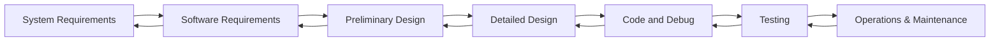
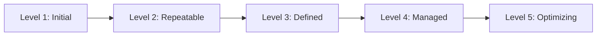
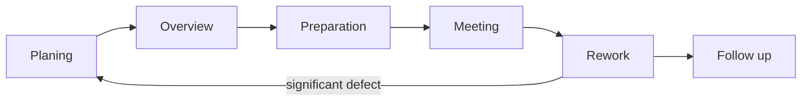

# CompTIA Security+ Exam (SY0-501): Architecture and Design

This domain accounts for 15% of the questions on the real test. We'll be focusing on

- explaining use cases for frameworks, best practices, and secure configuration guides
- implementing secure network architectures
- implementing secure system designs
- developing and deploying software in a secure manner
- securing embedded systems
- using the Cloud and virtualization securely
- using resiliency and automation to reduce risk
- implementing physical security controls


## 1. Security Design

### 1.1 Legislative and regulatory compliance

#### Compliance Obligations

- Criminal law
- Civil law
- Administrative law
- Private regulations

##### Criminal Law

- Deter and punish acts detrimental to society

Criminal laws have one important characteristic that is not found in any other type of law. Violations of criminal law may be punishable by The Deprivation of Liberty such as a jail sentence or probation. 

##### Civil Law

- Resolve disputes

Civil laws cover almost any matter that is not addressed by criminal law, including liability claims, estate probate, contractual disputes and other matters. Civil laws do not provide for the possibility of jail time. The most common outcomes of a successful civil lawsuit are monetary damages or orders by the court that someone perform or refrain from an action. 

##### Administrative Law

- Facilitate effective government

These regulations often provide details missing from the law or provide procedural rules for the operation of government. For example, the Health Insurance Portability and Accountability Act, HIPAA, provides criminal and civil law governing the uses of health information, but doesn't go into great detail. The Centers for Medicare and Medicaid Services publishes security and privacy regulations that provide the specific requirements that covered entities must follow. At the federal level, administrative law is found in the Code of Federal Regulations, or CFR. 

##### Private Regulations

- Flow from contractual relationships

The most common example of a private regulation in the world of cyber security is the Payment Card Industry Data Security Standard (PCIDSS). PCIDSS was created by a consortium of companies without the involvement of a government agency. This consortium then included language in the contracts for those accepting and processing credit cards that requires compliance with PCIDSS.

#### Fourth Amendment 

> The right of the people to be secure in their persons, houses, papers, and effects, against unreasonable searches and seizures, shall not be violated, and no warrants shall issue, but upon probable cause, supported by oath or affirmation, and particularly describing the place to be searched, and the persons or things to be seized

The Fourth Amendment comes into play any time a government agents, including law enforcement officers, wish to collect private information from computing systems without the owners consent. If they do this without a warrant, they run the risk of the evidence being inadmissible in court. 

**Federal Information Security Management Act (FISMA)**

A law that governs information security matters for federal agencies and government contractors. It requires the creation of security programs throughout the federal government and provides details on the controls necessary to run information systems that are categorized as FISMA High, FISMA Moderate, or FISMA Low.


### 1.2 Frameworks and reference architectures

#### Security Framework

- A collection of standards and practices designed to form a solid approach to information security

#### Reference Architectures

- A description of the **specific** controls that would achieve an organization's security objectives

Security frameworks are high level, and they're often focused on activities such as identifying risks and responding to attacks. Reference architectures get more into the technical details. Describing the specific controls and the technical components of a security program and how those components fit together to meet control objectives. 

#### NIST Cybersecurity Framework

- Provides a common language for cybersecurity risk
- Helps identify and prioritize actions
- Aligns security actions across control types
- Offers different value to different organizations

https://www.nist.gov/cyberframework

**Reference architectures dive deeper into the <font color=red>how</font> of cybersecurity.**


**Frameworks and reference architectures represent the collective wisdom of the cybersecurity community.**


### 1.3 Developing security baselines

**Baseline security standards describe minimum requirements.**

#### Baseline Security: Standard Elements

- Administered by a named individual
- Protected against unauthorized access
- Doesn't jeopardize other systems or data
- Remains under positive control
- Complies with data security requirements

#### Baseline Are Generic

- They cover an uncertain future

**Baselines may include specific requirements for handling different categories of information.**

#### Specific Security Standards

- Operating systems
- Mobile devices
- Network infrastructure components
- Appliances

**System configuration managers automate policy deployment.**

#### Monitoring is Critical

- Watcher for baseline deviations


### 1.4 Leveraging industry standards

#### Sources of Security Standards

- Vendors
- Government agencies (e.g. NIST)
- Independent organizations (e.g. CIS)

**Industry standards provide an excellent starting point.**


### 1.5 Customizing security standards

**Scope and tailor standards to meet organization-specific requirements.**

For example, 

> Use strong encryption to protect stored data
>
> Encrypt disk using AES encryption with ~~128-bit, 192-bit,~~ 256-bit keys

an industry standard might suggest using full disc encryption to protect stored data on an endpoint and suggest the use of AES encryption with a 128, 192 or 256-bit key. The organization, however, might be under a more stringent compliance requirement that mandates the use of 256-bit keys and specifically prohibits the use of 128 or 192-bit keys. In this case the organization might use the benchmark standard but modify it to require the use of a 256-bit key, removing the options to use a 128 or 198-bit alternative. 

The easiest way to document these changes is to write a security standard that references another standard. For example,

> Windows Server 2012 R2 systems should be configured to the CIS Benchmark dated 4/28/2016, with the following exceptions...
>
> 1. Change Requirement: 1.1.2 to a 180-day password expiration
> 2. Change Requirement: 1.2.2 to a threshold of five logins

**Document the reasons for any deviations.**

**More stringent settings may be required based upon data sensitivity or system criticality.**


### 1.6 Defense in depth

**Defense in Depth** Organizations should use multiple, overlapping security controls to achieve each of their security objectives.

This is a layered approach to security and protects against the failure of any single security control. 

#### Defense in Depth: Eavesdropping

- Encryption through virtual private networks
- Encryption at the application layer
- Segmentation with VLANs

#### Defense in Depth: Access Control

- Network access control
- Role-appropriate VLANs (802.1x )
- MAC filtering
- Port security

#### Defense in Depth: Perimeter


#### ! EXAM TIPS

Keep the defense in depth principle front of mind during the Security+ exam!


### 1.7 Control diversity

**Diversity among our team members helps build stronger teams, with a wide range of experiences.**

#### Diversity in Cybersecurity

- Control type diversity
- Vendor diversity

#### Control Type Diversity

##### Technical

- Dat loss prevention
- Monitoring
- Content filtering

##### Administrative

- Background checks
- Nondisclosure agreements
- Training

##### Physical

- Security guards
- Random inspections
- Cameras

#### Vendor Diversity 

- Reduces susceptibility to vulnerabilities
- Using different firewall brands at different control points is an example of vendor diversity


### Chapter Quiz

1. Organizations often customize industry security standards to meet their specific security and business requirements.

   A. TRUE

   B. FALSE

2. Security baselines often require hundreds or thousands of individual security settings on a particular device.

   A. TRUE

   B. FALSE

3. The Payment Card Industry Data Security Standard (PCI DSS) is an example of what type of regulation?

   A. criminal law

   B. civil law

   C. administrative law

   D. private regulation

4. What U.S. federal government agency publishes security standards that are widely used throughout the government and private industry?

   A. FTC

   B. NIST

   C. CIA

   D. FCC

5. Which of the following controls would not constitute defense-in-depth for network access control?

   A. IDS

   B. 802.1x

   C. MAC filtering

   D. NAC


Answers:

1. TRUE
2. <font color=red>TRUE</font>
3. private regulation
4. NIST
5. <font color=red>IDS</font>


## 2. User Training

### 2.1 Security Education

##### Security Training

- Provides users with the knowledge that need to protect the organization's security

##### Security Awareness

- Keeps the lessons learned during security training top of mind for employees

#### Security Training Methods

- Instruction in on-site classes
- Integration with orientations
- Education through online providers
- Participation in vendor provided classroom training

**Customize training based upon user roles**

#### Training Frequency

- Initial training for new employees
- Update training for employees with new roles
- Refresher training on an annual basis
- Awareness efforts throughout the year

**Review training materials regularly to ensure relevance.**


### 2.2 Information classification

**Data Classification Policies** Assign information into categories, known as classifications, that determine storage, handling, and access requirements

#### Assign Classifications Based Upon

- Sensitivity of information
- Criticality of information

Classification schemes vary but all basically try to group information into high, medium and low sensitivity levels and differentiate between public and private information. 

#### Classification Levels

| Military Classification | Business Classification |
| ----------------------- | ----------------------- |
| Top Secret              | Highly Sensitive        |
| Secret                  | Sensitive               |
| Confidential            | Internal                |
| Unclassified            | Public                  |

**Classification guides other security decisions.**

For example a company might require the use of strong encryption to protect sensitive and highly sensitive information. Both at rest and in motion.

#### Labeling Requirements

- Identify sensitive information

**Securely dispose of information when no longer needed.**

These include software applications such as Darik's Boot and Nuke otherwise known as DBAN and hardware tools such as magnetic degaussers and device shredders. 

Information classification gives employees a consistent way to identify, label, handle and dispose of sensitive information.


### 2.3 Compliance training

**Compliance Programs** Ensure that an organization's information security controls are consistent with the laws, regulations, and standards that govern the organization's activities

**Include compliance obligations in security training**

#### Compliance Obligations

- Laws (GLBA, Gramm-Leach-Bliley Act)
- Regulations (HIPAA)
-  Standards (PCIDSS, Payment Card Industry Data Security Standard)

Standards are detailed technical specifications for security and other controls. 

**Begin compliance efforts with a gap analysis.**


### 2.4 User habits

- Include secure password practices in security education programs
- Clean desk policies and other data handling practices boost security
- Physical security training should include discussions of the dangers of tailgating
- Include BYOD policies in security training efforts
- Cover appropriate use of social media and peer-to-peer networks in security education


### 2.5 User-based threats

- Phishing uses spoofed messages to obtain information and convince users to perform risky actions
- Social engineering isn't limited to email. It can occur over the phone or in person as well
- New threats arise *every day*


### 2.6 Measuring security education

#### Simulated Phishing

- Directly measures user awareness

#### Security Awareness Surveys

- How well does the organization prepare you to deal with security threats
- Do you know your information security responsibilities?
- Do you know where to report a security incident?

**Measure how awareness changes over time**

**Change tactics based upon survey results**


### Chapter Quiz

1. Which one of the following is not an example of security education?

   A. online education

   B. classroom instruction

   C. briefings at team meetings

   D. reminder posters in the hallway

2. Which one of the following is the lowest level of classification in the government's classification scheme?

   A. secret

   B. confidential

   C. public

   D. top secret

3. Which one of the following regulatory schemes applies to healthcare providers in the United States?

   A. GLBA

   B. HIPAA

   C. PCI DSS

   D. FERPA

4. What is the name of the practice where a user holds a door open for the individual following them into a building?

   A. should surfing

   B. smurfing

   C. tailgating

   D. politeness

5. What type of social engineering attack targets end users via email messages?

   A. shoulder surfing

   B. vishing

   C. phishing

   D. pharming


Answers:

1. <font color=red>reminder posters in the hallway</font>
2. <font color=red>confidential</font>
3. HIPAA
4. tailgating
5. phishing


## 3. Secure Network Design

### 3.1 Security Zones

#### Network Border Firewall

- Internet Zone
- Intranet Zone
- DMZ Zone


#### Extranets

- Intranet segments extended to business partners

#### Honey nets

- Decoy networks designed to attract attackers

#### Ad Hoc Networks

- Temporary networks that may bypass security controls

Ad hoc networks may present a security risk especially if they are inter connected with other networks that lack strong security controls. For example, an employee who sets up a wireless point without using encryption and then connects it to the intranet, may inadvertently expose sensitive information to eavesdropping and create a potential path for an attacker to enter the organizations network. 


### 3.2 Public and private addressing

#### Public IP Addresses

- Assigned by a central authority and are routable over the Internet
- **I**nternet **C**orporation for **A**ssigned **N**ames and **N**umbers (ICANN)
- ICANN distributes large blocks of addresses to regional authorities for distribution
  - ARIN: US and Canada
  - LACNIC: Latin American and Caribbean regions
  - AfriNIC: Africa
  - RIPE NCC: Europe, West Asia, and the former USSR
  - APNIC: Asia-Pacific

##### IP Addresses Scarce

- No large blocks available

There are no large blocks of IPv4 addresses available for assignment today, and the only way to get these public IP addresses is by purchasing or renting them from other organizations, such as ISP.

##### Historic Free Use of Public IPs


- IPv4 allows for 4.3 billion possible addresses
- But there are currently at least 7.5 billion mobile devices in the world (not including include servers, desktop computers, network appliances, or any non-mobile devices)

#### Private IP Addresses

- Available for anyone's use but not routable over the Internet

##### Private IP Address Ranges

- 10.0.0.1-10.255.255.255
- 172.16.0.1-172.31.255.255
- 192.168.0.1-192.168.255.255

**Private IP Addresses Are not Internet Routable!**

#### Organizations Mix

- Public and private addresses

They use private addresses broadly within their private networks, assigning them to all of their internal systems. They then use a small number of public IP addresses for systems that require public access.


Systems that have private IP addresses cannot communicate on the internet using those addresses because they are not internet routable. Thousands of organizations around the world use those same private addresses on their own internal networks, so remote systems would have no way of telling where reply traffic should actually go. 

#### Network Address Translation

- Translates private IP addresses


#### NAT AND Security

- Hides internal addresses from Internet systems
- Limit direct access to systems
- Makes it difficult to identify the true origin of traffic

For this reason, most organizations maintain logs of their NAT translations that allow them to determine who was using a particular public IP address at any given time.

**NAT requires a large pool of public IP addresses.**

Since most organizations have a limited pool of public addresses, they can quickly run into a situation where that pool is exhausted and no new systems can communicate on the internet. 

#### Port Address Translation (PAT)

- Allows multiple systems to share the same public address
- Assigns unique ports to each communication

Instead of recording translations between IP addresses, PAT assigns each connection a different port on a public IP address. This way, many different systems can share the same public IP address at any point in time.


### 3.3 Subnetting

**Subnetting** Subdivides large networks

#### Subnets


Network Address | Host Address

192.168|1.100 -> single network with over 165,000 possible host addresses

192.168.1 | 100 -> 256 possible subnetworks with 254 possible hosts each


On our network diagram, we can now give the accounting group, the 192 168.1 address space, the sales group, the 192 168.2 subnetwork, and then assign the 192 168.3 subnetwork to the IT group, leaving the remaining 253 subnets for future uses. Each of those subnetworks can have up to 254 systems connected to it. 

#### Subnet Masks

- Identify the dividing line between network and host addresses


##### Subnet Mask Notion

- IP addresses: 192.168.1.100
- Subnet mask: 255.255.255.0

##### Slash Notation

- 192.168.1.0/24


### 3.4 VLANs and network segmentation

#### Virtual LANs

- Separate systems on a network into logical groups based upon function, regardless of physical location


When users from different departments are mingled together and those departments are spread across multiple buildings. That's where virtual LANs come into play. We can use them to connect people who are on different parts of the network to each other and also to separate them from other users who might actually be geographically close to them. 

**VLANs extend the broadcast domain.**

This means that users on the same VLAN will be able to directly contact each other as if they were connected to the same switch. All of this happens at layer two of the network stack without involving routers or firewalls. 

#### Configuring VLANs

- Enable VLAN trunking (This allows switches in different locations on the network to carry the same VLANs)
- Assign switchports to VLANS


### 3.5 Security device placement

#### Network Border Firewall


In this example the firewall sits at the network border, separating an internal network and the DMZ from the internet. There could easily be additional firewalls on the internal network. 


For example we might place a firewall here to enforce separation between the endpoint network, wireless network, guest network, and data center network. 

#### Network Traffic Collectors

- Intrusion detection and prevention sensors
- Network taps
- Port mirrors

##### Sensor Placement

For example if you place an intrusion detection system sensor in the DMZ, it will be unable to collect traffic that exists only on the internal network. 

If you place a sensor on the internal network, it won't be able to see traffic that passes between systems on the internet and those in the DMZ.

If you place a sensor outside the firewall on the internet, it won't see traffic between internal systems. 

So if you want full coverage of the networks connected to this firewall, you'd need to put sensors on all three networks. As you design network sensors, you'll need to understand your organizations network design. For example here's a common.

**Aggregation (or distribution) switches connect downstream access switches to each other.**


Here's a common design that uses an aggregation switch to pull together network traffic from the access switches that are deeper in the network, and those are the ones that are actually connected to user devices. 

Span ports on switches provide a copy of all traffic that crosses the switch, and these are very useful for many security applications. However depending upon your design, you may not see the traffic that you would expect. For example, if you place a span port on this switch, you will only see traffic to, from or between any of the systems on that switch. That probably makes sense. However, if you place a span port on the aggregation switch, you won't necessarily see all of the traffic from the four switches beneath it. If two systems connected to the same switch communicate with each other, the edge switch at the access layer handles that traffic without passing it up to the aggregation switch. 

#### Security Information and Event Management

- Gather information using collectors
- Analyze information with a centralized correlation engine
- Place collectors near the systems generating records
- Place the correlation engine in a secure location

**Proxy servers and content filters typically belong in the DMZ.**

The location of these systems may vary depending upon your specific architectural design, but it's often good practice to place them in the DMZ network. This is especially true for proxy servers, because they have to initiate connections to the outside world. Using a DMZ based proxy limits the amount of outbound network traffic from the internal network, placing an added layer of isolation around that sensitive network. 

#### VPN Concentrators

- Aggregate remote user connections
- Often reside in their own VLAN, where access controls may restrict remote user activity
- Sophisticated designs may use multiple VLANs for different user roles

#### SSL Accelerators

- Handle the difficult cryptographic  work of setting up TLS connections

#### Load Balancers

- Distribute connection requests among multiple servers

**SSL accelerators and load balancers belong in the DMZ.**

#### DDoS Mitigation Tools

- Belong as close to the internet as possible

**Purchasing DDoS mitigation services from your ISP is an ideal approach.**

So that the attacks can be blocked before they even reach your network. 


### 3.6 Software-defined networking (SDN)

**Reconfiguring traditional networks requires reconfiguring devices.**

#### Network Functions

##### 1 Control Plane

- Responsible for making routing and switching decisions

##### 2 Data plane

- Responsible for carrying out the instructions of the control plane

**SDN separates the control plane from the data plane.**

Instead of each router and switch making independent decisions about how to route packets, these decisions come from an SDN controller. The SDN controller is where network administrators and algorithms make decisions about network routing, and then the controller reaches out to each device on the network and programs it to carry out those instructions properly. 

The SDN controller implements the control plane of the network, while the routers and switches accept instructions from that control plane to carry out the data plane function. 

**SDN makes the network programmable.**

#### SDN Security Benefits

- Allows granular network configuration

In many organizations, network administrators typically balk at routing VLANs across networks of different buildings because of the difficulty of configuring those VLANs. However, with SDN, this becomes quite easy, and allows the use of strong network-segmentation practices. 

- Facilitates faster response to security incidents

For example, if the network comes under a DoS attack from a misconfigured host, security tools can automatically reach out, and disable the network switch port belonging to that host, and place the host in a quarantine zone, where it has very limited network access. 

**SDN increases network complexity.**

It requires the use of strong access controls. You wouldn't want a malicious individual gaining access to your network control plane and using SDN to conduct eavesdropping or impersonation attacks.


#### 3.7 Port isolation

Particularly useful when users of the network do not trust each other and are not trusted themselves. 

#### ! EXAM TIPS

Port isolation and private VLANs are the same thing.

**Port isolation restricts traffic from a source port to a single destination port.**

#### Why User Port Isolation

- Prevents devices on the same switch from communicating with each other
- Blocks data-link-layer attacks, such as ARP spoofing

**Port isolation typically isn't effective on a corporate network.**

**Port isolation works very well on hotel guest room networks.**


### Chapter Quiz

1. Which one of the following is a public IP address?

   A. 172.18.144.144

   B. 10.194.99.16

   C. 142.19.15.4

   D. 192.168.14.129

2. How would a network technician write the subnet mask 255.255.0.0 in slash notation?

   A. /32

   B. /24

   C. /16

   D. /8

3. Which one of the following devices carries VLANs on a network?

   A. hub

   B. switch

   C. router

   D. firewall


Answers:

1. <font color=red>142.19.15.4</font>

2. /16

3. switch


## 4. Secure System Design

### 4.1 Operating system types

#### Workstation OS

- Power laptop and desktop computers
- Typically Windows or macOS
- Some Linux distributions

#### Server OS

- Designed for special-purpose computers that provide services to others
- Windows Server OS
- Linux

#### Mobile OS

- Designed for smartphones and tablets
- iOS
- Android
- Windows Mobile

#### Kiosk Computers

- Devices placed inside of specialized furniture and with limited functionality
- Operating system depends upon hardware

#### Kiosk Security

- Kiosk devices require the same type of security controls that you would deploy for their fully functioning counterparts
- You must also verify that the technology limiting kiosk functionality works properly

#### Appliances

- Bundle together hardware and software to achieve a function
- Often run full operating systems
- Require vendor support for updates

Appliances are proliferating in enterprise data centers. These devices package together the hardware and software necessary to perform a function such as providing DNS services, performing searches, or carrying out security tasks such as the Qualys vulnerability scanning appliance shown here. Appliances run operating systems but the specific operating system run by an appliance may not be readily apparent to the end user. Administrators at the end user organization typically do not have access to the underlying operating system. When it comes to securing appliances, you'll typically need to depend upon the vendor to provide any necessary security updates. 

#### Network Devices

- Run special-purpose network operating systems
- Cisco IOS
- Juniper Junos OS


### 4.2 Data encryption

#### Encryption Protects Data

- Using algorithms and secret keys

#### Most Encryption Uses Software

For example, in Linux we could

```bash
aescrypt -e AES.html
aescrypt -d AES.html.aes
```

#### Full Disk Encryption

- Protects an Entire Hard Drive

This is an important protection against the loss of an entire computer system. If an employee loses a laptop, someone who finds it can easily bypass the operating system access controls by placing the hard drive in another computer system. If the drive is encrypted, this is not possible. It's easy to perform full disc encryption on almost any modern operating system. 

#### Database Encryption 

- Protects the Contents of Databases from Attack.

#### Hardware Encryption 

- Is More Efficient than Software Encryption

##### Hardware Security Modules (HSM) 

- Use Dedicated Hardware for Encryption, Decryption, and Key Management**

##### Trusted Platform Modules (TPMs) 

- bring hardware encryption to typical computers

**Some Hard Drives and USB Devices Have Built-In Encryption Technology**


### 4.3 Hardware and firmware security

Some attacks may target the very basic building blocks of the computing system that work before the operating system even loads. 

**Operating systems must be loaded from disk during the boot process.**

#### Basic Input/Output System (BIOS)

- Lightweight operating system stored in firmware that provides the basic functionality necessary to load the full operating system from disk

**BIOS attacks may give a malicious individual full control of a device.**

That's a really dangerous attack, and its one of the reasons that BIOS is now used very rarely. Instead, computer manufacturers have replaced BIOS with UEFI. 

#### Unified Extensible Firmware Interface (UEFI)

- Replaces BIOS with a flexible alternative

##### Secure Boot

1. Read the boot loader from disk
2. Compute the hash of the boot loader
3. Decrypt the boot loader's digital signature
4. Verify that the signature is accurate

Secure Boot technology ensures that the operating system being loaded by UEFI is a genuine operating system from a trusted manufacturer.

**Booting stops abruptly if the boot loader's digital signature fails verification**

**Remote attestation sends a compliance report to an external server.**

If you dive even deeper into the security rabbit hole, you next might ask yourself how you can be sure that the UEFI firmware wasn't tampered with. That's where Root of Trust comes into play. 

#### Hardware Root of Trust

- Verifies firmware integrity

The Root of Trust stores the keys used to validate the UEFI firmware and hardware and verifies that the UEFI is intact and unaltered before the boot process begins.

**Together, the hardware root of trust, UEFI, TPM, and Secure Boot provide trusted computing.**

#### Electromagnetic Interference (EMI)

- Electromagnetic waves, normally generated unintentionally, that cause disruption to nearby electronic equipment

Copper shielding may be used to minimize Electromagnetic Interference but is typically pretty difficult to work with.

- Electromagnetic pulses (EMPs) are extreme bursts of EMI
- They may be generated by a nuclear explosion


### 4.4 Peripheral security

Peripherals are the supplementary computing devices that help us use our laptops, desktops, smartphones, and tablets more effectively. We use keyboards, mice, memory cards, printers, and other peripherals to help us share information, work efficiently, and produce output. 

- Many wireless devices use the same Wi-Fi and Bluetooth protocols used by other computing systems - and must be secured in the same way
- Removable storage devices create the risk of data theft by trusted insiders
- Some storage cards create their own wireless networks (e.g. Wi-Fi-enabled microSD cards for digital cameras)
- Modern printers contain fully functioning computers

#### Printer Security Practices

1. Patch the operating system
2. Secure the printer's webserver
3. Encrypt print traffic (e.g. TLS)
4. Securely wipe printer hard drives


### 4.5 IT automation

- In  a legacy approach to IT, servers are handcrafted artisanal products
- Automation uses scripts to create servers, treating infrastructure as code

#### Start with a Master Image

- Customize with templates and script commands

#### Benefits of Automating Server Builds

- Consistency: Remove the human element
- Elasticity: Facilitate adding additional servers
- Load balancing: Add and remove servers as needed
- Scalability: Modify server configurations easily
- Resiliency: Rebuild servers from the original script

#### ! EXAM TIPS

CompTIA uses the term *distributive allocation* to refer to load balancing.

**Automation can validate system configurations against standards.**

**Continuous monitoring can leverage automation for both analysis and response to events.**

For example, if an intrusion detection system detects an external system conducting a Port Scan, it can create a rule on an upstream firewall to block all network traffic from that device for 24 hours. 


### 4.6 Non-persistence

As IT organizations increasingly adopt Infrastructure as Code approaches to managing data centers, they are moving towards nonpersistence systems. 

**Nonpersistence** Design for failure

The idea is that whenever you put together an IT architecture, that architecture should expect that individual components may fail and be able to work around that failure either by using redundancy or by automatically rebuilding the failed component.

#### Nonpersistent Technologies

- Automated server builds
- System snapshots
- Reversion to a known state
- Live boot media

Live boot media: the storage is separated from the physical computing hardware. Users carry around a USB drive that contains an entire operating system and use it to boot their hardware device. 


### Chapter Quiz

1. Network appliances do not often run standard operating systems.

   A. TRUE

   B. FALSE

2. What hardware technology may be embedded in a laptop computer to protect encrypted hard drives from removal?

   A. TPM

   B. TLS

   C. SSL

   D. USB


Answers:

1. <font color=red>FALSE</font>
2. TPM


## 5. Secure Staging and Deployment

### 5.1 Software staging and release

#### Deploying Code with Process

- Surprises end users
- Introduces security flaws, intentionally or accidentally
- Causes operational disruptions
- Increases the difficulty of rolling back flawed code

#### Development Environment

- Allows developers to create and modify code

#### Testing Environment

- Facilitates human and automated testing

#### Staging Environment

- Prepares code for release to production

#### Production Environment

- Provides live services to end users

#### Sensitive Data

- Should be prohibited or tightly controlled in non-production environments

#### Code Deployment

- Should be performed by someone other than a developer, particularly in production


### 5.2 Software risk assessment and mitigation

**Risk analysis identifies issues.**

**Risk mitigation reduces their likelihood and impact;**

**Many practices combine to produce secure software.**

#### Integrate Security with the SDLC

- Avoid bolt-on security!

**Understand software security threat!**

This includes having a detailed understanding of SQL injection, cross site scripting, cross site request forgery, buffer overflows, and various other potential flaws we've discussed in these courses.

#### Mitigate Software Risks

- Perform input validation
- Encrypt sensitive data
- Enforce the least privilege principle
- Test all code prior to deployment

#### Sandboxing

- Isolates development code


### 5.3 Secure baselines and integrity

#### Baselines

- Provide a snapshot in time

For example, in the case of computer systems, that snapshot might be of operating system settings, installed applications and the current code base. The purpose of a baseline is to provide a reference point from which to measure changes in the measured object's attributes, know as deviations from the baseline.

#### Deviations

- Are changes from baseline

#### Development Baselines

- Track code changes made by developers during the software development process

#### Integrity Measurement

- Track changes made to code after deployment, noting unexpected changes


### Chapter Quiz

1. _____ are development and testing environments where programmers can work with code to modify and test it without having access to any production resources.

   A. Honeypots

   B. Quarantines

   C. Sandboxes

   D. VLANS


Answers:

1. Sandboxes


## 6. Embedded System Security

### 6.1 Industrial control systems

**Industrial Control Systems (ICS) monitor and control industrial processes.**

#### ICS Are Hacker Targets

- Attacks have dramatic implications.
- Systems are often not well secured.
- Systems are less likely to be current on patches

In fact, some ICS systems manufacturers advise their customers to not update the control systems and sensor devices. This makes protecting SCADA and DCS systems an even greater challenge, requiring additional planning to overcome. 

#### ICS Types

- Supervisory control and data acquisition (SCADA)
- Distributed control systems (DCS)
- Programmable logic controllers (PLC)

##### SCADA

- Remote monitoring
- Remote telemetry
- Report back to control systems
- Multiple points of attack


e.g. natural gas pipelines, power production and distribution infrastructure, and water supply control systems.

Attacks against SCADA systems can target the feedback provided to the central control system or can cause the local sensor and control unit to perform an incorrect action.

##### DCS

- Focus on controlling processes
- Use sensors and feedback systems
- Have multiple points of attack


Frequently used to control water, and wastewater treatment and distribution systems, power generation plants, refineries and production lines, and facilities like those that make cars, electronics, and even food products throughout the world. 

Much like SCADA systems, an attack against a DCS system could be as simple as providing incorrect feedback, resulting in a shut-down, overproduction, or delay in the system at a critical time. 

##### PLC

- Handle specialized input and output
- Ensure uninterrupted processing
- Connect to a Human Machine Interface (HMI)


They are typically designed to handle difficult environments with special temperature, vibration, or other requirements while still functioning. Typical PLCs don't have a monitor or other interface beyond buttons or lights built into them. PLCs are commonly used in both SCADA and DCS systems. 


### 6.3 Securing smart devices

**"Smart" technology is everywhere!**

**Smart Devices Are Computer Controlled and Network Connected**

#### ! EXAM TIPS

The Security+ exam uses the term *embedded systems* to refer to smart devices

- Smart devices began with a desire for wireless network connectivity.

- Smart cars have in-vehicle connectivity.
- Wearable devices monitor our fitness and health
- The IoT changes the way we live and work.

#### Security Challenges

- Use difficult-to-update software and underlying OS
- Connect to home and office wireless networks

If a smart device is compromised, it can be a gateway to the rest of our network.

- Connect back to cloud services for command and control

Creates potential pathway onto our network for external attackers that bypasses the firewall. 


### 6.4 Secure networking for smart devices

**Smart Devices Require Regular Updates!**

Failing to patch them regularly can result in a serious risk of compromise, not only of your smart device but of your entire network. 

#### Automatic Updates

- Install without the user's knowledge or intervention when published by the device manufacturer

#### Manual Updates

- Require that the user check for updates and manually download and install them when available

#### Firmware Version Control

- Updates applied in orderly fashion

In very sensitive environments, such as industrial control systems, you should go a step farther and institute a formal Firmware Version Control system that ensures that the appropriate firmware versions are installed on all of your system components. Updates to that firmware should only happen under the auspices of a formal change management process that evaluates risk and manages the rollout process.

#### Security Wrappers

- Vets requests for embedded systems

In some cases it's not possible to patch known vulnerabilities. Organizations that must run vulnerable systems may turn to Security Wrappers as an alternative approach. In this approach, the device is not directly accessible over the network, but instead is reached through a wrapper system that monitors input and output for security issues and only passes through vetted requests from network systems (like a mini firewall).

**Use Diverse and Redundant Security Controls to Protect Embedded Devices.**


### 6.5 Embedded systems

#### Network Segmentation

- Separates untrusted devices

Network segmentation simply places untrusted devices on a network of their own, where they have no access to trusted systems.


**Segmenting embedded devices increases network security.**

If it looks like a firewall DMZ and it's the same concept. Placing embedded systems in an isolated DMZ allows them to access each other and the internet, but also allows you to strictly control that access, as well as limit the access those devices have to other systems on your network. 

#### ! EXAM TIPS

Network segmentation is the most important control for embedded devices.

**Application Firewalls Add Protection for Embedded Devices.**

Particularly if those systems are accessible by untrusted individuals. Embedded systems that have web interfaces are susceptible to many of the same web application attacks that we find on more complex systems. They can be vulnerable to SQL injection, buffer overflows, and cross-site scripting attacks. Application firewalls when placed in front of embedded systems, monitor inbound traffic for signs of malicious activity, and when they detect this type of hostile traffic, they can block it before it reaches a potentially vulnerable embedded device. 

#### ! EXAM TIPS

Embedded device security controls are effective for mainframes as well.

### 6.6 Embedded systems

- Printers and multifunction devices contain embedded systems.
- Cameras also use embedded systems for image processing and network connectivity.
- Self-driving cars
- Other vehicles
- Aircraft

#### ! EXAM TIPS

Know that system on a chip (SoC) and real-time operating system (RTOS) technologies power IoT

#### SoC

- A system on a chip (SoC) combines processing, memory, networking, and other embedded system components on a single chip

#### RTOS

- Real-time operating systems (RTOS) provide reliable and secure computing for IoT devices

The real-time operating system is designed to provide resources to the highest priority tasks as they occur. This is critical for IoT systems that drive high-value processes or affect human safety.


### Chapter Quiz

1. What type of system is used to gather information from remote sensors via telemetry?

   A. DSP

   B. SCADA

   C. PLC

   D. DCS

2. What term does the Security+ exam use for smart devices?

   A. legacy systems

   B. network systems

   C. cloud systems

   D. embedded system

3. What technology can you use as a compensating control when it's not possible to patch an embedded system?

   A. IDS

   B. SIEM

   D. log analysis

   C. wrappers

4. What is the most important control to apply to smart devices?

   A. network segmentation

   B. application firewalls

   C. wrappers

   D. intrusion detection


Answers:

1. SCADA
2. embedded systems
3. wrappers
4. **network segmentation**


## 7. Software Development Security

### 7.1 Development methodologies

**Begin with business requirements and translate them into design**

**Quality software requires a quality design**

#### Waterfall Model



- The waterfall process is very rigid

For example, if a business unit identifies a desirable new feature halfway through the coding process, there's no opportunity to modify the design. 

#### Spiral Model


They begin in the first phase and then move through each of the phases multiple times until they have a satisfactory finished product. 

#### Agile Model

4 Core Values:

- **Individuals and interactions** over processes and tools
- **Working software** over comprehensive documentation
- **Customer collaboration** over contract negotiation
- **Responding to change** over follow a plan

12 Principles:

- Our highest priority is to satisfy the customer through early and continuous delivery of valuable software.

- Welcome changing requirements, even late in development. Agile processes harness change for the customer's competitive advantage.
- Deliver working software frequently, from a couple of weeks to a couple of months, with a preference to the shorter timescale.
- Business people and developers must work together daily throughout the project.
- Build projects around motivated individuals. Give them the environment and support they need, and trust them to get the job done. 
- The most efficient and effective method of conveying information to and within a development team is face-to-face conversation.
- Working software is the primary measure of progress.
- Agile processes promote sustainable development. The sponsors, developers, and users should be able to maintain a constant pace indefinitely.
- Continuous attention to technical excellence and good design enhances agility. 
- Simplicity--the art of maximizing the amount of work not done--is essential.
- The best architectures, requirements, and designs emerge from self-organizing teams.
- At regular intervals, the team reflects on how to become more effective, then tunes and adjusts its behavior accordingly.

https://agilemanifesto.org/


### 7.2 Maturity models

#### SW CMM

- The Software Capability Maturity Model (SW CMM) assess an organization's software development practices



##### Level 1: Initial

- Disorganized approach to software development

##### Level 2: Repeatable

- Requirements management
- Software project planning
- Software project tracking and oversight
- Subcontract management
- Quality assurance
- Configuration management

##### Level 3: Definition

- Organization process focus
- Process definition
- Training programs
- Integrated management
- Software engineering
- Intergroup coordination
- Peer review

##### Level 4: Managed

- Quantitative process management
- Software quality management

##### Level 5: Optimizing

- Defect prevention
- Technology change management
- Process change management

#### IDEAL Model

1. **I**nitiating
2. **D**iagnosing
3. **E**stablishing
4. **A**ction
5. **L**earning


###  7.3 Operation, maintenance, and change management

**Software development is never finished!**

#### Change Management

- Request control
- Change control
- Release control

**Request control manages, evaluates, and prioritizes inbound requests from customers.**

**Change control grants permission for developers to make changes to application code.**

**Release control moves the code from the development environment into production**


### 7.4 DevOps

#### Merging Two Words

- Development
- Operation

Developers are motivated to rapidly release code and meet those demands. IT operations staff are charged with maintaining the infrastructure and keeping the enterprise stable. They are often wary of change because change brings the possibility of instability. This makes them nervous when developers seek to rapidly deploy new code. 

#### DevOps Goals

- Build collaborative relationships
- Embrace automation
- Facilitate rapid release of code
- Provide a stable operating environment

**DevOps and Agile are related. Both seek continuous integration.**

#### Infrastructure as Code

- Scripts the creation of resources

Operations teams no longer manually configure servers and other infrastructure components by logging in and modifying their configurations directly. Instead, they write scripts that specify how to start with a baseline configuration image and then customize that image to meet the specific requirements of the situation. For example, an organization might have a standard baseline for a Linux system. When someone needs a new server they write a script that starts a server instance using the baseline configuration and then automatically configures it to meet the specific functional needs.

#### Infrastructure as Code: Advantages

Infrastructure as code separates server configuration from specific physical or virtual servers.

- Increases scalability of environment (If the organization needs more computing power, the code can create as many servers as necessary extremely rapidly.)
- Reduces use error
- Facilitates testing of new code

**DevOps facilitates security automation**


### 7.5 Code repositories

#### Code Repositories

- Store software source code files
- Coordinate changes among multiple developers
- Perform version control
- Promote code reuse

**Code repositories help to avoid dead code.**

Where code is in use in an organization, but nobody is responsible for the maintenance of that code, and in fact, nobody may even know where the original source files reside.

#### Git

**Public code repositories create potential disclosure issues.**

Source code repositories may be public or private. For example, GitHub is a cloud-based code repository that supports both public and private repositories. Security teams must be careful to ensure that developers use the correct type to avoid exposing sensitive code on the web. Even when developers do intend to release code publicly, they must be careful to remove sensitive information from that code before publishing it.


### 7.6 Third-party code

#### Libraries

- Contain shared software code

For example, a software library might contain a series of functions related to biology research, financial analysis or social media. Instead of having to write the code to perform every detailed function that they need, developers can simply locate libraries that contain relevant functions and then call those functions. 

#### Software Development Kits (SDKs)

- Provide programming resources

Collections of software libraries combined with documentation, examples, and other resources designed to help programmers get up and running quickly in an development environment. SDKs also often include specialized utilities designed to help developers design and test code. 

#### Application Programming Interfaces (APIs)

- Allow interaction with remote services

**Shared code creates shared security vulnerabilities.**

Security professionals should be familiar with the various ways that third party code is used in their organization as well as ways that their organization makes services available to others. It's fairly common for security flaws to arise in shared code making it extremely important to know these dependencies and remain vigilant about security updates. 


### 7.7 Code signing

**Digital signatures provide nonrepudiation.**

#### Code Signing

- Applies digital signatures to software

##### Signing Code

1. Developer obtains a digital certificate
2. Developer creates a digital signature for the code using the private key associated with the certificate

##### Verifying Code Signatures

1. User downloads software
2. Operating system uses the certificate's public key to validate the signature
3. OS verifies the signature's hash matches the code
4. OS verifies that the developer is trusted


### 7.8 Database security controls

#### Database Normal Forms

- Design rules for columns and  tables

#### Why Normalize?

- Prevent data inconsistency
- Prevent update anomalies
- Reduce the need for restructuring existing databases
- Make the database schema more informative

#### ! EXAM TIPS

You don't need to know the details of the normal forms on the exam (but you should know the general idea that normalization improves database design, and has security advantages.)

#### First Normal Form (1NF)

1. Create separate tables for different sets of related data
2. Provide a primary key for every table
3. Records may not have multivalued fields
4. Records in a table must have the same number of fields.

#### Second Normal Form (2NF)

1. The table must be in 1NF
2. Every non-key field must be a fact about the *entire* key

#### Third Normal Form (3NF)

1. The table must be in 2NF
2. No non-key field may be a fact about another non-key field

**Use encryption to protect sensitive data stored in a database.**

**Obfuscation and camouflage hide the locations of sensitive information.**

Security through obscurity isn't something you can rely upon, but it is good common sense not to name your database server credit card database or something like that. Use a little strategy in your naming conventions, and don't point attackers directly at your sensitive information. 

#### Store Procedures

- Protect against SQL injection

Store the text of a query on the database server and then allow applications to simply provide the arguments instead of the entire SQL command.


### 7.9 Software testing

#### Verification and Validation

##### 1. Software model validation

- Are we building the *right* software?

##### 2. Software model verification

- Are we building the *software* right?

#### Stress (Load) Testing

- Uses automated scripts to verify system capacity
- May be run internally or through a vendor
- Verifies the system can handle the maximum expected load
- Determines the maximum capacity of the system

#### User Acceptance Testing (UAT)

- Ensures software will work for users
- UAT is commonly referred to as "beta testing."

After releasing code, developers often make minor and major changes to that code to fix bugs discovered post-launch and to add new functionality to the system. Before releasing these modifications, they conduct regression testing.

#### Regression Testing

- Checks for unexpected side effects

The process of regression testing uses sets of inputs and provides them to both the original system and the modified code. Test packages then verify that the software behaves the same way both before and after the modification, except of course for any changes that were planned as part of the software modification. 


### 7.10 Code reviews

Application code is one of the most common sources of security vulnerabilities. Developers write millions of lines of code each year and there are thousands of security issues buried in the complexity of that code just waiting to be discovered. Code reviews are one of the most important software testing techniques.

#### Code Review

- Use peer analysis to assess code

#### Fagan Inspections



- Fagan inspections follow a formalized, six-step code review process
- The planning phase includes preparing materials, identifying participants, and scheduling the review
- The overview phase includes assigning roles to participants and providing an overview of the software
- During the preparation phase, participants independently examine the code for potential defects
- During the inspection meeting, reviewers discuss and formally identify any code defects
- During the rework phase, the code developers correct any defects identified during the inspection
- During the follow-up phase, the leader verifies that defects were resolved and completes project documentation

**Most organizations use a less formal review process.**


### 7.11 Code tests

#### Code Tests

- Use technology to inspect software

Use both code tests and code reviews on the same software to gain different perspectives on software quality and security.

#### Static Tests

- Use automated techniques to analyze code for errors and security flaws without actually executing it

#### Dynamic Tests

- Execute code verify that it is functioning correctly and doesn't have security flaws

This is the closest test to real-world operations and is a valuable step in preparing to move code to production

**Synthetic transactions supply inputs to code with known, expected outputs.**

Synthetic transactions are scripted sets of inputs and instructions that are given to code when the testers know what output the code should produce for each input. 

#### ! EXAM TIPS

Code reviews, static testing, and dynamic testing are complementary, rather than competitors!

Static tests often identify defects that weren't included in the synthetic transactions used by dynamic tests. Dynamic tests often identify defects in functionality that a static test can't foresee. And the trained eye of a skilled developer can pick out deficiencies that escaped all of these automated tests during a manual code review. 


### 7.13 Fuzz testing

#### Fuzzing

- Fuzzing is a software testing technique that feeds software many different input values in an attempt to cause unpredictable state or unauthorized access

#### Fuzz Testing Input Sources

- Developer-supplied input
- Developer-supplied script
- Generation fuzzing
- Mutation fuzzing

e.g. [OWASP Zed Proxy](https://www.zaproxy.org/)


#### Avoid Looking Like a Hack

- Only fuzz test with permission!


### 7.14 Code Execution

**Developers write source code in the programming language of their choice.**

#### Interpreted Code

- The computer executes the source code instructions as written by the developer
- R, Perl, PHP, and VBScript are all examples of interpreted languages

#### Compiled Code

- The developer runs a compiler to convert source code into an executable file written in machine language
- C, C++, Java, Julia, and Fortran are all examples of compiled languages


### Chapter Quiz

1. Static code testing software executes code to verify that it is functioning properly.

   A. TRUE

   B. FALSE

2. The main purpose of a code repository is to store the source files used in software development in a centralized location that allows for secure storage.

   A. TRUE

   B. FALSE

3. The DevOps model prioritizes development efforts over operational tasks.

   A. TRUE

   B. FALSE

4. What software development methodology uses four stages in an iterative process?

   A. DevOps

   B. Waterfall

   C. Agile

   D. Spiral

5. What phase of the capability maturity model introduces the reuse of code across projects?

   A. repeatable

   B. optimizing

   C. defined

   D. initial

6. What component of a change management program includes final testing that the software functions properly?

   A. request management

   B. iteration management

   C. release management

   D. change management

7. _____ consist of shared code objects that perform related functions.

   A. Libraries

   B. DLPs

   C. ETLs

   D. APIs

8. Developers wishing to sign their code must have a _____.

   A. shared secret key

   B. patent

   C. software license

   D. digital certificate

9. _____ is usually the final stage in code testing.

   A. Unit testing

   B. UAT

   C. Load testing

   D. Integration testing

10. What is the first step of a Fagan inspection?

    A. preparation

    B. planning

    C. overview

    D. meeting

11. What type of fuzz testing captures real software input and modifies it?

    A. twist fuzzing

    B. generation fuzzing

    C. mutation fuzzing

    D. switch fuzzing


Answers:

1. FALSE
2. TRUE
3. FALSE
4. <font color=red>Spiral</font>
5. repeatable
6. release management
7. Libraries
8. digital certificate
9. <font color=red>UAT</font>
10. planning
11. mutation fuzzing


## Reference

[1] https://www.linkedin.com/learning/comptia-security-plus-sy0-501-cert-prep-3-architecture-and-design/

[2] https://agilemanifesto.org/
