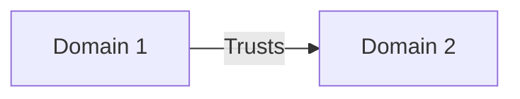
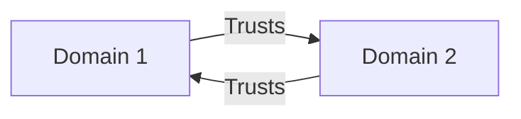
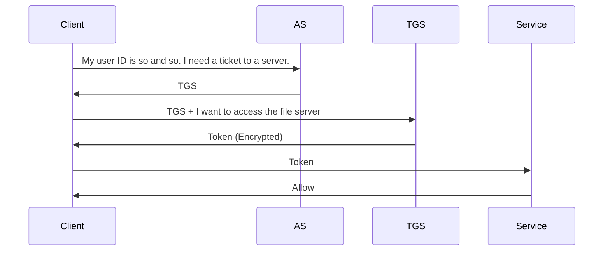

# CompTIA Security+ Exam (SY0-501): Identity and Access Management

This domain accounts for 16% of the questions on the real exam. We'll be focusing on:

- understanding common identity and access management concepts
- installing and configuring access and identity services
- implementing identity and access management controls
- using common account management processes

## 1. Identification

### 1.1 Identification, authentication, authorization, and accounting

#### Identification

An individual makes a claim about his or her identity. The person trying to gain access doesn't present any proof at this point. They simply make an assertion. 

#### Authentication

Proof comes into play during the authentication process. The individual proves his or her identity to the satisfaction of the access control system.

#### Authorization

Just proving your identity isn't enough to gain access to a system however. The access control system also needs to be satisfied that you are allowed to access the system. That's the third step of the access control process, authorization.

#### ! EXAM TIPS

Remember that identification and authentication are separate and distinct steps

#### Triple A

- **A**uthentication
- **A**uthorization
- **A**ccounting

In addition to these processes, access control systems also provide accounting functionality that allows administrators to track user activity and reconstruct it from logs at a later date. Together, the activities of authentication, authorization, and accounting are commonly described as Triple A.

### 1.2 Identification Mechanisms

#### Usernames

- Usually easily identify the individual
- Often consist of a first initial and last name
- Should not be considered secret

Remember, usernames are for identification, not authentication, so there's no need to keep them secret. Obvious usernames make everyone's lives easier.

#### Access Cards

- Often serve as proof of employment
- May perform both identification and authentication

##### Magnetic Stripe Cards

These magnetic stripes are easily duplicated with readily available equipment, so they should not be considered secure. Anyone who gains possession of a magnetic stripe card, or even knows how the card is encoded, can create a copy of that card. 

##### Smart Cards

Contain an integrated circuit chip that works with the card reader to prove the authenticity of the card. 

Some smart cards are read by directly inserting them into a card reader. Chip and pin credit cards use similar technology. 

Contactless smart cards, or proximity cards, simply need to be placed near the reader. An antenna in the card communicates with the reader. Some of these cards, known as **passive cards**, must be placed into or extremely close to the reader to work properly. They receive power from the reader that energizes the chip, so they last indefinitely. Other proximity cards, known as **active cards**, contain batteries and transmitters. They use these batteries and can then transmit over longer distances and be read from several feet away. Toll transponders use this technology. The **disadvantage to active cards** is that they contain batteries and must be replaced periodically. 

### 1.3 Biometrics

**Something You Are**

- Identification and Authentication

#### Good Biometric Systems Provide

- Easy enrollment
- Low false acceptance rates
- Lose false rejection rates
- Low intrusiveness

##### Fingerprint Scans

- Often found on computing devices
- Allow self-enrollment
- Low false rejection and acceptance rates

##### Eye Scans

- Analyze
  - Color pattern of iris
  - Blood vessel of retina
- Seen as highly intrusive by users

Not commonly used outside of high-security physical buildings.

##### Voiceprint Matching

- Requires user to speak a phrase
- Subject to reply attacks
- Often combined with other authentication techniques

##### Facial Recognition

- Scans user's facial structure
- Has a high “creepiness factor"
- Improving error rates

As authentication tools, biometrics are much harder to fool than passwords and other knowledge-based approaches.

### Chapter Quiz

1. During what phase of the access control process does a user prove his or her identity?

   A. identification

   B. authorization

   C. remediation

   D. authentication

2. Which one of the following access control cards is the easiest to duplicate without permission?

   A. active card

   B. proximity card

   C. smart card

   D. magnetic stripe card

3. What characteristic of biometrics measures the frequency at which legitimate users are denied access to a system or facility?

   A. intrusiveness factor

   B. false rejection rate

   C. false acceptance rate

   D. enrollment reliability

Answers:

1. authentication
2. magnetic stripe card
3. false rejection rate

## 2. Authentication

### 2.1 Authentication factors

#### Authentication Factors

1. Something you know
2. Something you have
3. Something you are

##### Something You Know

- Normally a password
- Strong passwords are long and complex
- Passphrases are better than passwords 

Chocolate-covered strawberries are for me! -> ChocolateCoveredStrawberriesR4Me!

##### Something You Are

- Biometric authentication
  - Fingerprints
  - Eye scans
  - Facial recognition
  - Voice prints

##### Something you have

- Requires physical possession of a device
  - Smartphone with authentication app
  - Authentication key fob

#### False Acceptance

- System misidentifies an individual as an authorized user.
- Measured by the false acceptance rate (FAR)

This is a very serious error because it allows unauthorized access to the system, device, information, or facility. 

#### False Rejection

- System fails to recognize an authorized user.
- Measured by the false rejection rate (FRR)

This is not as serious as a false acceptance because it does not jeopardize confidentiality or integrity, but it is still a serious error because it jeopardizes the availability of those resources to authorized users. 

**FAR and FRR are not good measures on their own.**

Because they may easily be manipulated. On one extreme, administrators may configure the system to simply admit nobody at all, giving it a perfect false acceptance rate, but also a very high false rejection rate. Similarly, if the system allows anyone access, it has a perfect false rejection rate, but an unacceptably high false acceptance rate. 

#### Crossover Error Rate (CER)

The solution to this measurement problem is to use a balanced measure of authentication strength called CER. The crossover error rate is the error frequency that occurs when administrators tune the system to have equal false acceptance and false rejection rates.

### 2.2 Multifactor authentication

#### Authentication Factors

1. Something you know
2. Something you have
3. Something you are
4. Somewhere you are (e.g. inside a secure building)
5. Something you do

**Authentication can be tricked!**

#### Multifactor Authentication

- It combines techniques from two or more of the authentication categories: something you know, something you have, something you are, somewhere you are, and something you do

#### Multifactor Examples

- Password (something you know) + Smart Card (something you have)
- Fingerprint (something you are) + PIN (something you know)

#### NOT Multifactor

- Password (something you know) + Security Question (something you know)

#### ! EXAM TIPS

Make sure examples of authentication techniques are *really* different factors!

### 2.3 Something you have

#### Physical and Soft Tokens

- Physical token is replaced by soft-token
- The codes provided on both hardware and software tokens are known as one-time passwords, or OTPs. 

#### Protocols for Generating Codes

##### HMAAC-based One-time Password algorithm (HOTP)

- Uses a shared secret and an incrementing counter to generate the code displayed on the token
- The code changes whenever the button is pushed, and the code is valid until it is used. 

##### Time-based One-Time Password algorithm (TOTP)

- Doesn't use counter
- Uses the time of day in conjunction with a shared secret instead
- The code changes constantly and is only valid until the token generates the next code. 
- The token and the authentication system must have synchronized clocks for TOTP to function correctly.
- Google Authenticator soft token uses TOTP.

#### Smart Cards

- Contain embedded microchips. 

When the user authenticates with a smart card, he or she inserts it in a special reader attached to the computer. The reader then verifies the information on the chip to verify the card's authenticity. 

### 2.4 Password Authentication Protocols

#### Password Authentication Protocols (PAP)

**Major Flaw**

PAP does not use any encryption to protect this communication. Anyone able to eavesdrop on the connection can read the username and password right off the network. For this reason, **PAP should not be used, except under circumstances where the transmission is encrypted by other means**. 

#### Challenge Handshake Authentication Protocol (CHAP)

- Secure alternative to PAP
- Authenticates the client without ever having to send the actual secret password over the network

**MS-CHAP and MS-CHAPv2 are insecure.**

### 2.5 Single sign-on and federation

#### Federated Identity Management

- Individuals may have accounts across multiple systems
- Federated identity management systems share identity information
- This reduces the number of individual identities a user must have

#### Single Sign-On (SSO)

- Authentication system that shares a single authentication session across multiple systems, avoiding asking users to log in multiple times

 If the organization sets the expiration period to the length of a business day, it means that users only need to logon once per day, and then their single sign-on will last the entire day. 

The higher education community has a significant need for federated identity management, because faculty and students often move between and work across institutions. A consortium of colleges and universities banded together to create an open source single sign-on system called **Shibboleth**. It is designed to work in federated situations. 

#### Trust Characteristics

- Direction (one way or two way)
- Transitivity (transitive or nontransitive)

##### One-Way Trust

- Domain 1 trusts Domain 2, but Domain 2 does not trust Domain 1

##### Two-Way Trust

- Domains 1 and 2 trust each other

##### Transitive Trust

- If Domains 1 and 2 trust each other, and Domains 2 and 3 trust each other, then Domain 1 and 3 trust each other

##### Non-Transitive Trust

- Trust between Domains 1 and 2 and Domains 2 and 3 doe snot imply trust between Domains 1 and 3.

### 2.6 RADIUS and TACACS

One of the most common access control needs is for an organization to have a centralized approach to network and application authentication, authorization and accounting.

#### RADIUS

- Remote Access Dial-In User Service

##### RADIUS for Modem Pools

A centralized RADIUS server could support modem pools located around the country, providing a single point of administration for password and account management, and consolidating accounting records in a centralized location. 

##### Successful RADIUS Authentication

RADIUS is still used today, even though dial-in modem pools are a thing of the past. Today they're used to allow many diverse applications to reply upon the same authentication source. 

#### ! EXAM TIPS

Remember that a *RADIUS client* is usually an application server.

In our example of a wireless network, the end user is the wireless client, but the wireless network itself is the one performing the RADIUS authentication, so the access point is the RADIUS client. 

#### RADIUS Disadvantages

- Uses unrealizable User Datagram Protocol (UDP)
- Does not encrypt the entire authentication sequence

#### TACACS

- Terminal Access Controller Access Control System

##### TACACS

- Developed in the 1980s using UDP

##### XTACACS

- Cisco proprietary replacement for TACACS

#### TACACS+

- Functions similarly to RADIUS
- Uses Transmission Control Protocol (TCP)
- Encrypts full authentication session

### 2.7 Kerberos and LDAP

It is one of the core protocols underlying Microsoft Active Directory. 

#### Kerberos

- Ticket-based authentication system that allows users to authenticate to a centralized service and then use tickets to gain access to distributed services.

In Greek mythology, Kerberos is a dog with three heads. Kerberos is an authentication protocol for client/server applications. On most computer systems, your password is used to prove your identities; buy anyone knowing your password will effectively be you, which is no good. Therefore it is necessary to prevent anyone from eavesdropping on your password on a unsecure network. It is also necessary to provide a means of authenticating users to use any service anytime. These can be done with Kerberos, which is designed for two purposes: security and authentication.

#### Kerberos at Works

Suppose a client wants to access a file server, but with Kerberos, the client must be verified through a trusted third party, Key Distribution Center (KDC). KDC includes two servers:

- Authentication Server (AS)
- Ticket Granting Server (TGS)

Step 1:

1. Client sends a request to AS, "My user ID is so and so. I need a ticket to a server." This request is partially encrypted with a secret key: his password. Keep in mind, client never sends his/her password over unsecure network, but uses it as an encryption key.
2. When AS gets the client's request, it will retrieve client's password in the data base based on userID, and use  client's password as a key to decrypt client's request. Remember, client's password is a shred secret key between AS and the client. This is how the user is verified.
3. After verifying the client, AS sends back a ticket called Ticket Granting Ticket (TGT) encrypted with another secret key.

Step 2:

1. After the client gets the encrypted TGT, the client send it to TGS, along with his request "I want to access the file server".
2. When TGS gets the TGT, it decrypts the ticket with the secret key shared with AS.
3. Then TGS issues the client a token, which is encrypted with another secret key. This third secret key is shared between TGS and the file server.
4. Then the client sends the token to the file server.

Step 3:

1. When the file server gets the token, it decrypts the token with the secret key shared with TGS.
2. The file server allows the client to use its resources for a certain period of time according to the token.

The token is like a movie ticket, with which a person can go to a theatre to enjoy a certain movie at a certain time on a certain day.

**3 Secret Keys**

- The client and AS share a secret key (client's password)

- AS and TGS share a secret key

- TGS and Sever share a secret key

Kerberos is one example of using private key encryption, or symmetric key encryption

#### Lightweight Directory Access Protocol (LDAP)

- Provides the means to query a centralized directory service, such as Microsoft Active Directory

It allows services on a network to share information about users and their authorizations in a standardized, open format. 

Active Directory uses LDAP in combination with Kerberos. While Kerberos handles authentication, LDAP provides the means to query information stored in the directory service. 

#### Ports

- Kerberos uses port 88
- LDAP uses port 389 (for unencrypted communications)
- Secure LDAP uses port 636

#### NTLM Authentication

- Was widely used on Windows systems for many years
- Depends on a hash-based challenge-response protocol (similar to CHAP)
- Has serious security vulnerabilities

#### NTLM Security Issues

##### Weak encryption

- Jeopardizes the security of encrypted hash values

##### Pass the hash

- Allows the use of credentials from one system to gain access to another system

**Avoid the use of NTLM!**

### 2.8 SAML

**SAML** The Security Assertion Markup Language allows single sign-on (SSO) within a web browser across a variety of systems.

#### SAML Authentication

- Principal: end user
- Identity Provider (IdP): end user's employer, school, or other account provider
- Service Provide (SP)

#### SAML Benefits

- True SSO experience for end users
- No credential access for service provider

SP may use the IdP's authentication without gaining access to the user's password, which remains a shared secret between the user and the identity provider.

### 2.9 OAuth and OpenID Connect

The OAuth and OpenID Connect protocols provide a federated single sign-on experience for the web. 

#### OAuth Providers

- LinkedIn
- Facebook
- Google
- Amazon

#### OAuth

- **Authorization** protocol designed to work across a variety of web services

#### OpenID Connect

- Identification and **authentication** protocol designed work work with OAuth

The OAuth and OpenID Connect protocols are commonly used on the web for authentication.

### 2.10 Certificate-based authentication

**Digital certificates contain a signed copy of a user's public key.**

#### Key-Based Authentication

**Key-based authentication may be automated.**

One server can connect to another using certificate-based authentication without someone entering a password.

**Certificate authorities create digital certificates for public keys used in authentication.**

#### Certificate Authentication Uses

- SSH connections
- Smart cards (CAC/PIV)
- Network access (802.1x)

### Chapter Quiz

1. Security questions are an example of what type of authentication factor?

   A. something you have

   B. something you do

   C. something you are

   D. something you know

2. Which one of the following is an example of multifactor authentication?

   A. retinal scan and fingerprint

   B. password and security questions

   C. ID card and PIN

   D. ID card and key

3. Jane uses an authentication token that requires her to push a button each time she wishes to login to a system. What type of token is she using?

   A. SSL

   B. HOTP

   C. TOTP

   D. HMAC

4. Which one of the following authentication protocols requires the use of external encryption to protect passwords?

   A. Kerberos

   B. CHAP

   C. SAML

   D.PAP

5. Which one of the following is not an example of federated authentication?

   A. RADIUS

   B. Twitter Accounts

   C. Facebook Connect

   D. Google Accounts

6. Ricky would like to use an authentication protocol that fully encrypts the authentication session, uses the reliable TCP protocol and will work on his Cisco devices. What protocol should he choose?

   A. RADIUS

   B. XTACACS

   C. TACACS

   D. TACACS+

7. In the Kerberos protocol, what system performs authentication of the end user?

   A. TGS

   B. SS

   C. TGT

   D. AS

8. In SAML, what organization performs authentication of the end user?

   A. principal

   B. authentication source

   C. identity provider

   D. service provider

Answers:

1. something you know
2. ID card and PIN
3. HOTP
4. PAP
5. RADIUS
6. TACACS+
7. AS
8. identity provider

## 3. Authorization

### 3.1 Understanding Authorization

Authorization is the final step in the access control process. Once an individual successfully authenticates to a system, authorization determines the privileges that individual has to access resources and information. 

#### Least Privilege

- An individual should only have the minimum set of privileges necessary to carry our his or her job functions

- Limits the potential damage from an insider attack
- Restricts the ability of an external attacker to leverage a compromised account

#### Separation of Duties

- Performing any critical business function should require the involvement of two or more individuals

#### Privilege Creep

- This is a situation that occurs when a user accumulates excess permission after shifting job responsibilities one or more times
- Account reviews limit privilege creep
  - Automated and manual checks verify that users only have appropriate authorization levels

#### ! EXAM TIP

Be able to identify least privilege and separation of duties issues in a scenario.

### 3.2 Mandatory Access Controls

#### Mandatory Access Controls (MAC)

- This is an access control system where the operating system enforces security policies that users may not modify.

For this reason, MAC is rarely fully implemented on production systems outside of highly-secure environments. MAC is normally implemented as a rule-based access control system where users and resources have labels and the operating system makes access control decisions by comparing those labels.

**Security-Enhanced Linux (SELinux) uses mandatory access controls.** Including Read Hat Enterprise Linux, CentOS, and Fedora

#### ! EXAM TIPS

You won't need to know details about configuring SELinux for the exam

### 3.3 Discretionary Access Controls

#### Discretionary Access Controls

- This is type of access control system where permission may be set by the owners of files, computers, and other resources

Discretionary access control systems are the most common form of access control, because they provide organizations with needed flexibility. 

**Windows NTFS permissions are an example of a discretionary access control system.**

### 3.4 Access Control Lists

**Resource owners set DAC permission through the use of access control lists.**

#### NTFS Permissions

- **Full control** grants complete authority over a resource.
- **Read** allows the user to read the file.
- **Read & Execute** also allows the user to execute an application.
- **Write** allows the user to create files and modify their contents.
- **Modify** adds the ability to delete files and also includes Read & Execute permissions.

### 3.5 Advanced Authorization Concepts

#### Implicit Deny Principle (Default Deny)

- Any action which is not explicitly allowed must be denied
  - e.g. Firewall

#### ! EXAM TIPS

The implicit deny rule is a critical concept on the Security+ exam.

#### Role-Based Access Control

- Permissions are grouped together into functional roles and users are assigned to those roles. 

#### Attribute-Based Access Control (ABAC)

- Allows administrators to make access control decisions based upon characteristics of the user, object, and environment.

##### ABAC Example

- User must be a manager AND
- User must be the employee's manager OR that manager's manger AND
- Date must be later than March 15, 2017

For example, you might write a policy that allows managers to access salary information only after executives have finalized merit increases in March. 

#### Location-Based Controls

- Limit access based upon geographic location

**Time of Day restrictions limit the use of resources during certain hours.**

### 

### 3.6 Database Access Control

Microsoft SQL Server supports three different types of user authentication. 

#### SQL Server Authentication

- Uses local database user accounts

#### Windows Authentication

- Uses underlying server user accounts

#### Mixed Authentication

- Uses both SQL Server and Windows authentication

There are also two major techniques that you can use to control database authorization. 

#### Role-Based Authorization

- Manages permission through roles that are assigned to users by administrators

#### Account-Based Authorization

- Manages permissions by making explicit permissions grants to each account

### Chapter Quiz

1. Windows provides a facility for administrators to implement Time of Day restrictions without requiring the use of a third party tool.

   A. TRUE

   B. FALSE

2. In a discretionary access control system, individual users have the ability to alter access permissions.

   A. TRUE

   B. FALSE

3. Tobias recently permanently moved from a job in accounting to a job in human resources but never had his accounting privileges revoked. What situation occurred in this case?

   A. job rotation

   B. separation of duties

   C. privilege creep

   D. least privilege

4. What command can administrators use to determine whether the SELinux kernel module is enabled?

   A. fsck

   B. selmodule

   C. secheck

   D. getenforce

5. What file permission does NOT allow a user to launch an application?

   A. read and execute

   B. full control

   C. read

   D. modify

Answers:

1. TRUE
2. TRUE
3. privilege creep
4. getenforce
5. **read**

## 4. Account Management

### 4.1 Account and Privilege Management

#### Account Management Tasks

- Implement least privilege
- Implement separation of duties
- Implement job rotation
- Manage the account life cycle

#### Least Privilege

- Users should have only the minimum set of permissions necessary for their job function.

#### Separation of Duties

- Sensitive functions should require action by two separate users.

#### Job Rotation

- Regularly move people between jobs to prevent fraud

#### Mandatory Vacation

- Enforce periods of time when employees have no access to systems

**Standard naming conventions facilitate user identification.**

e.g. Mike Chapple -> mchapple / mchappl2

#### Account Management Life Cycle

### 4.2 Account Types

#### User Accounts

- have standard permissions and standard monitoring

#### Privileged Accounts

- have administrative rights and require strong controls

**Privileged accounts should not be used for routine activities.**

Because the more you use an account, the higher the likelihood of compromise. 

#### Guest Accounts

- Have limited permissions and temporary lifetimes

#### Shared (Generic) Accounts

- Reduce accountability and should not be used

#### Service Accounts

- Provide access for internal server processes

### 4.3 Account Policies

#### Group Policy Objects (GPO)

- Apply configuration settings to users and computers

### 4.4 Password Policies

#### Prevent Password Guessing

##### Password length

- At least 8 characters

##### Password complexity

- Uppercase letters
- Lowercase letters
- Digits
- Symbols

#### Prevent Long-Term Illegitimate Use

##### Password expiration

- Every 90 days

Users sometimes attempt to bypass these password change requirements by changing their password when it expires and then immediately changing it back to the previous value. 

##### Password history and reuse

- Keep track of previous passwords
- Prevent reuse of old passwords

#### Protect against Brute Force Attacks

##### Account lockout

- After several incorrect password guesses

##### Account disablement

- Block use of old accounts

#### Password Recovery Mechanisms

- Allow users to reset passwords on a self-service basis
- Relieve burden on help desk
- Improve user satisfaction with IT

### 4.5 Managing Roles

#### Roles Group Permissions

- Allowing shared security settings

**Windows Security Groups** Implement role-based security

#### Benefits of Roles

- Roles simplify account management.
- Administrators may assign permissions to new users by adding a role to the user
- Administrators may then remove permissions from departing users by removing the role.

**Roles Eliminate Dangers** Shared and generic accounts

### 4.6 Account Monitoring

#### Account Security Issues

##### 1. Inaccurate permissions

- Prevent legitimate work
- Grant extra access (privilege creep)

##### 2. Illegitimate account use

- Unauthorized use of permitted access

#### User Access Reviews

- Pull listing of user permissions
- Review permissions with managers
- Make any necessary adjustments
- Focus on users who recently changed roles

#### Continuous Account Monitoring

##### Alert administrators to strange activity

##### Flag unusual activity, such as

- Unusual login locations
- Strange login times
- Deviations from normal behavior
- High-volume activity

### 4.7 Provisioning and Deprovisioning

#### Provisioning

- After onboarding, administrators create authentication credentials and grant appropriate authorization.

#### Deprovisioning

- During the offboarding process, administrators disable accounts and revoke authorizations at appropriate time.

#### Failure to Terminate Accurately

- May inform a user in advance of pending termination
- May allow a user access to resources after termination

### Chapter Quiz

1. When a user is terminated, administrators should first disable the account and then delete it later.

   A. TRUE

   B. FALSE

2. Which of the following is not an important account management practice for security professionals?

   A. mandatory vacations

   B. privilege creep

   C. least privilege

   D. separation of duties

3. What Windows mechanism allows the easy application of security settings to groups of users?

   A. ADUC

   B. MMC

   C. SCEP

   D. GPOs

4. What is the minimum suggested length for a strong password?

   A. 12 characters

   B. 6 characters

   C. 10 characters

   D. 8 characters

5. Matt would like to assign users to roles within his Windows enterprise. What feature can he use to create a role?

   A. forest

   B. security group

   C. distribution group

   D. domain

6. Which one of the following is not a normal account activity attribute to monitor?

   A. login time

   B. login location

   C. password

   D. incorrect login attempts

Answers:

1. TRUE
2. privilege creep
3. GPOs
4. 8 characters
5. security group
6. password

## Reference

[1] https://www.linkedin.com/learning/comptia-security-plus-sy0-501-cert-prep-4-identity-and-access-management/

[2] [Kerberos by Sunny Classroom](https://www.youtube.com/watch?v=_44CHD3Vx-0)

