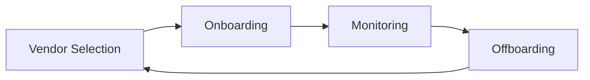

# CompTIA Security+ Exam (SY0-501): Risk Management

We'll be focusing on 

- explaining the importance of policies, plans, and procedures related to organizational security
- summarizing business impact analysis concepts
- explaining risk management processes and concepts
- following incident response procedures
- summarizing the basic concepts of forensics
- explaining disaster recovery and continuity of operation concepts
- comparing and contrasting various types of security controls
- carrying out data security and privacy practices

## 1. Controls and Risks

### 1.1 Security Controls

#### Security Controls

- Security Controls are the procedures and mechanisms that an organization puts in place to manage security risks

#### Defense in Depth

- Multiple controls for one objective

#### Categorizing Controls by Purpose

- Deterrent controls: Designed to discourage attack attempts
- Detective controls: Designed to identify attack attempts (e.g. IDS)
- Preventive controls: Designed to stop attacks that are in progress
- Corrective controls: Designed to help an organization to recover from an incident (e.g. backup)

#### Categorizing Controls by Mechanism

- Technical controls: Use technology to achieve security control objectives
- Administrative controls: Management processes that we put in place to improve enterprise security
- Physical controls: Deter, detect, or prevent unauthorized physical access to a facility

You might find yourself facing a control requirement that seems impossible to meet. For example, your organization might have a security requirement that you use only current versions of operating systems, but you might also have a business requirement to use a critical software product that requires the use of an outdated operating system. In those cases, you might meet both requirements by deploying a compensating control.

#### Compensating Controls

- Fill gaps left when you are unable to implement other required controls

#### False Positive Errors

- Occur when a control inadvertently triggers when it should not

They're dangerous because they reduce the confidence that security administrators have in the control, and sometimes lead to administrators ignoring future alerts from that system. 

#### False Negative Errors

- Occur when a control fails to trigger in a situation when it should

### 1.2 Security Policy Framework

- Policies
- Standards
- Guidelines
- Procedures

#### Security Policies

- Provide the foundation for a security program
- Are written carefully over a long period of time
- Require compliance from all employees
- Are approved at the highest levels of the organization

##### Too Specific

> Encrypt sensitive information with AES-256

> Store employee records in Room 226

##### Right Level

> Encrypt sensitive data in transit and at rest

> Store employee records in HR-approved locations

#### Security Standards

- Provide specific details of security controls
- Derive their authority from policies
- Follow a less rigorous approval process
- Require compliance from all employees

When it comes to complex configuration standards, organizations often draw up industry sources such as the standards available from the Center for Internet Security. These standards standards provide detailed configuration settings for a wide variety of operating systems, network devices, application platforms, and other components of the IT infrastructure. They provide a great starting point for an organization's security standards.

#### Security Guidelines

- Provide security advice to the organization
- Follow best practices from industry
- Suggest optional practices; not mandatory

#### Security Procedures

- Outline a step-by-step process for an activity
- May require compliance, depending upon the circumstances 

#### ! EXAM TIPS

Policies and standards are mandatory. Guidelines are optional. Procedures can go either way.

### 1.3 Security Policies

#### Factors Affecting Security Policy

- Culture of the organization
- Industry
- Regulatory environment

#### Common Policies

- Information security policy
- Privacy policy
- Acceptable use policy

##### Information Security Policy

- Designation of individual responsible for security
- Description of security roles and responsibilities
- Authority for creation of security standards
- Authority for incident response
- Process for policy exceptions and violations

##### Privacy policy

The organization should also have a published privacy policy that covers the ways that the organization collects, stores, and shares information about individuals. 

##### Acceptable use policy

- Also known as responsible use policy
- Describes how individuals may use information systems
- Prohibits illegal activity
- Describes what personal use is permitted

#### Least Privilege

- Assign users only the minimum set of permissions necessary for their jobs

#### Separation of Duties

- Prevents users from simultaneously holding two conflicting permissions

#### Mandatory Vacation

- Force privileged users to take one or two weeks of consecutive vacation annually

#### Job Rotation

- Rotate users in and out of positions with sensitive responsibilities

### 1.4 Risk Assessment

Addressing each one of risks takes both time and money, therefore, information security professionals need to prioritize their risk lists in order to spend these precious resources where they will have the greatest security effect. 

#### Risk Assessment

- Identifies and prioritizes risks

based upon the likelihood of their occurrence and the expected impact they will have on the organization's operations.

#### Key Terms

- Threats
- Risks
- Vulnerabilities

#### Threat

- External force jeopardizing security

Threats might be naturally occurring, such as hurricanes and wildfires, or manmade, such as hacking and terrorism. **You can't normally control what threats are out there, they exist independently**. There is one related term that you should know for the exam. 

#### ! EXAM TIPS

Threat vectors are the specific methods that threats use to exploit a vulnerabilities.

(This might be a hacker toolkit, social engineering, physical intrusion, or any of a number of other hacking techniques.)

#### Vulnerability

- Weaknesses in security controls

that a threat might exploit to undermine the confidentiality, integrity, or availability of your information or systems. These might include missing patches, promiscuous firewall rules, or other security misconfigurations. **You do have control over the vulnerabilities in your environment** and security professionals spend much of their time hunting down and remediating vulnerabilities. 

#### Risk

- The combination of a vulnerability and a corresponding threat

For example, if you haven't update your antivirus signatures recently and hackers release a new virus on the internet, you face a risk. You are vulnerable because you're missing a security control and there is a threat, the new virus. 

There is no risk if either the threat or vulnerability factor is missing. For example, if you live in an area far from the coast, it doesn't matter if your building is vulnerable to hurricanes because there's no threat of a hurricane in your region. Similarly, if you store your backup tapes in a fire-proof box, there is no risk from a building fire because your storage container is not vulnerable to fire.

**Never conduct penetration testing or vulnerability testing without authorization!**

#### Prioritize Risks

- Likelihood: Probability that a risk will occur
- Impact: Amount of expected damage

#### Qualitative Risk Assessment

- Uses subjective ratings to evaluate risk likelihood and impact (e.g. low, medium, high)

#### Quantitative Risk Assessment

- Uses objective numeric ratings to evaluate risk likelihood and impact (usually in terms of dollars)

### 1.5 Quantitative Risk Assessment

**Perform quantitative risk assessment for a single risk and asset pair. **

#### Asset Value (AV)

- The dollar value of an asset

##### Asset Valuation Techniques

- Original cost
- Depreciated cost
- Replacement cost

#### Exposure Factor (EF)

- Expected % of damage to an asset

#### Single-Loss Expectancy

- Expected dollar loss if a risk occurs one time
- AV * EF = SLE
  - \$20M * 50% = ​\$10M

#### Annualized Rate of Occurrence (ARO)

- Number of times a risk is expected to occur each year

#### Annualized Loss Expectancy (ALE)

- Expected dollar loss from a risk in any given year
- SLE * ARO = ALE
  - \$10 * 0.01 = \$100,000

It is important to remember that in reality this cost won't occur each year. What will really have happened is \$10 million in damage each time a flood occurs but since we expect that to happen only once every 100 years, it averages out to ​\$100,000 a year. 

#### ! EXAM TIPS

Be prepared to work through a quantitative risk assessment calculation on the exam!

**Time to restore service depends upon whether a component is repairable.**

#### Mean Time To Failure (MTTF)

- Average time a **nonrepairable** component will last

When using mean values, it's important to remember that these are averages. Half of the assets of this type will fail before the MTTF and half will last longer than the average value. Mean values are useful for planning purposes but you shouldn't completely depend upon them. 

#### Mean Time Between Failures (MTBF)

- Average time gap between failures of a **repairable** component

#### Mean Time To Repair (MTTR)

- Average time required to return a **repairable** component to service

When we look at the MTTF, and MTTR values together, we can get a good idea of the expected downtime for an IT service or a component.

### 1.6 Risk Management

**Risk Management** This is a process of systematically analyzing potential responses to each risk and implementing strategies to control those risks appropriately.

#### Risk Management Strategies

- Risk avoidance: Changes the organization's business practices
  - e.g. Avoid the risk of a flood by relocating the data center
- Risk transference: Shifts the impact of a risk to another organization
  - e.g. Transfer the risk of a flood by purchasing flood insurance
  - insurance policy (cyber liability insurance)
  - you can't always transfer risk completely
- Risk mitigation: Reduces the likelihood or impact of the risk
  - e.g. Mitigate the risk of a flood by installing flood control measures
- Risk acceptance: Accepts the risk without taking further action
  - e.g. Accepting the risk would continue operations as is in a data center despite the flooding risk
- Risk deterrence: Takes actions that dissuade a threat from exploiting a vulnerability
  - Deter the risk of burglary with dangerous-looing fences and guard dogs!

#### ! EXAM TIPS

Outside the exam environment, most consider risk deterrence as an example of risk mitigation.

### 1.7 Risk Visibility and Reporting

Risk visibility and reporting techniques ensure that the results of these risk management processes are clearly documented and tracked over time.

#### Risk Register

- Tracks risk information

#### Risk Register Contents

- Description
- Category
- Probability and impact
- Risk rating
- Risk management actions

#### Risk Register Information Sources

- Risk assessment results
- Audit findings
- Team member input
- Threat Intelligence: Shares risk information.

**Threat intelligence may be used both strategically and operationally.**

### Chapter Quiz

1. Which category of security control focuses on the processes that we put in place to manage technology in a secure manner?

   A. technical controls

   B. management controls

   C. administrative controls

   D. operational controls

2. Which element of the security policy framework includes suggestions that are not mandatory?

   A. policies

   B. guidelines

   C. standards

   D. procedures

3. What security principle prevents against an individual having excess security rights?

   A. separation of duties

   B. mandatory vacations

   C. job rotation

   D. least privilege

4. What two factors are used to evaluate a risk?

   A. frequency and likelihood

   B. criticality and likelihood

   C. impact and criticality

   D. likelihood and impact

5. What is the correct formula for computing the annualized loss expectancy?

   A. ALE = EF * SLE * ARO

   B. ALE = AV - SLE

   C. ALE = ARO * AV

   D. ALE = SLE * ARO

6. Purchasing an insurance policy is an example of which risk management strategy?

   A. risk acceptance

   B. risk mitigation

   C. risk transference

   D. risk deterrence

Answers:

1. operational controls?

   The classes identified by NIST are:

   - Technical - the control is implemented as a system (hardware, software, firmware). For example, firewalls, anti-virus software, and OS access control models.
   - Operational / administrative - the control is implement primarily by people rather than systems. For example, security guards and training programs are operational controls.
   - Management - the control gives oversight of the information system. Examples could include risk identification or a tool allowing the evaluation and selection of other security controls. 

2. guidelines

3. least privilege

4. likelihood and impact

5. ALE = SLE * ARO

6. risk transference

## 2. Supply Chain Risk

### 2.1 Managing Vendor Relationships

**Ensure that vendor security policies are *at least as* stringent as your own**

#### Vendor Management Life Cycle

##### Vendor Selection

- May use a formal RFP
- May be an informal process
- Should include security requirements
- Should evaluate security

##### Onboarding

- Verify contract details
- Arrange secure data transfer
- Establish incident procedures

##### Monitoring

- Conduct site visits
- Review independent audits
- Handle security incidents

##### Offboarding

- Destroys confidential information
- Unwinds a business relationship
- May restart the life cycle

### 2.2 Vendor Agreements

#### Service-Level Requirement (SLR)

- Document specific requirements that a customer has about any aspect of a vendor's service performance

##### Examples of SLRs

- System response time 
- Service availability
- Data preservation

**Document SLRs in a service-level agreement (SLA)**

#### Other Agreement Types

- Memorandum of understanding (MOU, a.k.a MOA)
- Business partnership agreement (BPA)
- Interconnection security agreement (ISA)

MOUs are commonly used when a legal dispute is unlikely but the customer and vendor still wish to document their relationship to avoid future misunderstandings. MOUs are commonly used in cases where an internal service provider is offering a service to a customer that is in a different business unit of the same company.

**Include security requirements in SLRs, SLAs, and other agreements.**

#### Security and Compliance Terms

- Document security and compliance requirements
- Facilitate customer monitoring of compliance
- Ensure the right of audit and assessment

### 2.3 Vendor Information Management

**Agreements should contain clear data ownership language.**

#### Data ownership Provisions

- Customer retains uninhibited data ownership
- Vendor's right to use information is limited to activities performed on behalf of the customer
- Vendor's right to use information is limited to activities performed with the customer's knowledge
- Vendor must delete information at the end of the contract

**Agreements should limit data sharing with third parties.**

**Agreement should include data protection provisions.**

### Chapter Quiz

1. Vendors extend your organization's technology environment. If they handle data on your behalf, you should expect they execute the same degree of care that you would in your own operations.

   A. TRUE

   B. FALSE

2. What type of agreement is used to define availability requirements for an IT service that an organization is purchasing from a vendor?

   A. SLA

   B. MOU

   C. ISA

   D. BPA

Answer:

1. TRUE
2. SLA

## 3. Personnel Management

### 3.1 Need to Know and Least Privilege

#### Need to Know

- Limits information access

This need-to-know principle is commonly followed in military and government circles that handle classified information. 

#### Least Privilege

- Limits system permissions
- Implementing least privilege can be cumbersome

**Emergency access procedures reduce the business impact.**

#### Privilege Aggregation (Privilege Creep)

- Jeopardizes least privilege

IT staff who remain in an organization for a long time, with a variety of different positions, may accumulate privileges over time that, in aggregate, violate the least privilege principle. **User account reviews** are a good control against privilege creep. The principles of need-to-know and least privilege form the core foundation of cyber security programs.

### 3.2 Separation of Duties and Responsibilities

#### Separation of Duties

- No individual should possess two permissions that, in combination, allow them to perform a highly sensitive action.
- Accounting groups often separate the responsibilities of creating new vendors and issuing payments
- Information security professionals are often called on to implement separation of duties
- IT teams often separate the privileges of writing code and deploying code into production

#### Two-Person (Dual) Control

- Requires the authorization of two separate individuals to carry out a sensitive action; also known as dual control
- Missile launch facilities implement the concept of two-person control.
- Checks that require two signatures are an example of two-person control
- IT teams commonly use two-person control for sensitive tasks

### 3.3 Security in the Hiring Process

**Employees pose a significant threat to enterprise security, known as the "insider threat."**

**Preemployment screening checks the background of potential employees.**

#### Preemployment Screening

- Criminal records check
- Sex offender registry
- Reference checks
- Education and employment verification
- Credit checks

#### Employment Agreements

- Should include nondisclosure agreements (NDAs)
- Should discuss return of information and physical assets at termination

#### Include Security Policies in Orientation Sessions

### 3.4 Employee Termination Process

- Every employee eventually leaves the organization.
- Exit interview provide a chance to debrief departing employees.
- Use exit interviews to remind employees of their NDA
- Revoke access promptly, but not prematurely

#### Retrieve Organization Property

- Keys
- Access badges
- Laptops and mobile devices
- Paper and electronic files

### Chapter Quiz

1. What security principle most directly applies to limiting information access?

   A. least privilege

   B. two person control

   C. separation of duties

   D. need to know

2. What security principle requires two individuals to perform a sensitive action?

   A. separation of duties

   B. least privilege

   C. two person control

   D. need to know

3. Which one of the following agreements is most directly designed to protect confidential information after an employee has left the organization?

   A. SLA

   B. BAA

   C. NDA

   D. Asset return

Answers:

1. need to know
2. two person control
3. NDA

## 4. Awareness and Training

### 4.1 Security Education

#### Security Training

- Provides users with the knowledge they need to protect the organization's security

#### Security Awareness

- Keeps the lessons learned during security training

#### Security Training Methods

- Instruction in on-site classes
- Integration with orientations
- Education through online providers
- Participation in vendor-provided classroom training

**Customize training based upon user roles.**

For example, employees handling credit card information should receive training on PCI DSS requirements. Human resources team members should be trained on handling personally identifiable information or PII. IT staff need specialized skills to implement security controls. 

#### Role-Based Training

- Data and system owners
- System administrators and other privileged users
- Normal users
- Executives

#### Training Frequency

- Initial training for new employees
- Update training for employees with new roles
- Refresher training on an annual basis
- Awareness efforts throughout the year

**Review training materials regularly to ensure relevance.**

#### Continuing Education

- Reminds employees of security responsibilities

### 4.2 Information Classification

#### Data Classification Policies

- Assign information into categories, known as classifications, that determines storage, handling and access requirements

#### Assign Classifications Based Upon

- Sensitivity of information
- Criticality of information

Classification schemes vary, but all basically try to group information into high, medium, and low sensitivity levels and differentiate between public and private information. 

#### Classification Levels

| Military Classification | Business Classification |
| ----------------------- | ----------------------- |
| Top Secret              | Highly Sensitive        |
| Secret                  | Sensitive               |
| Confidential            | Internal                |
| Unclassified            | Public                  |

**Classification guides other security decisions.**

#### Labeling Requirements

- Identify sensitive information

**Securely dispose of information when no longer needed.**

e.g. software: Darik's Boot and Nuke (DBAN); hardware: magnetic degaussers, device shredders

### 4.3 Compliance Training

#### Compliance Programs

- Ensure that an organization's information security controls are consistent with the laws, regulations, and standards that govern the organization's activities
- Include compliance obligations in security training

#### Compliance Obligations

- Laws
  - Requirements passed by a government authority at the national or local level
  - e.g. Graham-Leech-Bliley Act, or GLBA, affects security practices of financial institutions. 
- Regulations
  - Mandatory requirements but are not embodied in law
  - e.g. HIPAA (Health Insurance Portability and Accountability Act) rules
- Standards
  - Detailed technical specifications
  - PCIDSS (Payment Card Industry Data Security Standard)

**Begin compliance efforts with a gap analysis.**

### 4.4 User Habits

- Include secure password practices in security education programs.
- Clean desk policies and other data handling practices boost security.
- Physical security training should include discussions of the dangers of tailgating.
- Include BYOD policies in security training efforts.
- Cover appropriate use of social media and peer-to-peer networks in security education.
- Security training should cover acceptable uses of corporate IT resources and the consequences of policy violations.

### 4.5 User-based Threats

- Phishing uses spoofed messages to obtain information and convince users to perform risky actions.
- Social engineering isn't limited to email. It can occur over the phone or in person as well.
- New threats arise *every day*.

### 4.6 Measuring Security Education

#### Simulated Phishing

- Directly measures user awareness

#### Security Awareness Surveys

- How well do the organization prepare you to deal with security threats?
- Do you know your information security responsibilities?
- Do you know where to report a security incident?

**Measure how awareness changes over time.**

**Change tactics based upon survey results.**

### Chapter Quiz

1. Which one of the following is not an example of security education?

   A. briefings at team meetings

   B. reminder posters in the hallway

   C. online education

   D. classroom instruction

2. Which one of the following is the lowest level of classification in the government's classification scheme?

   A. Public

   B. Top Secret

   C. Secret

   D. Confidential

3. Which one of the following regulatory schemes applies to healthcare providers in the United States?

   A. GLBA

   B. FERPA

   C. PCI DSS

   D. HIPAA

4. What is the name of the practice where a user holds a door open for the individual following them into a building?

   A. smurfing

   B. politeness

   C. shoulder surfing

   D. tailgating

5. What type of social engineering attack targets end users via email messages?

   A. phishing

   B. pharming

   C. vishing

   D. shoulder surfing

Answers:

1. **reminder posters in the hallway** (security awareness)
2. Confidential
3. HIPAA
4. tailgating
5. phishing

## Reference

[1] https://www.linkedin.com/learning/comptia-security-plus-sy0-501-cert-prep-5-risk-management

[2] [Security Threat and Controls](http://ccilearning.com/store-ca/wp-content/uploads/2015/03/CompTIA%20Security+%20Student-Sample.pdf)

