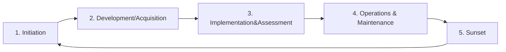

# CompTIA Security+ Exam (SY0-501): Cryptography

We'll be focusing on 

- comparing and contrasting the basic concepts of cryptography
- explaining cryptographic algorithms and their basic characteristics
- installing and configuring wireless security settings
- implementing public key infrastructure

## 1. Encryption

### 1.1 Understanding Cryptography

#### Cryptography

- The use of mathematical algorithms to transform information into an encrypted form that is not readable by unauthorized individuals
- Cryptography does provide authorized individuals with the ability to transform it back to readable form through decryption

#### Encryption

- Converts information from plaintext form into encrypted ciphertext

#### Decryption

- Converts ciphertext messages back into their plaintext form

#### Algorithms

- Serve as mathematical recipes

#### Fahrenheit to Celsius Algorithm

- **Input**: F, a temperature in Fahrenheit
- Subtract 32 from F
- Multiply the result by 5
- Divide that result by 9
- **Output**: C, the temperature in Celsius

#### Encryption Algorithms

- **Input**: P, the plaintext message
- **Input**: K, the encryption key
- Perform encryption steps using P and K
- **Output**: C, the encrypted ciphertext

#### Decryption Algorithms

- **Input**: C, the ciphertext
- **Input**: K, the decryption key
- Perform decryption steps using P and K
- **Output**: P, the plaintext message

### 1.2 Symmetric and Asymmetric Cryptography

**Symmetric shapes have identical halves.**

#### Symmetric Algorithms (Shared Secret Algorithms )

- Encryption and decryption operations use the same key
- Larger groups require more symmetric keys
- The number of symmetric keys required: $\frac{n(n-1)}{2}$ 

| Group Size | Symmetric Keys |
| ---------- | -------------- |
| 2          | 1              |
| 3          | 3              |
| 10         | 45             |
| 100        | 4950           |
| 1,000      | 499,500        |
| 10,000     | 49,995,000     |

 For example, if we have an organization with 10,000 employees, we'd need almost 50 million encryption keys. If a new person joins the organization, we'd need to generate 10,000 new keys for that one person to be able to communicate with the other employees in the organization. And then we'd need to distribute those 10,000 keys to every other employee in the organization.

#### Asymmetric Algorithms (Public Key Encryption Algorithms)

- Encryption and decryption operation use different keys
- use keypairs
- Anything encrypted with one key from a pair can be decrypted with the other key from that same pair
- Asymmetric cryptography is slower than symmetric, but also more scalable

##### Public Key

- Freely distributed to everyone with whom the user would like to communicate

##### Private Key

- Held in secret by the user and not disclosed to anyone else

For normal communications, the sender of the message would encrypt it with the recipient's public key, which is publicly known. The recipient would then use his or her private key to decrypt the message. 

#### ! EXAM TIPS

Keys used to encrypt and decrypt using asymmetric cryptography must be from the same pair!

### 1.3 Goals of Cryptography

#### Confidentiality

- Only authorized individuals can access information

#### States of Data

- Data at rest (on hard drive)
- Data in motion
- Data in use (in memory)

#### Integrity

- No unauthorized changes

#### Authentication

- Proof of identity claims

#### Nonrepudiation

- Proving the origin of a message to a third party
- Digital signatures provide nonrepudiation
- Nonrepudiation is only possible with asymmetric cryptography

### 1.4 Code and Ciphers

#### ! EXAM TIPS

Codes and ciphers are two different things!

#### Code

- A system that substitute one word or phrase for another. Codes are intended to provide secrecy and/or efficiency.
- Seemingly meaningless phrases may convey significant messages

##### "Ten" Code

Used by police and other organizations who communicate by radio. 

| Code  | Meaning                              |
| ----- | ------------------------------------ |
| 10-4  | I acknowledge your message           |
| 10-7  | I am going out of service            |
| 10-9  | Please repeat your last transmission |
| 10-31 | There is a crime in progress         |
| 10-78 | Officer needs assistance             |

#### Ciphers

- A system that uses **mathematical algorithms** to encrypt and decrypt message

##### Stream Ciphers

- Operate on one character, or bit, of a message at a time

##### Block Ciphers

- Operate on large segments of the message at the same time

#### Substitution Ciphers (Rotation Ciphers)

- Change the characters
- Rotation ciphers, such as ROT13, simply shift the alphabet several positions to the left or right

#### Transposition Ciphers

- Rearrange the characters

**Substitution and transposition are the building blocks of modern cryptography**

### 1.5 Cryptographic Math

#### Exclusive Or (XOR)

- True when exactly one of two input values is true

| X     | Y     | X**⊕**Y |
| ----- | ----- | ------- |
| FALSE | FALSE | FALSE   |
| TRUE  | FALSE | TRUE    |
| FALSE | TRUE  | TRUE    |
| TRUE  | TRUE  | FALSE   |

**Cryptography relies upon pseudorandom number generation because we lack a source of truly random numbers.**

#### Confusion

- Every bit of the ciphertext must depend upon more than one bit of the encryption key.

#### Diffusion

- Changing a single bit of the plaintext should change about 50% of the ciphertext bits.

#### Obfuscation

- Uses cryptography to hide source code from users

### 1.6 The Perfect Encryption Algorithm

#### One-Time Pad

- It is an unbreakable encryption algorithm
- Sender and receiver have identical pads
- Key is at least as long as the message
- One-time pads are unbreakable because they are totally random

##### Example: One-Time Pad Encryption

There's no repetition, so there isn't any cryptographic attack I can perform against it as long as the sender only uses the pad one time. 

**Using one time pads is very difficult.**

It's very difficult to distribute one-time pads. The sender and receiver need to be in the same room and physically hand over the pad, and then they need to meet again once they run out of pages. That's not a very efficient way to communicate.

### 1.7 Choosing Encryption Algorithms

#### ! EXAM TIPS

Don't try to build your own encryption algorithm unless you really know what you're doing.

(It's important to remember that encryption is very complicated. It uses sophisticated mathematical techniques and even the smallest flaw can render an algorithm completely insecure.)

#### Security through Obscurity

- The security of the algorithm depends upon its secrecy.

Security through obscurity is a slanderous term and not something that you'd want to hear used to describe your own approach to security. 

**Use encryption algorithms proven to be secure.**

#### Choosing Your Key Length

The more secure your information will be. There is a downside, however. As keys get longer, the performance of the algorithm goes down. You're trading off security for speed and making a classic decision that must balance security constraints with available resources. 

**Use tested encryption modules and cryptographic service providers.**

### 1.8 The Cryptographic Lifecycle

**As cryptographic algorithms age, they often become insecure.**

Either because researchers discover flaws in their implementation or because the key length used by the algorithm becomes vulnerable to brute force attacks. Therefore, it is important to have a lifecycle approach to cryptography that phases algorithms out as they become insecure. 

#### NIST's Cryptographic Lifecycle

##### Phase 1: Initiation

- Gather requirements for the new cryptographic system

This should include the specific confidentiality, integrity, and availability objectives of the organization based upon the sensitivity of the information that will be protected. 

**Security Objectives**

##### Phase 2: Development and Acquisition

- Find an appropriate combination of hardware, software, and algorithms that meet objectives

##### Phase 3: Implementation and Assessment

- Configure and test the cryptographic system

##### Phase 4: Operation and Maintenance

- Ensure the continued secure operation of the cryptographic system

##### Phase 5: Sunset

- Phase out the system and destroy/archive keying material

### Chapter Quiz

1. If Alice wants to send a message to Bob using symmetric cryptography, what key does she use to encrypt the message?

   A. Bob's public key

   B. shared secret key

   C. Alice's private key

   D. Alice's public key

2. Alice would like to be able to prove to Charlie that a message she received actually came from Bob. What cryptographic goal is Alice trying to enforce?

   A. Authentication

   B. Confidentiality

   C. Integrity

   D. Non-repudiation

3. Bob is planning to use a cryptographic cipher that rearranges the characters in a message. What type of cipher is Bob planning to use?

   A. substitution cipher

   B. transposition cipher

   C. elliptic cipher

   D. stream cipher

4. What is the simplest way to take an existing cipher and make it stronger?

   A. replace the cipher with a stronger cipher

   B. rewrite the algorithm to include added rounds

   C. increase the size of the hash function output

   D. increase the length of the encryption key

5. Which one of the following is NOT critical to the security of one-time pad operations?

   A. securely exchanging the pads

   B. only using the pad one time

   C. choosing the key at random

   D. using AES in conjunction with the one-time pad

Answers:

1. shared secret key
2. Non-repudiation
3. transposition cipher
4. increase the length of the encryption key
5. using AES in conjunction with the one-time pad

## 2. Symmetric Cryptography

### 2.1 Data Encryption Standard (DES)

#### Data Encryption Standard (DES)

- Designed by IBM in the 1970s
- Intended to serve as federal encryption standard
- Replaced untested algorithms used by agencies
- Enhance interoperability of communications

- DES uses an encryption operation called the Fesitel function of 16 rounds of encryption
- Each F-box performs a combination of substitution and transposition operations
- The Feistel function repeat 16 times in a single DES encryption operation!

It takes 64 bits of plain text as input in the top and then runs it through an encryption operation known as the Feistel It uses the Feistel function 16 different times in order to produce the cipher text. 

Each of these F boxes that implements the Feistel function takes half a block of input or 32 bits and combines it with a piece of the 56-bit encryption key. 

Then the output of that function is broken up into eight segments and fed into eight different functions called S boxes, these yellow boxes labeled S1 through S8 that just appeared on the screen. S stands for Substitution and each one of these boxes contains a different substitution cipher. 

The results of all of those substitutions are then combined back together again and fed into a P box. P stands for Permutation which is just another term for transposition. So the output of all of those S boxes is scrambled up to produce the cipher text. 

**DES is no longer considered secure!**

#### Key Facts about DES

- Symmetric encryption algorithm
- Block cipher operating on 64-bit blocks
- Key length of 56 bits
- Now considered insecure

### 2.2 3DES

#### Triple DES

- Applied DES to plaintext 3 times with 3 keys: K1, K2, and K3

#### DES Keying Options

##### Keying Option 1

- ${K1}\neq{K2}\neq{K3}$

This is the strongest approach and results an encryption with an effective key strength of 112 bits. 

##### Keying Option 2

- $K1=K3,{K1}\neq{K2},{K2}\neq{K3}$

This requires fewer keys, but reduces the strength of the algorithm from 112 bits down to 80 bits. 

##### Keying Option 3

- $K1=K2=K3$

This emulates the standard DES algorithm and is just as insecure as that standard approach. It is included for backwards compatibility with DES, but is definitely not a good option. 

#### ! EXAM TIPS

Double DES is no more secure than standard DES, due to the meet-in-the-middle attack.

**Triple DES is considered secure through 2030.**

when used in keying mode one. 

#### Key Facts about 3DES

- Symmetric encryption algorithm
- Block cipher operating on 64-bits blocks
- Effective key length of 112 bits
- Considered secure

### 2.3 AES, Blowfish, and Twofish

- The Rijndael algorithm won a competition to become the Advanced Encryption Standard (AES).
- AES uses substitution and transposition

It is widely used today in many different cryptographic applications ranging from web security to encrypted voice communications. 

#### Key Facts about AES

- Symmetric encryption algorithm
- Block cipher operating on 128-bit blocks
- Key length of 128, 192, or 256 bits
- Considered secure

#### Blowfish

- Is a public domain algorithm
- Designed as a DES replacement
- Uses a Feistel network
- Combines substitution and transposition

#### Key Facts about Blowfish

- Symmetric encryption algorithm
- Block cipher operating on 64 bit blocks
- Key length anywhere between 32 and 448 bits
- Not considered secure

#### Twofish

- Designed as a DES replacement
- Placed into the public domain
- Uses a Feistel network
- Combines substitution and transposition

#### Key Facts about Twofish

- Symmetric encryption algorithm
- Block cipher operating on 128-bit blocks
- Key length of 128, 192, and 256 bits
- Considered secure

### 2.4 RC4

**RC4 was a trade secret from its invention in 1987 until its public disclosure in 1994.**

#### RC4 and Network Encryption

- Wired Equivalent Privacy (WEP)
- Wi-Fi Protected Access (WPA)
- Secure Sockets Layer (SSL)
- Transport Layer Security (TLS)

**RC4 uses a pseudorandom keystream.**

This stream has many of the qualities of a random string, but it is not quite random because it is initialized using a selected encryption key. This makes it possible for both the sender and recipient of a message to use the same key to generate the same keystream. 

**RC4 is no longer considered secure.**

#### Key Facts about RC4

- Symmetric encryption algorithm
- Stream cipher
- Variable length key between 40 bits and 2,048 bits
- Not considered secure

### 2.5 Cipher Modes

**Cipher Mode** Describes how an algorithm encrypts and decrypts data

#### Electronic Codebook (ECB) Mode

Perhaps the most straightforward cipher mode. The algorithm simulates a digital codebook that provides an encrypted version of each possible input. 

For example, if we have a message of 192 bits that we want to encrypt, and are using a 64-bit block cipher, the algorithm breaks the message up into 3 blocks and handles each of them completely independently. It takes the first block and uses the encryption algorithm to encrypt that block with the encryption key. That creates the first ciphertext block. It then moves on to the second block and encrypts it with the same key, and then repeats the same process for the third block. 

**Encrypting the same block with the same key in ECB mode results in identical cipher text blocks.**

This is the key disadvantage of this mode, as it makes cryptoanalysis easier. CBC seeks to resolve this disadvantage by making the encryption of a block dependent upon the encryption of all previous blocks.

#### Cipher Block Chaining (CBC) Mode

CBC feeds the previous encrypted block into the encryption of the next block. 

We begin in the same way as ECB mode. Breaking our plaintext into blocks. We then combine the first block with an initialization vector using the exclusive or operation. This initialization vector is just to get us started. The algorithm then uses the encryption key to encrypt the XORed combination of the plaintext and the initialization vector to get the ciphertext block. Then, when we move on to the second block, instead of using the initialization vector, we XOR the second plaintext block with the first ciphertext block and then encrypt that combination to get the second ciphertext block. We then move on to the third plaintext block, where the second encrypted block is then combined with the third plaintext block, and encrypted to get the third ciphertext block. And the process continues on, until we run out plaintext blocks. 

#### Counter Mode (CTR)

It begins with a plaintext, and two values. A randomly generated value, known as a nonce. And a counter, that begins at zero, and increments during each encryption operation. The value created by the nonce and the counter is the encrypted with the encryption key, and the resulting value is XORed with the plaintext to get the cipher text. When we get to the second block, the counter value is incremented to one, and we repeat the previous operation to get the second ciphertext block. And we then do the same thing for the third block, with a counter value of two to get the final ciphertext block. 

**Galois/Counter Mode (GCM) adds authentication capability.**

Galois counter mode, or GCM, is a variant of counter mode that adds authentication to the cipher process. Supplementing the confidentiality capabilities of electronic codebook, cipher block chaining, and traditional counter mode.

### 2.6 Steganography

**Steganography** Hides data in large files

- Steganography often uses innocent-looking high-resolution images
- Slight modifications to image pixels may hide information
- Images with embedded text may be posted in plain sight

### Chapter Quiz

1. What length encryption key does the Data Encryption Standard use?

   A. 256 bits

   B. 56 bits

   C. 38 bits

   D. 128 bits

2. How many keys should be used with 3DES to achieve the greatest level of security?

   A. 4

   B. 2

   C. 3

   D. 1

3. What basic cryptographic functions does the AES algorithm use to encrypt plaintext?

   A. Transposition only

   B. Both substitution and transposition

   C. Substitution only

   D. Neither substitution nor transposition

4. What action can users take to overcome security flaws in RC4?

   A. It is not possible to use RC4 securely

   B. Use three rounds of encryption

   C. Increase the key length

   D. User two rounds of encryption

5. Jasmine comes across a file sent out of her organization that she suspects contains proprietary trade secrets but appears to be an innocuous image. What technique might the sender have used to hide information in the image?

   A. steganography

   B. elliptic curves

   C. polymorphism

   D. rasterization

Answers:

1. **56 bits**
2. 3
3. Both substitution and transposition
4. It is not possible to use RC4 securely
5. steganography

## 3. Asymmetric Cryptography

### 3.1 Rivest-Shamir-Adleman (RSA)

Asymmetric cryptography solves issues of scalability by giving each user a pair of keys for use in encryption and decryption operations. 

#### ! EXAM TIPS

Users create RSA key pairs using to large prime numbers.

**User distributes the public key freely and keeps the private key secure.**

#### RSA Keys

- Sender encrypts a message using the recipient's public key
- Recipient decrypts a message using the recipient's private key
- Usually used to transfers symmetric keys instead of long messages
- Patent is now expired

The major drawback to the RSA algorithm is that it is fairly slow. Therefore, it is not normally used for exchanging long messages directly between communicating systems. Instead, RSA is often used to create an initial secure communications channel over which two systems exchange a symmetric key. The systems can then use that symmetric key to encrypt communications for the remainder of the session.

#### Key Facts about RSA

- Asymmetric encryption algorithm
- Variable length key between 1,024 and 4,096
- Considered secure

Although there have been some published attacks against RSA, recent implementations of the algorithm are still considered secure when used with a sufficiently long key of at least 1,024 bits.

### 3.2 PGP and GnuPG

**Phil Zimmerman created Pretty Good Privacy (PGP) in 1991.**

**PGP is widely available today through the OpenPGP standard.**

#### PGP Function

- Uses public and private keys
- Combines both symmetric and asymmetric cryptography

##### PGP Encryption

The sender of a message has the original plain text and then generates a random symmetric encryption key. Next, the sender encrypts the message using that random symmetric key, and then encrypts the random key using the recipient's public key. The sender then transmits the encrypted message which is a combination of the encrypted data and the encrypted random key. 

##### PGP Decryption

When the recipient receives the encrypted message. First, the recipient decrypts the encrypted random key using the recipient's private key. This produces the random key created by the sender. Next, the recipient uses that random key to decrypt the encrypted message and retrieve the original message.

- **PGP** Commercial product
- **GnuPG** Available for free (New Privacy Guard)

**PGP relies upon other encryption algorithms.**

One important note to remember, PGP is not an encryption algorithm itself. It is a framework for using other encryption algorithms. 

### 3.3 Elliptic Curve and Quantum Cryptography

**Asymmetric cryptography is based upon the difficulty of solving complex math problems.**

In the case of the RSA algorithm, the security of the algorithm depends upon the difficulty of factoring the product of two large prime numbers. 

**Prime Number** Only divisible by themselves and 1

**Finding a way to solve the prime factorization problem efficiently would break modern cryptography!**

#### Elliptic Curve Cryptography (ECC)

- Uses the EC discrete logarithm problem

Does not depend upon the prime factorization problem. It uses a completely different problem known as the elliptic curve discrete logarithm problem.

#### ! EXAM TIPS

You won't need to know the details of ECC. Remember that it doesn't use prime factorization.

#### Quantum Computing

- Uses quantum mechanics principles

It still mostly a theoretical field. But if it advances to the point where that theory becomes practical to implement, quantum cryptography may be able to defeat cryptographic algorithms that depend upon factoring large prime numbers. 

**Elliptic curve cryptography can't protect against quantum attacks.**

Elliptic curve approaches are even more susceptible to quantum attack than prime factorization algorithms.

### 3.4 Tor and Perfect Forward Secrecy

Tor is a software package that provides an anonymous, secure way for individuals to access the internet. Tor also enables access to anonymous websites that are commonly known as the dark web.

#### Tor

- The Onion Router (Tor) is a software package that uses encryption and relay nodes to facilitate anonymous Internet access

#### Tor in Action

Alice's Tor browser accesses a Tor directory server and loads a list of all of the Tor nodes currently available on the internet. This is a very long list because it includes every Tor node. Each of these nodes is an individual computer system whose owner has placed it at the service of the Tor network. The owner doesn't receive any compensation for this. He or she simply wants to contribute to providing anonymized web surfing. 

Once Alice's browser has the list of nodes, it randomly selects a series of nodes, usually 3, that are used to route traffic to its final destination. Each node involved in the process only knows the identity of the node before and after it. So when Alice sends her request to node 1, node 1 knows that the request came from Alice, and it also knows that the next step in the process is to sent it to node 2, but it doesn't know that the Washington Post is the final destination. When node 2 receives the request, it knows that it came from node 1, and that it's headed next to node 3. But node 2 doesn't know Alice's identity, or the fact that the communication involves the Washington Post. When node 3 receives the message, it knows that the request came from node 2, and it knows that it needs to send the request on to the Washington Post. But node 3does not know that either Alice, or node 1was involved. 

When the request does arrive at the Washington Post server, it looks just like any other request that the website receives, but it appears to have come from node 3, and it doesn't provide Alice's identity. A server simply responds with the webpage, and sends it to node 3, thinking that it's done with the communication. However, when node 3 receives the Washington Post's response, it goes ahead and follows the circuit back, sending the reply to node 2, who sends it on to node 1, who finally sends it back to Alice. 

This preserves the anonymity of the communication, and enforces something known as perfect forward secrecy, or PFS. 

#### Perfect Forward Secrecy

- Hides nodes' identity from each other

Perfect forward secrecy uses encryption to hide the details of the communication from the participants in the communication, ensuring that each node only knows the identity of the node immediately before, and after it in the process. 

#### Request Chain

Tor also provides the ability to have two-way anonymity, so that the user doesn't know the location of the website either. That's a function known as 'hidden sites' in Tor. 

**Not everybody likes Tor!**

Tor has its fans, but it also has its enemies. Privacy advocates praise Tor because it does allow completely anonymous activity online. Law enforcement officials do not like Tor very much, because that anonymity may be used to hide criminal activity. 

### Chapter Quiz

1. Alice would like to send a message to Bob using RSA encryption. What key should she use to encrypt the message?

   A. Alice's private key

   B. Bob's public key

   C. shared secret key

   D. Alice's public key

2. What key is actually used to encrypt the contents of a message when using PGP?

   A. randomly generated key

   B. sender's public key

   C. sender's private key

   D. recipient's public key

3. Which one of the following encryption approaches is most susceptible to a quantum computing attack?

   A.  AES cryptography

   B. elliptic curve cryptography

   C. quantum cryptography

   D. RSA cryptography

Answers:

1. Bob's public key
2. randomly generated key
3. elliptic curve cryptography

## 4. Key Management

### 4.1 Key exchange

**Symmetric cryptography requires exchanging a shared secret key in advance.**

#### Symmetric Cryptography

#### Out-of-Band Key Exchange

- Uses a different channel

- Face-to-face meeting
- Physical mail
- Telephone call

**Out-of-band key exchange is difficult and time consuming.**

Alice and Bob might be separated by a great distance, making a physical meeting impractical. Sending a letter by physical mail takes a few days and attempting to read a lengthy encryption key over the phone is very difficult. 

#### In-Band Key Exchange

- Securely exchange keys digitally

### 4.2 Diffie-Hellman

**Ralph Merkle's work formed the basis of the Diffie-Hellman algorithm.**

**Whitfield Diffie and Martin Hellman created the Diffie-Hellman key exchange (DHE) algorithm**

#### Diffie-Hellman Example

Now, let's say that Mal was watching all of the messages that Alice and Bob exchanged. She'd know that they started with the color yellow and she'd know that they exchanged the colors green and orange. She would not know either of the two secret colors that Alice and Bob selected, red and blue, or the common secret color brown because those were never sent over email. 

- $p$ must be a prime number
- $A=g^{a}mod(p)$
- $B=g^{b}mode(p)$
- $S=B^{a}mod(p)$
- $S=A^{b}mod(p)$

If Mal watched the entire communication between Alice and Bob, she wouldn't have enough information to reconstruct that key, just like she couldn't figure out that the shared secret color in the earlier example was brown. 

**$p$ and $g$ must be large values to achieve strong security.**

#### Elliptic Curve Diffie Hellman (ECDHE)

- Uses elliptic curve problem

ECDH uses a similar approach, but replaces the prime factorization difficulty with complexity drawn from the elliptic curve problem that I discussed earlier in the course. 

#### Diffie-Hellman Groups

| Group Number | Description                      | Security                        |
| ------------ | -------------------------------- | ------------------------------- |
| 1            | 768-bit group                    | INSECURE |
| 2            | 1024-bit group                   | INSECURE |
| 5            | 1536-bit group                   | INSECURE |
| 14           | 2048-bit group                   | SECURE                          |
| 19           | 3072-bit group                   | SECURE                          |
| 20           | 384-bit elliptic curve group     | SECURE                          |
| 21           | 521-bit elliptic curve group     | SECURE                          |
| 24           | 2048-bit group, 256-bit subgroup | SECURE                          |

Diffie-Hellman algorithms use the concept of groups to describe key strength. There are two important things that you need to know

1. The higher the group number, the more secure the use of Diffie-Hellman and second
2. Group 14 is the lowest numbered group that is considered secure. You should not use Diffie-Hellman groups with numbers under 14.

### 4.3 Key Escrow

Strong encryption is very difficult to defeat, and this causes a problem for law enforcement and other government agencies, who feel that they have a right to access encrypted communications under certain circumstances, such as when they obtain a search warrant. That's where the concept of key escrow comes into play. 

#### Encryption Key Escrow

- Allows government access to keys

In this case, government officials have proposed key escrow technologies that would provide law enforcement with access to encrypted information. The idea is that government agents would have to obtain a court order before accessing escrowed keys, thus protecting the privacy of other individuals. 

While this may be a reasonable goal, there is not yet a reasonable way to implement this approach in a secure manner. 

- The Clipper chip included technology that would allow government access to encrypted communications
- Privacy advocates and industry firms fought strongly against the Clipper chip

The Clipper chip caused a tremendous public controversy, as groups like the Electronic Frontier Foundation joined forces with security firms like RSA, to campaign publicly against the Clipper chip's government back door. 

After further analysis of the Clipper chip's algorithm, security researchers discovered that it contained fundamental flaws, that would have prevented its secure use in the first place. 

We're left in a difficult situation, with two competing interests. The government has a legitimate need to access information, when they have a legitimately issued warrant. On the other hand, consumers expect technology companies to build secure products that keep out all kinds of unwanted intruders. 

#### Recovery Agents

- Allow internal access to lost keys

The recover agent possesses a master encryption key that may decrypt any information used by the organization. That key must be protected carefully, as it allows global access to all encrypted data in the organization.

### 4.4 Key Stretching

Many encryption technologies depend upon the ability to create an encryption key from a password in a way that remains strong. Key stretching technologies allow this to happen. 

#### Key Stretching

- Takes a relatively insecure value, such as a password, and uses mathematical techniques to strengthen it, making it harder to crack

##### Salting

- Adds a value to the encryption key to make it more complex

##### Hashing

- Adds time to the verification process by requiring more math

This might be less than a second, but key stretching algorithms repeat this process hundreds or thousands of times to consume longer amounts of time. 

**Verifying one key is fast, but guessing millions of keys is slow!**

#### PBKDF2

- Password-Based Key Derivation Function v2
- Uses salting and hashing to stretch a key
- Should be used at least 4,000 times

#### Bcrypt

- Key stretching with Blowfish

It's based upon the Blowfish cipher and uses that algorithm's hashing approach combined with a salt to strengthen keys.

### Chapter Quiz

1. Which one of the following is an example of an in-band approach to key exchange?

   A. U.S. mail

   B. physical meeting

   C. telephone call

   D. Diffie-Hellman

2. The difficulty of solving what mathematical problem provides the security underlying the Diffie-Hellman algorithm?

   A. graph isomorphism

   B. traveling salesman

   C. prime factorization

   D. elliptic curve

3. In the early 1990s, the National Security Agency attempted to introduce key escrow using what failed technology?

   A. Clipper chip

   B. DES

   C. Common certificates

   D. Common criteria

4. What algorithm uses the Blowfish cipher along with a salt to strengthen cryptographic keys?

   A. Blowdart

   B. PBKDF2

   C. PBKDF1

   D. Bcrypt

Answers:

1. Diffie-Hellman
2. prime factorization
3. Clipper chip
4. Bcrypt

## Reference

[1] https://www.linkedin.com/learning/comptia-security-plus-sy0-501-cert-prep-6-cryptography/

