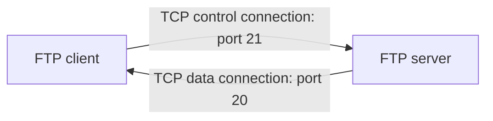

# TCP and UDP Ports Quiz

An FTP data transfer connection is established through a TCP port number

A. 23

B. 25

C. 20

D. 21

So the correct answer is 20.

Which of the port numbers listed below are used by FTP

- [ ] 20
- [ ] 989
- [ ] 5060
- [ ] 21
- [ ] 990
- [ ] 5061

989, 990

Dynamic Host Configuration Protocol (DHCP) runs on:

- [ ] UDP port 65
- [ ] UDP port 66
- [ ] UDP port 67
- [ ] UDP port 68
- [ ] UDP port 69

UDP port 67 and 68

What are the characteristic features of IMAPS?

- [ ] TCP port 143
- [ ] Secure Socket Layer (SSL)
- [ ] TCP port 993
- [ ] Transport Layer Security (TLS)
- [ ] TCP port 995

SSL, 993, TLS

Which protocols use port 500?

- [ ] L2TP
- [ ] IKE
- [ ] POP3S
- [ ] SIP
- [ ] ISAKMP

 IKE, ISAKMP. Internet Key Exchange (IKE) is the protocol used to set up a security association in the IPsec protocol suite. Internet Security Association and Key Management Protocol (ISAKMP) is used for negotiating, establishing, modification and deletion of SAs and related parameters.

Which of the following answers refers to a port number assigned to the Kerberos authentication system?

A. 49

B. 88

C. 1645

D. 1723

88

Port 1702 is used by:

A. L2TP

B. RADIUS

C. PPTP

D. SMTPS

L2TP. Layer Two Tunneling Protocol (L2TP) is an extension of the Point-to-Point Tunneling Protocol (PPTP) used by an ISP to enable the operation of a virtual private network (VPN) over the Internet.

TCP port 389 is the default network port for:

A. RDP

B. LDAP

C. SMB

D. LDAPS

LDAP 389, LDAPS 636, RDP 3389, SMB 139/445

A network admin has been asked to secure directory service access with an SSL/TLS encryption. Which of the following TCP ports needs to be opened to implement this change?

A. 636

B. 389

C. 443

D. 1720

LDAPS 636, teleconferencing 1720

TCP port 119 is assigned to:

A. Internet Message Access Protocol (IMAP)

B. Post Office Protocol v3 (POP3)

C. Network Time Protocol (NTP)

D. Network News Transfer Protocol (NNTP)

NNTP 119

Network Time Protocol (NTP) runs on UDP port:

A. 123

B. 110

C. 161

D. 137

A

Which of the answers listed below refer(s) to POP3S encrypted communication?

- [ ] TCP port 993
- [ ] Secure Sockets Layer (SSL)
- [ ] TCP port 995
- [ ] Transport Layer Security (TLS)
- [ ] TCP port 110

TCP port 995, SSL, TLS

Which of the following statements are true?

- [ ] Point-to-Point Tunneling Protocol (PPTP) runs on TCP port 1723
- [ ] Port 1702 is used by Layer 2 Forwarding Protocol (L2F) and Layer 2 Tunneling Protocol (L2TP)
- [ ] Port number 88 is used by Kerberos authentication system
- [ ] Hypertext Transfer Protocol over TLS/SSL runs on TCP port 143
- [ ] Port number 443 is used by Internet Message Access Protocol (IMAP)

ABC

Which of the ports listed below are used by RADIUS

- [ ] 989
- [ ] 1812
- [ ] 5060
- [ ] 990
- [ ] 1813
- [ ] 5061

1812, 1813

A network technician uses Remote Desktop Protocol (RDP) client on their Windows OS to remotely troubleshoot a problem on another Windows machine. Which of the following ports needs to be opened for the built-in Windows RDP server to allow this type of network connection?

A. TCP port 389

B. TCP port 636

C. TCP port 3389

D. TCP port 993

TCP port 3389

Which of the following ports are assigned to the Session Initiation Protocol (SIP)?

- [ ] 989
- [ ] 1812
- [ ] 5060
- [ ] 990
- [ ] 1813
- [ ] 5061

5060, 5061. The Session Initiation Protocol is a signaling protocol used for initiating, maintaining, and terminating real-time sessions that include voice, video and messaging applications. 

What are the characteristic features of SMTPS?

- [ ] TCP port 143
- [ ] Secure Socket Layer (SSL)
- [ ] TCP port 443
- [ ] Transport Layer Security (TLS)
- [ ] TCP port 465

SSL, TLS, 465

An SNMP management station receives SNMP notifications from Agents on UDP port:

A. 161

B. 137

C. 162

D. 138

162>

An SNMP Agent receives requests on UDP port:

A. 161

B. 137

D. 162

D. 138

161

A network admin has been asked to set up a VPN link on a connecting host with no dedicated VPN client application installed. Which of the following ports needs to be opened to enable this type of connection?

A. 443

B. 22

C. 143

D. 3389

443

Which of the answers listed below refer to ports used by syslog servers?

- [ ] UDP port 514
- [ ] TCP port 465
- [ ] TCP port 6514
- [ ] UDP port 500
- [ ] TCP port 1723

UDP port 514, TCP port 6514

TACACS+ runs on TCP port:

A. 389

B. 49

C. 636

D. 88

49

Trivial File Transfer Protocol (TFTP) uses:

A. UDP port 66

B. UDP port 67

C. UDP port 68

D. UDP port 69

69

